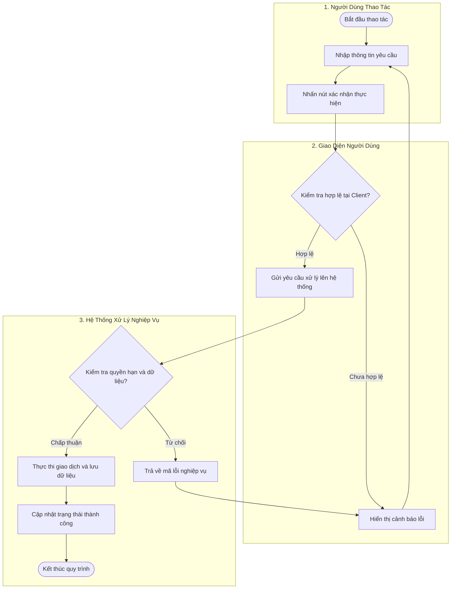
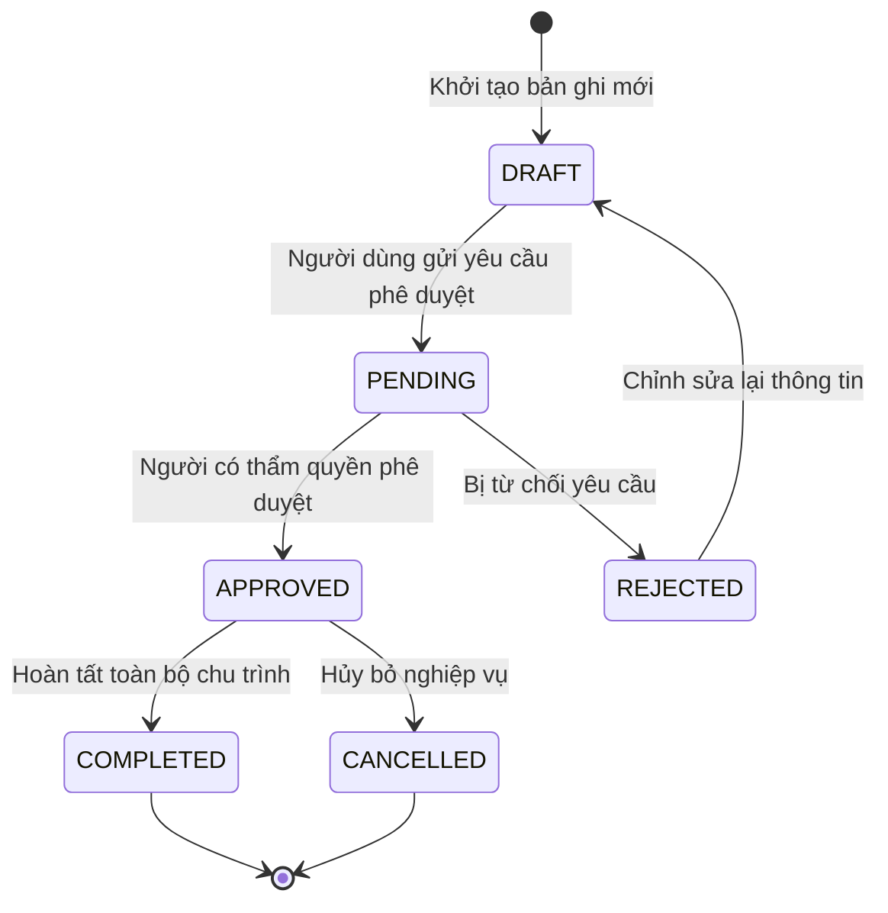
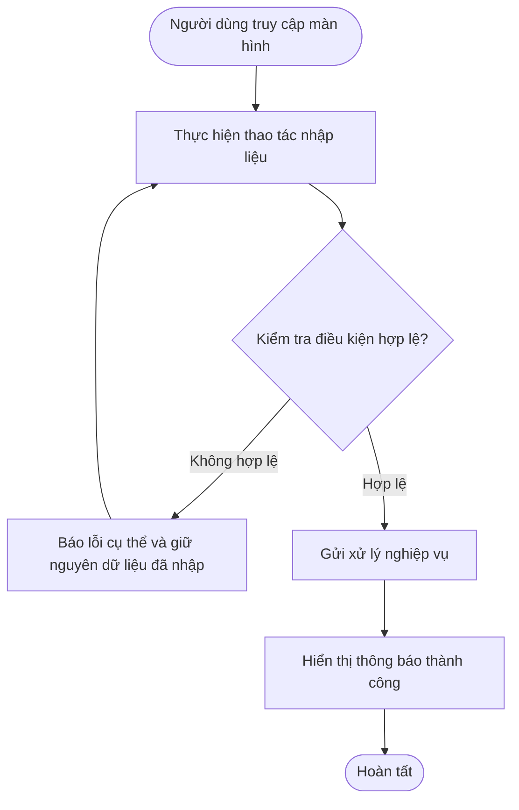

# TÀI LIỆU PHÂN TÍCH NGHIỆP VỤ (BA SPECIFICATION)
## [MÃ PHÂN HỆ/EPIC]: [TÊN PHÂN HỆ TIẾNG VIỆT] ([ENGLISH NAME])

> **Mã Tài Liệu:** `BA-DOC-[MÃ_PHÂN_HỆ]`  
> **Phiên Bản:** `2.0 - Production Specification (Consolidated Single Document)`  
> **Mã Màn Hình / Wireframe:** `[MÃ_MÀN_HÌNH]` (`[ĐƯỜNG_DẪN_ROUTE]`)  
> **Tiêu Chuẩn Định Dạng:** `ba-document Universal Skill V2.0`  
> **Quy Chuẩn Ngôn Ngữ:** Diễn đạt hoàn toàn bằng **Tiếng Việt chuyên ngành**, giữ nguyên các thuật ngữ kỹ thuật BA/ITC quốc tế (`User Story`, `Acceptance Criteria`, `MUST`, `Swim Lane`, `State Diagram`, `Flowchart`, `RBAC`...).  
> **Nguyên Tắc Giới Hạn:** Đặc tả chi tiết đến cấp độ **Acceptance Criteria (AC)** và luồng nghiệp vụ, không can thiệp sâu vào code lập trình hay kỹ thuật cài đặt chi tiết (Technical Implementation).

---

## MỤC LỤC TÀI LIỆU
1. [TỔNG QUAN HỆ THỐNG & MA TRẬN TÁC NHÂN](#1-tổng-quan-hệ-thống--ma-trận-tác-nhân)
2. [SƠ ĐỒ QUY TRÌNH NGHIỆP VỤ TỔNG THỂ (MASTER PROCESS FLOWS)](#2-sơ-đồ-quy-trình-nghiệp-vụ-tổng-thể-master-process-flows)
3. [DANH SÁCH USER STORIES, TIÊU CHÍ NGHIỆM THU & SƠ ĐỒ LUỒNG CHI TIẾT](#3-danh-sách-user-stories-tiêu-chí-nghiệm-thu--sơ-đồ-luồng-chi-tiết)
4. [TỪ ĐIỂN DỮ LIỆU & HỆ THỐNG QUY TẮC VÀNG (BUSINESS RULES)](#4-từ-điển-dữ-liệu--hệ-thống-quy-tắc-vàng-business-rules)

---

## 1. TỔNG QUAN HỆ THỐNG & MA TRẬN TÁC NHÂN

### 1.1 Bối Cảnh & Mục Tiêu Nghiệp Vụ
[Mô tả tổng quan bối cảnh thực tế và lý do ra đời của phân hệ trong hệ thống.]

Phân hệ giải quyết [3 đến 5] bài toán vận hành cốt lõi:
1. **[Tên Bài Toán 1]**: [Mô tả vấn đề thực tế và cách giải quyết].
2. **[Tên Bài Toán 2]**: [Mô tả vấn đề thực tế và cách giải quyết].
3. **[Tên Bài Toán 3]**: [Mô tả vấn đề thực tế và cách giải quyết].
4. **[Tên Bài Toán 4]**: [Mô tả vấn đề thực tế và cách giải quyết].
5. **[Tên Bài Toán 5]**: [Mô tả vấn đề thực tế và cách giải quyết].

### 1.2 Ma Trận Tác Nhân (Actor Matrix)

| STT | Tác Nhân (Actor) | Vai Trò (System Role) | Trách Nhiệm / Hành Vi Chính Trong Phân Hệ |
| :---: | :--- | :--- | :--- |
| **1** | **[Tác nhân người dùng 1]** | `[role_code_1]` | [Trách nhiệm, quyền hạn, màn hình tiếp nhận] |
| **2** | **[Tác nhân người dùng 2]** | `[role_code_2]` | [Trách nhiệm, quyền hạn, màn hình tiếp nhận] |
| **3** | **[Tác nhân người dùng 3]** | `[role_code_3]` | [Trách nhiệm, quyền hạn, màn hình tiếp nhận] |
| **4** | **Hệ Thống Tự Động (System Engine)** | `system` | [Tự động tính toán, kiểm tra quyền, gửi thông báo nền] |

### 1.3 Kiến Trúc Bố Cục Giao Diện Hoặc Chế Độ Vận Hành

```
┌────────────────────────────────────────────────────────────────────────────────────────┐
│                                 HEADER / THANH ĐIỀU HƯỚNG                               │
├──────────────────────────────┬─────────────────────────────────────────────────────────┤
│           PANEL TRÁI         │                       PANEL PHẢI                        │
│    [Bộ lọc / Danh sách]      │              [Chi tiết / Vùng thao tác chính]           │
│                              │                                                         │
│                              │                                                         │
└──────────────────────────────┴─────────────────────────────────────────────────────────┘
```

---

## 2. SƠ ĐỒ QUY TRÌNH NGHIỆP VỤ TỔNG THỂ (MASTER PROCESS FLOWS)

### 2.1 Swim Lane: Quy Trình Nghiệp Vụ Đa Tác Nhân



### 2.2 Sơ Đồ Vòng Đời Trạng Thái Nghiệp Vụ (Lifecycle State Machine)



#### Bảng Chuyển Trạng Thái
| # | Trạng Thái (State) | Mô Tả Ý Nghĩa | Sự Kiện Kích Hoạt (Trigger) | Trạng Thái Tiếp Theo |
| :-: | :--- | :--- | :--- | :--- |
| **1** | `DRAFT` | Bản ghi nháp, đang soạn thảo | Người dùng bấm tạo mới | `PENDING` |
| **2** | `PENDING` | Chờ thẩm tra, phê duyệt | Bấm nút gửi duyệt | `APPROVED` hoặc `REJECTED` |
| **3** | `APPROVED` | Đã được phê duyệt hợp lệ | Người có thẩm quyền nhấn Duyệt | `COMPLETED` hoặc `CANCELLED` |
| **4** | `REJECTED` | Bị từ chối phê duyệt | Người duyệt từ chối kèm lý do | `DRAFT` |
| **5** | `COMPLETED` | Nghiệp vụ đã hoàn tất trọn vẹn | Xử lý xong bước cuối cùng | Kết thúc (`[*]`) |
| **6** | `CANCELLED` | Đã bị hủy bỏ | Người dùng hoặc quản trị viên hủy | Kết thúc (`[*]`) |

---

## 3. DANH SÁCH USER STORIES, TIÊU CHÍ NGHIỆM THU & SƠ ĐỒ LUỒNG CHI TIẾT

### US-[MODULE]-001: [Tên Tính Năng 1]

**US ID:** `US-[MODULE]-001`  
**Summary:** [Mô tả ngắn gọn mục đích tính năng trong 1-2 câu]  
**User Story:**  
> Là một **[Tác nhân / Vai trò cụ thể]**,  
> Tôi muốn **[Hành vi hoặc tính năng muốn thực hiện]**,  
> Để **[Giá trị kinh doanh hoặc lợi ích mang lại]**.  

#### Bảng Tóm Tắt Tiêu Chí Nghiệm Thu (Acceptance Criteria Summary)
| ID | Feature | Acceptance Criteria (Tiêu Chí Nghiệm Thu) |
| :---: | :--- | :--- |
| **1.1** | [Tên Tiêu Chí 1] | Hệ thống BẮT BUỘC (**MUST**) [Yêu cầu cụ thể có thể kiểm thử] |
| **1.2** | [Tên Tiêu Chí 2] | Hệ thống BẮT BUỘC (**MUST**) [Yêu cầu cụ thể có thể kiểm thử] |
| **1.3** | [Tên Tiêu Chí 3] | Hệ thống BẮT BUỘC (**MUST**) [Yêu cầu cụ thể có thể kiểm thử] |
| **1.4** | [Tên Tiêu Chí 4] | Hệ thống BẮT BUỘC (**MUST**) [Yêu cầu cụ thể có thể kiểm thử] |

#### Sơ Đồ Luồng Nghiệp Vụ Chi Tiết (Mermaid Flowchart)


#### Đặc Tả Tiêu Chí Nghiệm Thu Chi Tiết (Bộ Quy Chuẩn 6 Bước)
1. **Yêu Cầu Hiển Thị Giao Diện (Display Requirements):**
   - Vị trí hiển thị: [Mô tả vị trí].
   - Trạng thái mặc định: [Mô tả trạng thái ban đầu].
   - Các thành phần UI: [Nút bấm, trường nhập, bảng biểu, icon].
2. **Quy Tắc Kiểm Tra & Ràng Buộc Dữ Liệu (Validation Rules):**
   - Ràng buộc trường bắt buộc: [Danh sách trường không được để trống].
   - Định dạng dữ liệu: [Ràng buộc email, số điện thoại, ngày tháng...].
   - Ràng buộc logic: [Ngưỡng tối thiểu/tối đa, điều kiện số học...].
3. **Quy Trình Xử Lý Nghiệp Vụ (Processing Logic):**
   - Bước 1: [Hệ thống tiếp nhận và xác thực].
   - Bước 2: [Hệ thống tính toán hoặc biến đổi dữ liệu].
   - Bước 3: [Hệ thống cập nhật cơ sở dữ liệu và chuyển trạng thái].
4. **Xử Lý Ngoại Lệ & Báo Lỗi (Exception & Error Handling):**
   - Khi [trường hợp lỗi 1]: Hiển thị thông báo `[Nội dung câu thông báo]`.
   - Khi [trường hợp lỗi 2]: Hiển thị thông báo `[Nội dung câu thông báo]`.
5. **Yêu Cầu Hiệu Năng & Phản Hồi (Performance & Response Times):**
   - Thời gian phản hồi giao diện tức thì: $< 500\text{ms}$.
   - Thời gian thực thi giao dịch: $< 2\text{s}$.
6. **Quy Định An Toàn & Bảo Mật (Security & Permissions):**
   - Quyền hạn (RBAC): Chỉ các vai trò `[role_list]` mới được phép thực hiện.
   - Cơ chế phòng ngừa: Khóa nút bấm chống bấm đúp (Double-click prevention).

---

<!-- [Ghi chú: Lặp lại cấu trúc trên cho các User Stories tiếp theo: US-[MODULE]-002, US-[MODULE]-003...] -->

---

## 4. TỪ ĐIỂN DỮ LIỆU & HỆ THỐNG QUY TẮC VÀNG (BUSINESS RULES)

### 4.1 Từ Điển Dữ Liệu Thực Thể (Data Dictionary)

#### Bảng / Thực Thể: `[entity_name]`
| Tên Trường (Field) | Kiểu Dữ Liệu | Khóa | Bắt Buộc | Mô Tả Nghiệp Vụ & Ràng Buộc |
| :--- | :--- | :---: | :---: | :--- |
| `id` | `UUID` / `String` | PK | ✅ | Định danh duy nhất toàn cầu |
| `code` | `VARCHAR(50)` | UK | ✅ | Mã định danh nghiệp vụ duy nhất |
| `status` | `VARCHAR(32)` | - | ✅ | Trạng thái: `DRAFT`, `PENDING`, `APPROVED`... |
| `created_at` | `TIMESTAMP` | - | ✅ | Thời điểm khởi tạo bản ghi |

---

### 4.2 Hệ Thống 15 - 20 Quy Tắc Vàng Nghiệp Vụ (Golden Business Rules)

- **`BR-[MODULE]-001` ([Tên Quy Tắc 1])**: [Mô tả quy tắc bất biến bảo vệ tính toàn vẹn nghiệp vụ].
- **`BR-[MODULE]-002` ([Tên Quy Tắc 2])**: [Mô tả quy tắc bất biến bảo vệ tính toàn vẹn nghiệp vụ].
- **`BR-[MODULE]-003` ([Tên Quy Tắc 3])**: [Mô tả quy tắc bất biến bảo vệ tính toàn vẹn nghiệp vụ].
- **`BR-[MODULE]-004` ([Tên Quy Tắc 4])**: [Mô tả quy tắc bất biến bảo vệ tính toàn vẹn nghiệp vụ].
- **`BR-[MODULE]-005` ([Tên Quy Tắc 5])**: [Mô tả quy tắc bất biến bảo vệ tính toàn vẹn nghiệp vụ].
- **`BR-[MODULE]-006` ([Tên Quy Tắc 6])**: [Mô tả quy tắc bất biến bảo vệ tính toàn vẹn nghiệp vụ].
- **`BR-[MODULE]-007` ([Tên Quy Tắc 7])**: [Mô tả quy tắc bất biến bảo vệ tính toàn vẹn nghiệp vụ].
- **`BR-[MODULE]-008` ([Tên Quy Tắc 8])**: [Mô tả quy tắc bất biến bảo vệ tính toàn vẹn nghiệp vụ].
- **`BR-[MODULE]-009` ([Tên Quy Tắc 9])**: [Mô tả quy tắc bất biến bảo vệ tính toàn vẹn nghiệp vụ].
- **`BR-[MODULE]-010` ([Tên Quy Tắc 10])**: [Mô tả quy tắc bất biến bảo vệ tính toàn vẹn nghiệp vụ].
- **`BR-[MODULE]-011` ([Tên Quy Tắc 11])**: [Mô tả quy tắc bất biến bảo vệ tính toàn vẹn nghiệp vụ].
- **`BR-[MODULE]-012` ([Tên Quy Tắc 12])**: [Mô tả quy tắc bất biến bảo vệ tính toàn vẹn nghiệp vụ].
- **`BR-[MODULE]-013` ([Tên Quy Tắc 13])**: [Mô tả quy tắc bất biến bảo vệ tính toàn vẹn nghiệp vụ].
- **`BR-[MODULE]-014` ([Tên Quy Tắc 14])**: [Mô tả quy tắc bất biến bảo vệ tính toàn vẹn nghiệp vụ].
- **`BR-[MODULE]-015` ([Tên Quy Tắc 15])**: [Mô tả quy tắc bất biến bảo vệ tính toàn vẹn nghiệp vụ].
