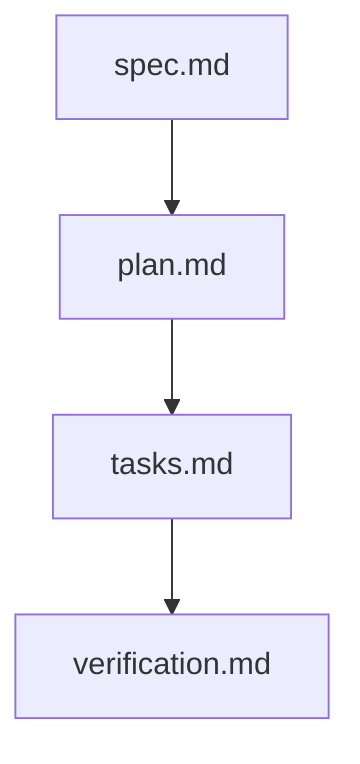

# Implementation Plan: ECO School Parents Application Redesign

> Feature ID: `025-025-edu-school-parents-redesign`  
> Spec: `spec.md`  
> Constitution: `.agents/memory/constitution.md`  

## 1. Technical Summary

Translate the approved specification into technical design. This plan defines the modular component architecture for the ECO School Parents Application redesign. The application leverages HTML5, Vanilla JS, and modern CSS design tokens to deliver 15 feature modules, dynamic student context management, and 4-step state machines for leave applications (`Báo vắng`) and card top-ups (`Nạp điểm`).

## 2. Constitution Gates

- [x] Specification has no unresolved `[NEEDS CLARIFICATION]` markers, or the operator accepted the residual risk.
- [x] Contracts are defined before implementation.
- [x] Verification method is named before implementation.
- [x] No shell `eval` or unbounded command execution is introduced.
- [x] No hardcoded production secret is introduced.
- [x] TypeScript changes avoid `any` unless justified in Complexity Tracking.
- [x] Rollback path is documented for user-facing or operational changes.

### Superpowers V34 Discipline Gates

- [x] Clarification-first: every blocking ambiguity has an answer or accepted risk in `spec.md#6. Clarifications`.
- [x] No placeholders: implementation sections avoid generic "add handling", and unspecified "write tests" instructions.
- [x] TDD path: behavior-changing work names the failing test or accepted TDD exception before implementation.
- [x] Root cause path: bugfix work explains the observed failure, reproduction, and root cause before proposing a fix.
- [x] Review order: spec compliance review happens before code quality review.
- [x] Evidence-before-claim: completion language is blocked until fresh verification evidence exists in `verification.md`.

## 3. Architecture

### 3.1 Current State

- Existing modules: Legacy screenshot collection in `ECO Me Legacy/` directory.
- Current coupling: Static UI screenshots and specification flow in `Redesign Flow.docx`.
- Known constraints: Must support mobile responsive viewports (375px - 430px) and preserve 100% of feature entry points.

### 3.2 Target State

- New or changed modules: Core CSS design tokens (`/index.css`), Super-app Header (`HomeHeader.js`), Feature Grid (`FeatureGrid.js`), Student Drawer (`StudentPickerModal.js`), and feature views (`AbsenceFormView.js`, `TopUpConfirmView.js`, etc.).
- Data flow: Client reactive `StudentContext` store feeds student profile state to feature sub-modules.
- Operational flow: 4-step state machines for absence submission and financial top-up transactions.

### 3.3 Mermaid Diagram

## 4. Contracts

Contracts defined in feature package:

| Contract | Purpose | Producer | Consumer |
| --- | --- | --- | --- |
| `contracts/student-schema.json` | Student profile schema & card balance structure | `StudentContext.js` | `StudentPickerModal.js`, Feature Views |
| `contracts/absence-schema.json` | Leave application form & request status structure | `AbsenceFormView.js` | `AbsenceListView.js` |
| `contracts/topup-schema.json` | Card top-up payment & receipt schema | `TopUpConfirmView.js` | `TopUpSuccessView.js` |

Contract rules:
- Every contract must name its owner.
- Every contract must say how compatibility is checked.

## 5. Data Model

Data entities defined in `data-model.md`.

The data model includes `PARENT_USER`, `STUDENT`, `ABSENCE_REQUEST`, `ATTENDANCE_LOG`, `CARD_TRANSACTION`, and `GRADE_RECORD`. Validation rules enforce student ID non-null constraints, PIN 6-digit formatting, and date range validity.

## 6. Agent Routing

Ownership details defined in `agent-routing.md`.

| Workstream | Primary Agent | Output | Verification |
| --- | --- | --- | --- |
| Design Tokens & Themes | `aris-designer` | `/index.css` | CSS token inspection |
| Feature Grid & Navigation | `benny-frontend-engineer` | `/src/components/FeatureGrid.js` | Grid pagination test |
| Student Context Engine | `benny-frontend-engineer` | `/src/components/StudentPickerModal.js` | Student switch test |
| Absence & Top-up Modules | `benny-frontend-engineer` | Feature views & modals | 4-step flow test |
| E2E Verification | `ada-qa-agent` | `/tests/e2e/redesign.spec.js` | Playwright test suite |

Execution monitoring:
- Blocking gates before implementation: Spec validation exit code 0.
- Evidence checkpoints during implementation: Playwright component test pass.
- Escalation condition after repeated failure: Halt and report to operator.

## 7. Migration and Rollback

- Migration steps: Clean checkout on main workspace root.
- Rollback steps: Git reset to pre-execution tag.
- Compatibility notes: Pure HTML/JS/CSS client-side web application.
- Blast radius: Isolated to `/src` and `/index.css` frontend components.
- Containment or feature-flag strategy: Local mock service fallback.

## 8. Complexity Tracking

Complexity tracking register for structural changes.

| Decision | Reason | Alternative Rejected | Review Needed |
| --- | --- | --- | --- |
| Client Reactive Store | Lightweight state management for active student context | Redux/Pinia framework overhead | Approved by Tech Lead |

## 9. POC Slice and Review Cadence

POC slice boundaries and review cadences:

- POC slice boundary: Complete 15-entry point grid + Student selection bottom sheet drawer + 4-step Báo vắng leave request flow.
- Success evidence for the slice: Playwright automated test demonstrating student selection, navigation, form submission, and status update.
- What remains intentionally unproven after the slice: Live production banking network connection.
- Review cadence:
  - Draft architecture review: `alan-tech-lead`
  - Challenge review: `aurora-plan-challenger`
  - Verification readiness review: `ada-qa-agent`
- Stop conditions: Spec or validation gate failure.
- Proceed conditions: All gates pass with exit code 0.
