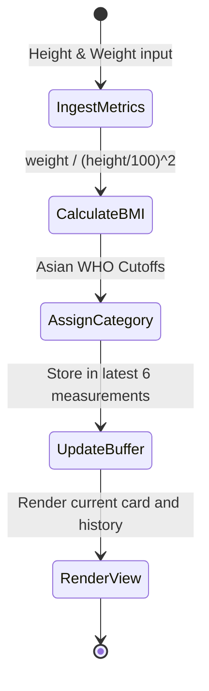

# Data Model: Child BMI Tracking and Hoc Sinh Screen

> Feature ID: `026-child-bmi-tracking-and-hoc-sinh-screen`

## Entities

| Entity | Fields | Owner | Notes |
| --- | --- | --- | --- |
| `StudentProfile` | `id`, `name`, `code`, `className`, `schoolName`, `cardBalance`, `avatarUrl` | `StudentStore` | Core child profile metadata |
| `StudentBmiRecord` | `id`, `studentId`, `heightCm`, `weightKg`, `bmiValue`, `classification`, `date`, `growthDelta` | `BmiStore` | Historical and current measurement item |
| `RecentActivity` | `id`, `studentId`, `title`, `subtitle`, `timestamp`, `iconType` | `ActivityStore` | Log entries displayed under Hoạt động gần đây |

## State Transitions

## Validation Rules

- `heightCm` must be a positive number (typically between 80.0 and 200.0 cm).
- `weightKg` must be a positive number (typically between 10.0 and 120.0 kg).
- `bmiValue` must be rounded to exactly 1 decimal place.
- `history` array length is bounded to a maximum of 6 elements.
