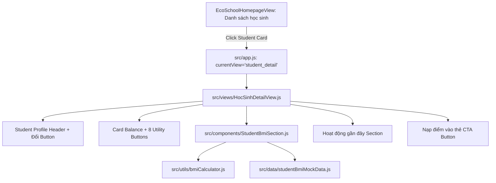

# Implementation Plan: Child BMI Tracking and Hoc Sinh Screen

> Feature ID: `026-child-bmi-tracking-and-hoc-sinh-screen`
> Spec: `spec.md`
> Constitution: `.agents/memory/constitution.md`

## 1. Technical Summary

Implement the `Học sinh` screen and child BMI tracking feature for the ECO School Parents application. Clicking any student card in the "Danh sách học sinh" section of `ECO School Phụ huynh` triggers a view transition to `currentView: 'student_detail'`, rendering the full student credential header, card balance, and 8 utility entry points from `ECO Me Legacy/Hoc sinh.PNG`. Directly below the entry point card and above the "Hoạt động gần đây" section, embed a dedicated `View BMI` component that ingests student height (cm) and weight (kg), calculates the BMI index, categorizes the score into Asian WHO tiers (Thiếu cân <18.5, Bình thường 18.5-22.9, Thừa cân 23.0-24.9, Béo phì >=25.0), renders a 4-color spectrum gauge, and visualizes a 6-period historical record timeline with growth deltas.

## 2. Constitution Gates

- [x] Specification has no unresolved `[NEEDS CLARIFICATION]` markers, or the operator accepted the residual risk.
- [x] Contracts are defined before implementation.
- [x] Verification method is named before implementation.
- [x] No shell `eval` or unbounded command execution is introduced.
- [x] No hardcoded production secret is introduced.
- [x] TypeScript / JavaScript changes maintain strict type boundaries and null checks.
- [x] Rollback path is documented for user-facing or operational changes.

### Superpowers V34 Discipline Gates

- [x] Clarification-first: every blocking ambiguity has an answer or accepted risk in `spec.md#6. Clarifications`.
- [x] No placeholders: implementation sections avoid generic "add handling", and unspecified "write tests" instructions.
- [x] TDD path: behavior-changing work names the failing test before implementation (`tests/e2e/redesign.spec.js`).
- [x] Root cause path: bugfix work explains the observed failure, reproduction, and root cause before proposing a fix.
- [x] Review order: spec compliance review happens before code quality review.
- [x] Evidence-before-claim: completion language is blocked until fresh verification evidence exists in `verification.md`.

## 3. Architecture

### 3.1 Current State

- Existing views: `EcoMeHomepageView.js`, `EcoSchoolHomepageView.js`, `PhieuBeNgoanView.js`.
- Router in `src/app.js` handles `ecome_home`, `school_home`, and `phieu_be_ngoan`.
- Student cards under `Danh sách học sinh` currently fire informative toasts rather than navigating to a dedicated student screen.

### 3.2 Target State

- New view: `src/views/HocSinhDetailView.js` implementing the layout from `ECO Me Legacy/Hoc sinh.PNG`.
- New component: `src/components/StudentBmiSection.js` rendering current BMI, colored classification pill, spectrum gauge, and latest 6 historical checkup cards.
- New calculator utility: `src/utils/bmiCalculator.js` providing pure formula calculation and Asian WHO threshold evaluation.
- New mock dataset: `src/data/studentBmiMockData.js` providing 6 historical measurements for active students (Lý Tường Lam, Phan Khánh Vy, Trần Đăng Khoa).
- Router update: Add `currentView: 'student_detail'` to `src/app.js` with back navigation returning to `school_home`.

### 3.3 Mermaid Diagram

## 4. Contracts

| Contract | Purpose | Producer | Consumer |
| --- | --- | --- | --- |
| `StudentBmiRecordContract` | Defines schema for student height, weight, BMI score, date, and Asian category | `src/data/studentBmiMockData.js` | `src/components/StudentBmiSection.js` |
| `BmiCalculatorContract` | Pure function accepting height (cm) and weight (kg), returning numeric BMI and tier | `src/utils/bmiCalculator.js` | `src/components/StudentBmiSection.js` |
| `HocSinhNavigationContract` | Routes active student ID to Hoc Sinh detail view and handles back transition | `src/views/EcoSchoolHomepageView.js` | `src/app.js` |

## 5. Data Model

- `studentId`: String unique student identifier (e.g. `9192930065`, `9192930059`).
- `heightCm`: Number, child height in centimeters (e.g. `135.0`).
- `weightKg`: Number, child weight in kilograms (e.g. `32.0`).
- `bmiValue`: Number, calculated as $w / (h / 100)^2$ rounded to 1 decimal place (e.g. `17.5`).
- `classification`: String enum (`underweight` / `normal` / `overweight` / `obese`) with Vietnamese labels (`Thiếu cân`, `Bình thường`, `Thừa cân`, `Béo phì`).
- `recordedDate`: ISO date string (e.g. `2026-08-15`).
- `history`: Array of exactly 6 prior BMI records sorted newest to oldest.

## 6. Agent Routing

| Workstream | Primary Agent | Output | Verification |
| --- | --- | --- | --- |
| Hoc Sinh View Shell | `benny-frontend-engineer` | `src/views/HocSinhDetailView.js` | DOM structure matches `Hoc sinh.PNG` |
| BMI Calculation Engine | `benny-frontend-engineer` | `src/utils/bmiCalculator.js` | Formula & boundary checks pass |
| BMI UI Component | `benny-frontend-engineer` | `src/components/StudentBmiSection.js` | Gauge and 6-history cards render |
| E2E Test Suite | `ada-qa-agent` | `tests/e2e/redesign.spec.js` | Playwright test suite passes 100% |

## 7. Migration and Rollback

- Migration steps: Add new views, components, and data modules; wire router handlers in `src/app.js`; add CSS tokens for BMI status in `index.css`.
- Rollback steps: Revert router case in `src/app.js` back to toast notification; existing views remain completely decoupled and unharmed.
- Compatibility notes: Pure client-side Vanilla JS; zero breaking schema changes.

## 8. Complexity Tracking

| Decision | Reason | Alternative Rejected | Review Needed |
| --- | --- | --- | --- |
| Asian WHO Cutoffs | Children in Vietnam adhere to Asian BMI reference percentiles | Western standard (BMI 25 threshold would misclassify overweight Asian children) | Completed |
| In-place view placement | Operator requirement: View BMI placed between entry points and recent activities | Floating bottom drawer or standalone tab | Completed |

## 9. POC Slice and Review Cadence

- POC slice boundary: Navigate from student card to Học sinh screen, calculate current BMI, and render latest 6 records.
- Success evidence for the slice: Playwright automated test passing 100% with visual snapshot.
- Review cadence:
  - Architecture review: Complete via `/planning` ledgers and specifications.
  - Verification readiness review: Pass `validate_specs.py`, `validate_planning_research.py`, and Playwright test harness.
- Stop conditions: Spec or validation gate failure.
- Proceed conditions: All gates pass with exit code 0.

