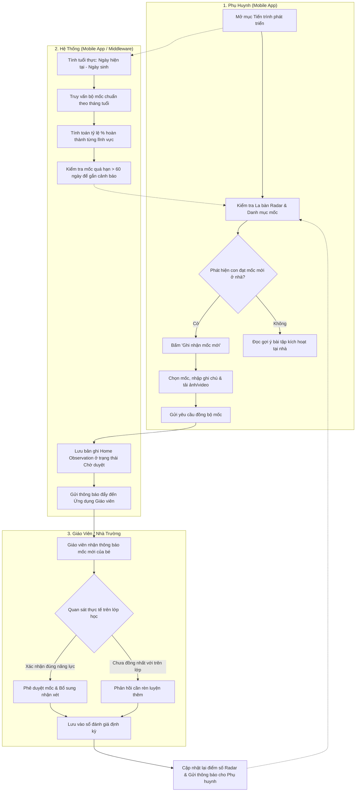
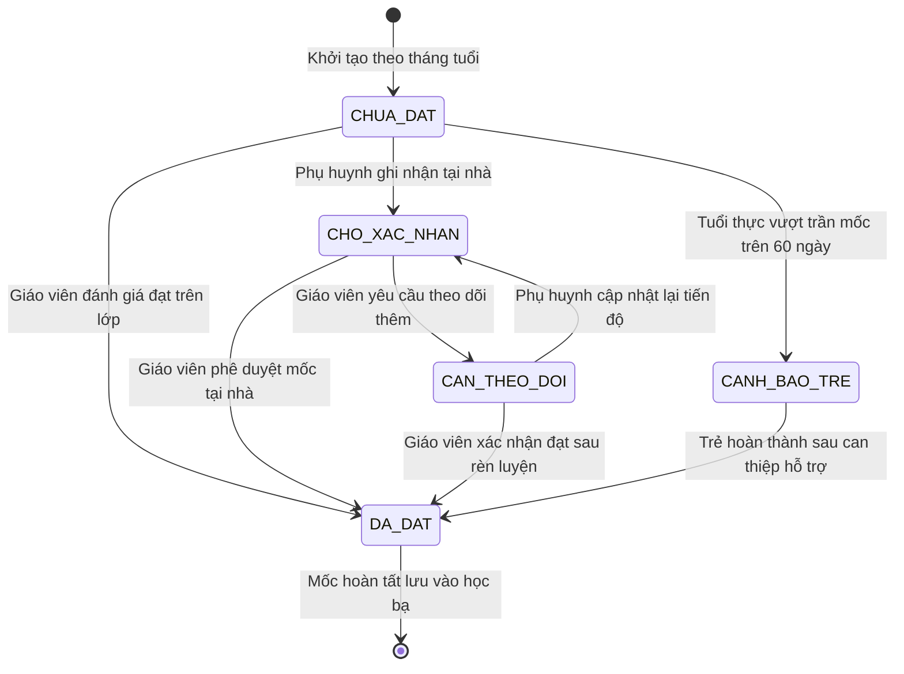
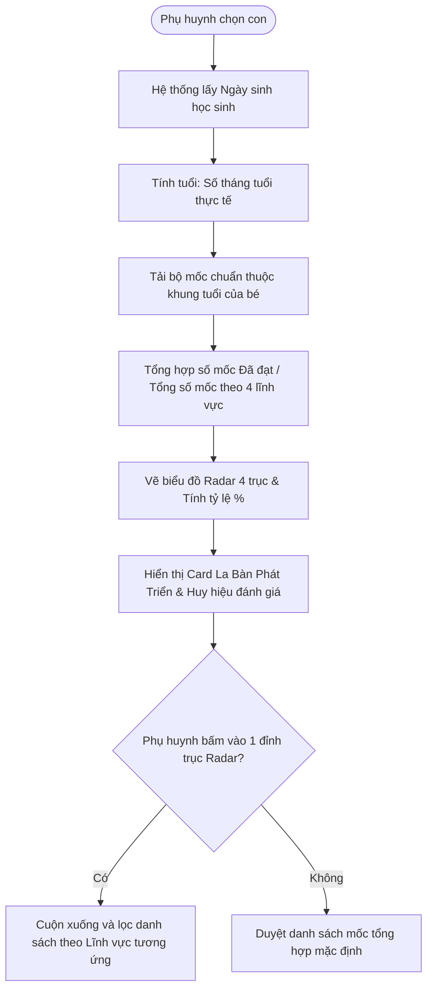
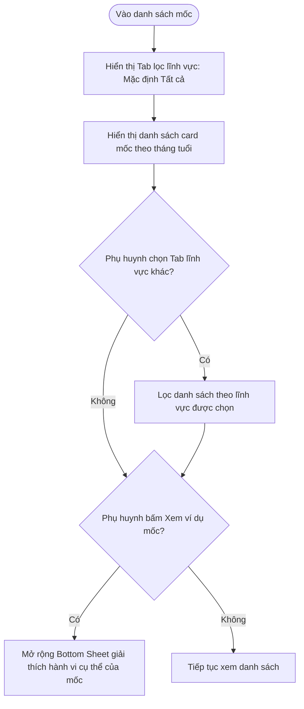
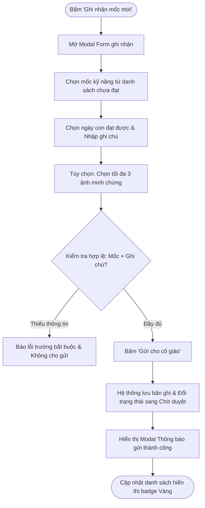
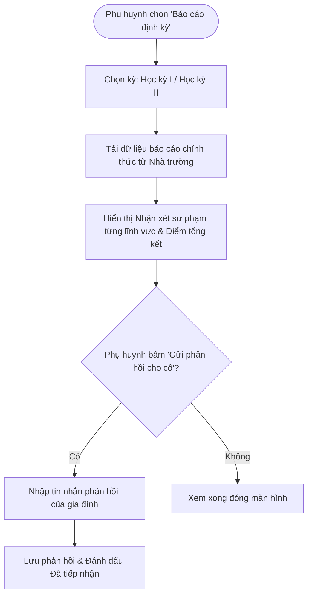
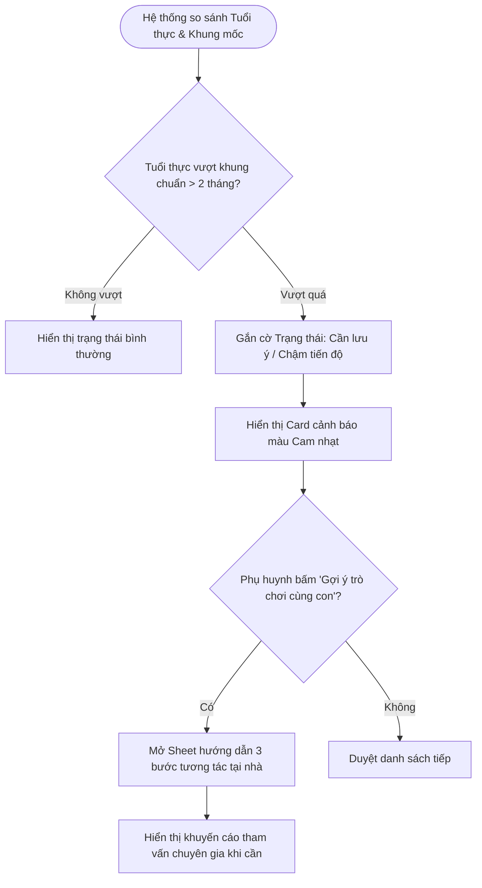
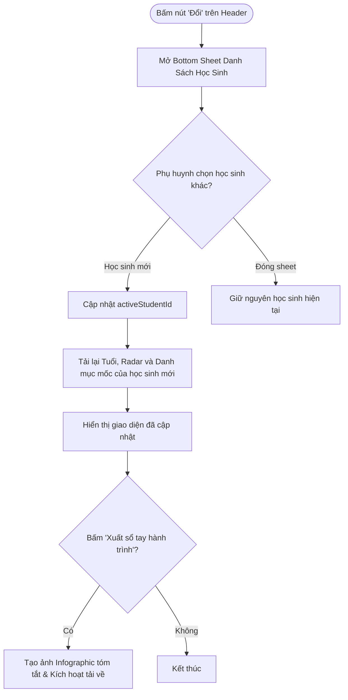

# TÀI LIỆU PHÂN TÍCH NGHIỆP VỤ & ĐẶC TẢ YÊU CẦU SẢN PHẨM (PRD & BA SPECIFICATION)
## PHÂN HỆ: TIẾN TRÌNH PHÁT TRIỂN CỦA TRẺ (CHILD DEVELOPMENT & MILESTONE PROGRESS TRACKING)

> **Mã Tài Liệu:** `BA-DOC-E002-CHILD-DEVELOPMENT`  
> **Phiên Bản:** `2.0 - Production Ready Specification (Consolidated Single Document)`  
> **Phân Hệ / Epic:** `E-002-child-development-milestones`  
> **Sản Phẩm:** `ECO School Phụ huynh (Parent App Prototype)`  
> **Vị Trí Điều Hướng:** `Màn hình Học sinh` $\rightarrow$ Card `Tiến trình phát triển` (hoặc Icon `Nhật ký chăm sóc / Học bạ số` trang 2 Home)  
> **Tiêu Chuẩn Định Dạng:** `ba-document Skill V2.0 & Sophia Product Manager Standard`  
> **Căn Cứ Pháp Lý & Y Khoa:**  
> - *Thông tư số 51/2020/TT-BGDĐT* (sửa đổi, bổ sung Thông tư 28/2016/TT-BGDĐT) của Bộ GD&ĐT về Chương trình Giáo dục Mầm non.  
> - *Quyết định số 3777/QĐ-BYT* ngày 16/12/2024 của Bộ Y tế về Hướng dẫn chẩn đoán, điều trị dinh dưỡng trẻ em.  
> - *Khung chỉ số phát triển trẻ thơ của UNICEF & Khuyến cáo giám sát mốc phát triển CDC / AAP (American Academy of Pediatrics)*.  
> - *Luật Trẻ em 2016 (Luật số 102/2016/QH13)* & *Nghị định số 13/2023/NĐ-CP* về bảo vệ dữ liệu cá nhân.

---

## MỤC LỤC TÀI LIỆU
1. [TỔNG QUAN HỆ THỐNG & MA TRẬN TÁC NHÂN](#1-tổng-quan-hệ-thống--ma-trận-tác-nhân)
   - 1.1 Bối Cảnh Nghiệp Vụ & 4 Bài Toán Vận Hành Cốt Lõi
   - 1.2 Ma Trận Tác Nhân (Actor Matrix)
   - 1.3 Kiến Trúc Bố Cục Giao Diện Di Động (Mobile Layout Architecture)
2. [SƠ ĐỒ QUY TRÌNH NGHIỆP VỤ TỔNG THỂ (MASTER PROCESS FLOWS)](#2-sơ-đồ-quy-trình-nghiệp-vụ-tổng-thể-master-process-flows)
   - 2.1 Swim Lane: Quy Trình Giám Sát & Phối Hợp Đánh Giá Đa Bên
   - 2.2 Sơ Đồ Vòng Đời Trạng Thái Mốc Phát Triển (Milestone Lifecycle)
3. [DANH SÁCH USER STORIES, TIÊU CHÍ NGHIỆM THU & SƠ ĐỒ LUỒNG CHI TIẾT](#3-danh-sách-user-stories-tiêu-chí-nghiệm-thu--sơ-đồ-luồng-chi-tiết)
   - [US-DEV-001: Xem Bảng Tổng Quan Tiến Trình & La Bàn Phát Triển (Development Radar)](#us-dev-001-xem-bảng-tổng-quan-tiến-trình--la-bàn-phát-triển-development-radar)
   - [US-DEV-002: Tra Cứu Danh Mục Mốc Chuẩn Theo Độ Tuổi & Lĩnh Vực](#us-dev-002-tra-cứu-danh-mục-mốc-chuẩn-theo-độ-tuổi--lĩnh-vực)
   - [US-DEV-003: Phụ Huynh Ghi Nhận Mốc Hoàn Thành Tại Nhà & Gửi Minh Chứng](#us-dev-003-phụ-huynh-ghi-nhận-mốc-hoàn-thành-tại-nhà--gửi-minh-chứng)
   - [US-DEV-004: Tiếp Nhận Báo Cáo Đánh Giá Định Kỳ Của Giáo Viên & Nhà Trường](#us-dev-004-tiếp-nhận-báo-cáo-đánh-giá-định-kỳ-của-giáo-viên--nhà-trường)
   - [US-DEV-005: Cảnh Báo Sớm Mốc Chậm Tiến Độ & Nhận Gợi Ý Hỗ Trợ Tại Nhà](#us-dev-005-cảnh-báo-sớm-mốc-chậm-tiến-độ--nhận-gợi-ý-hỗ-trợ-tại-nhà)
   - [US-DEV-006: Chuyển Đổi Ngữ Cảnh Con Em & Xuất Sổ Tay Phát Triển Điện Tử](#us-dev-006-chuyển-đổi-ngữ-cảnh-con-em--xuất-sổ-tay-phát-triển-điện-tử)
4. [TỪ ĐIỂN DỮ LIỆU & HỆ THỐNG QUY TẮC VÀNG (BUSINESS RULES)](#4-từ-điển-dữ-liệu--hệ-thống-quy-tắc-vàng-business-rules)
   - 4.1 Từ Điển Dữ Liệu Thực Thể (Data Dictionary)
   - 4.2 Hệ Thống 18 Quy Tắc Vàng Nghiệp Vụ (Golden Business Rules)

---

## 1. TỔNG QUAN HỆ THỐNG & MA TRẬN TÁC NHÂN

### 1.1 Bối Cảnh Nghiệp Vụ & 4 Bài Toán Vận Hành Cốt Lõi

Trong giai đoạn đầu đời (đặc biệt lứa tuổi Mầm non từ 0–6 tuổi và giai đoạn đầu Tiểu học từ 6–10 tuổi), trẻ em trải qua các bước nhảy vọt về thể chất, não bộ, ngôn ngữ và hành vi xã hội. Hiện tại trong ứng dụng `ECO School Phụ huynh`, phụ huynh mới chỉ tiếp cận các chỉ số thể chất cơ bản (Chiều cao, Cân nặng, BMI, Z-score tại `E-001`) và ghi nhận hành vi tuần (`Phiếu Bé Ngoan`). 

Tuy nhiên, phụ huynh và nhà trường đang gặp phải khoảng trống lớn về thông tin tiến trình toàn diện:
1. **Thiếu sự liên kết đa chiều (Siloed Tracking):** Thể chất tách rời nhận thức, cảm xúc tách rời vận động. Phụ huynh không có cái nhìn tổng thể về mức độ phát triển cân bằng của con.
2. **Khó phát hiện sớm độ lệch chuẩn hoặc nguy cơ chậm phát triển (Late Detection of Developmental Lag):** Các khó khăn về ngôn ngữ (chậm nói, khó diễn đạt câu), vận động tinh (yếu cơ tay, khó cầm bút) hay tương tác xã hội thường chỉ được phát hiện khi trẻ vào lớp 1, bỏ lỡ "giai đoạn vàng" can thiệp (trước 5 tuổi).
3. **Mất kết nối thông tin hai chiều giữa Gia đình và Nhà trường (One-way Disconnect):** Giáo viên quan sát trẻ ở lớp nhưng không nắm được hành vi của trẻ ở nhà; ngược lại phụ huynh thấy con đạt mốc mới ở nhà nhưng không có kênh chính thức để đồng bộ vào hồ sơ theo dõi của trường.
4. **Tâm lý lo âu thiếu căn cứ khoa học của phụ huynh (Parental Anxiety & Information Overload):** Phụ huynh thường so sánh con mình với "con nhà người ta" trên mạng xã hội thay vì đối chiếu với các bảng chuẩn mốc phát triển theo tháng tuổi đã được Bộ GD&ĐT và WHO chứng thực.

**Phân hệ "Tiến trình phát triển của trẻ" giải quyết triệt để 4 bài toán vận hành cốt lõi sau:**

1. **Chuẩn Hóa Đa Lĩnh Vực Theo Khung Khoa Học (4-Pillar Holistic Framework):** Phân chia tiến trình phát triển thành 4 lĩnh vực cốt lõi:
   - **Thể chất & Vận động (Physical & Motor Skills):** Gồm Vận động thô (Gross Motor) và Vận động tinh (Fine Motor) kết hợp thể lực.
   - **Nhận thức & Trí tuệ (Cognitive Development):** Tư duy logic, nhận biết không gian, màu sắc, chữ số, giải quyết vấn đề.
   - **Ngôn ngữ & Giao tiếp (Language & Communication):** Khả năng nghe hiểu, vốn từ, diễn đạt mạch lạc, phản xạ tương tác.
   - **Cảm xúc - Xã hội & Kỹ năng Tự lập (Socio-Emotional & Self-care):** Tự phục vụ, quản lý cảm xúc, tương tác bạn bè và tuân thủ quy tắc.
2. **Trực Quan Hóa Bằng La Bàn Phát Triển (Holistic Development Radar):** Biểu diễn tỷ lệ hoàn thành mốc của trẻ trên biểu đồ mạng nhện đa giác, so sánh trực quan với đường chuẩn trung bình lứa tuổi (theo tháng tuổi thực).
3. **Đồng Hành Đánh Giá Hai Chiều (Parent-Teacher Collaborative Observation):** Cho phép phụ huynh ghi nhận mốc con đạt được tại nhà (kèm ảnh/video/ghi chú), giáo viên tiếp nhận, xác thực và bổ sung nhận xét định kỳ.
4. **Cảnh Báo Chuyên Biệt Không Chẩn Đoán (Non-diagnostic Early Alert & Guidance):** Tự động phát hiện các mốc trễ hạn quá 60 ngày so với chuẩn lứa tuổi, đưa ra lời khuyên kích hoạt hoạt động tại nhà (Home Activity Guidance) và khuyến nghị phụ huynh trao đổi với chuyên gia tâm lý/y tế khi cần thiết.

---

### 1.2 Ma Trận Tác Nhân (Actor Matrix)

| STT | Tác Nhân (Actor) | Vai Trò (System Role) | Trách Nhiệm / Hành Vi Chính Trong Phân Hệ |
| :---: | :--- | :--- | :--- |
| **1** | **Phụ huynh học sinh** | `parent` | Xem la bàn phát triển của con; duyệt danh mục mốc theo tháng tuổi; tích chọn ghi nhận mốc đạt được ở nhà kèm minh chứng; xem báo cáo định kỳ của cô giáo; đọc bài tập kích hoạt gợi ý. |
| **2** | **Giáo viên mầm non / Chủ nhiệm** | `teacher` (Hệ thống trường) | Đánh giá định kỳ theo đợt (tháng/học kỳ); duyệt hoặc ghi nhận mốc của trẻ tại lớp; viết nhận xét sư phạm chuyên sâu; xác thực mốc do phụ huynh gửi lên. |
| **3** | **Cán bộ Y tế học đường** | `school_nurse` | Nhập chỉ số thể chất định kỳ, tầm soát giác quan (mắt, tai, răng), gắn cờ nghi vấn phát triển thể chất hoặc giác quan. |
| **4** | **Quản trị nhà trường / BGH** | `school_admin` | Cấu hình bộ mốc chuẩn theo khung tuổi quy định của Bộ GD&ĐT; mở đợt đánh giá định kỳ; trích xuất thống kê toàn trường. |
| **5** | **Công cụ tính toán tự động** | `system` / `milestone_engine` | Tính tuổi thực tế theo tháng (Age in Months); ánh xạ bộ mốc chuẩn tương ứng; tính điểm hoàn thành theo lĩnh vực; vẽ biểu đồ Radar; kích hoạt cảnh báo trễ mốc. |

---

### 1.3 Kiến Trúc Bố Cục Giao Diện Di Động (Mobile Layout Architecture)

Giao diện tích hợp liền mạch bên trong khung điện thoại chuẩn của ứng dụng `ECO School Phụ huynh`, kế thừa thanh Header hồ sơ học sinh (`Avatar, Tên, Mã định danh, Lớp, Nút Đổi con`).

```text
+-------------------------------------------------------------+
| [ < ]  Tiến Trình Phát Triển Của Bé                 [ ? ]   |
+-------------------------------------------------------------+
| [Avatar] Phan Khánh Vy - Mã: 9192930059                     |
| Lớp Lá | Trường Mầm non Demo                      [ Đổi > ] |
+-------------------------------------------------------------+
| THÁNG TUỔI HIỆN TẠI: 72 Tháng (6 Tuổi 0 Tháng)              |
+-------------------------------------------------------------+
| +---------------------------------------------------------+ |
| | LA BÀN PHÁT TRIỂN TOÀN DIỆN (DEVELOPMENT RADAR)         | |
| |                    Vận động (90%)                       | |
| |                         /\                              | |
| |     Ngôn ngữ (95%)     /  \    Nhận thức (85%)          | |
| |                       /____\                            | |
| |                    Cảm xúc-XH (80%)                     | |
| |                                                         | |
| |  Đã đạt: 38/42 mốc chuẩn lứa tuổi (90.4% - Hoàn thiện)  | |
| |  [Xem báo cáo định kỳ Học kỳ I ›]                       | |
| +---------------------------------------------------------+ |
+-------------------------------------------------------------+
| BỘ LỌC LĨNH VỰC: [Tất cả] [Vận động] [Nhận thức] [Ngôn ngữ] |
+-------------------------------------------------------------+
| DANH SÁCH MỐC PHÁT TRIỂN THEO THÁNG TUỔI (MILESTONE LIST)   |
|                                                             |
| +---------------------------------------------------------+ |
| | [Icon Chân] Biết nhảy lò cò 1 chân liên tục 5 bước      | |
| | Lĩnh vực: Vận động thô | Chuẩn: 60-72 tháng             | |
| | Trạng thái: [ĐÃ ĐẠT - Cô Mai duyệt ngày 20/09/2026]     | |
| +---------------------------------------------------------+ |
| | [Icon Bút] Cầm bút đúng 3 ngón tay, tô màu không chờm viền| |
| | Lĩnh vực: Vận động tinh | Chuẩn: 60-72 tháng            | |
| | Trạng thái: [BÉ ĐÃ ĐẠT Ở NHÀ - Chờ cô duyệt]            | |
| +---------------------------------------------------------+ |
| | [Icon Sách] Kể lại câu chuyện có mở đầu, diễn biến, kết | |
| | Lĩnh vực: Ngôn ngữ | Chuẩn: 60-72 tháng                 | |
| | Trạng thái: [CHƯA ĐẠT - Cần rèn thêm]      [Ghi nhận +] | |
| | ⚠️ Gợi ý: Con đang chậm hơn mốc chuẩn 45 ngày          | |
| | [💡 Xem trò chơi rèn luyện tại nhà cho bé ›]             | |
| +---------------------------------------------------------+ |
+-------------------------------------------------------------+
| [CTA CỐ ĐỊNH]: [ + Ghi nhận mốc mới ở nhà ] [ Xuất sổ tay ] |
+-------------------------------------------------------------+
```

---

## 2. SƠ ĐỒ QUY TRÌNH NGHIỆP VỤ TỔNG THỂ (MASTER PROCESS FLOWS)

### 2.1 Swim Lane: Quy Trình Giám Sát & Phối Hợp Đánh Giá Đa Bên



---

### 2.2 Sơ Đồ Vòng Đời Trạng Thái Mốc Phát Triển (Milestone Lifecycle)

Một mốc phát triển của trẻ trong danh mục sẽ chuyển tiếp qua các trạng thái tuần tự:



#### Bảng Chuyển Trạng Thái (State Transition Table)

| # | Trạng Thái (State) | Mô Tả Ý Nghĩa | Sự Kiện Kích Hoạt (Trigger) | Trạng Thái Tiếp Theo |
| :-: | :--- | :--- | :--- | :--- |
| **1** | `CHUA_DAT` (Chưa đạt) | Trẻ đang trong độ tuổi phát triển mốc này, chưa được ghi nhận hoàn thành. | Trẻ bước vào khung tháng tuổi chuẩn. | `CHO_XAC_NHAN`, `DA_DAT`, hoặc `CANH_BAO_TRE` |
| **2** | `CHO_XAC_NHAN` (Chờ duyệt) | Phụ huynh gửi minh chứng con đã làm được ở nhà, chờ giáo viên xem xét. | Phụ huynh nhấn "Gửi ghi nhận mốc". | `DA_DAT` hoặc `CANH_BAO_TRE` / `CAN_THEO_DOI` |
| **3** | `CAN_THEO_DOI` (Cần theo dõi) | Giáo viên nhận thấy ở lớp trẻ chưa thể hiện vững vàng kỹ năng này, cần theo dõi thêm. | Giáo viên gửi phản hồi kèm hướng dẫn. | `CHO_XAC_NHAN` hoặc `DA_DAT` |
| **4** | `CANH_BAO_TRE` (Trễ mốc) | Trẻ đã vượt quá độ tuổi tối đa của mốc từ 60 ngày trở lên mà chưa đạt. | Động cơ hệ thống quét định kỳ ngày sinh. | `DA_DAT` (sau can thiệp) |
| **5** | `DA_DAT` (Đã đạt) | Mốc kỹ năng đã được công nhận hoàn thành bởi giáo viên hoặc cán bộ chuyên môn. | Giáo viên duyệt hoặc chấm đạt trong kỳ đánh giá. | `LOCKED_ARCHIVED` (Lưu hồ sơ cố định) |

---

## 3. DANH SÁCH USER STORIES, TIÊU CHÍ NGHIỆM THU & SƠ ĐỒ LUỒNG CHI TIẾT

---

### US-DEV-001: Xem Bảng Tổng Quan Tiến Trình & La Bàn Phát Triển (Development Radar)

**US ID:** `US-DEV-001`  
**Summary:** Phụ huynh xem tổng thể mức độ phát triển cân bằng của con qua biểu đồ la bàn 4 trục (Thể chất/Vận động, Nhận thức, Ngôn ngữ, Cảm xúc/Xã hội) và tỷ lệ % hoàn thành mốc theo chuẩn tháng tuổi.

**User Story:**  
> Là một **Phụ huynh học sinh (Parent)**,  
> Tôi muốn **nhìn thấy ngay một biểu đồ đa chiều trực quan và tổng kết số mốc con đã đạt so với chuẩn tháng tuổi**,  
> Để **tôi nắm bắt được toàn diện sự phát triển của con, biết con đang vượt trội hoặc cần hỗ trợ ở khía cạnh nào mà không bị hoang mang**.

#### Bảng Tóm Tắt Tiêu Chí Nghiệm Thu (Acceptance Criteria Summary)
| ID | Feature | Acceptance Criteria (Tiêu Chí Nghiệm Thu) |
| :---: | :--- | :--- |
| **1.1** | Tính tháng tuổi tự động | Hệ thống BẮT BUỘC (**MUST**) tính chính xác số tháng tuổi từ `dob` đến thời điểm xem và hiển thị dạng `X Tuổi Y Tháng (Z Tháng)`. |
| **1.2** | Render biểu đồ La bàn Radar | Hệ thống BẮT BUỘC (**MUST**) hiển thị biểu đồ Radar 4 trục tương ứng 4 lĩnh vực chuẩn, mỗi trục tính theo công thức `(Số mốc đã đạt / Tổng số mốc của lứa tuổi) * 100%`. |
| **1.3** | Badge đánh giá tổng quan | Hệ thống BẮT BUỘC (**MUST**) gán nhãn: `Xuất sắc (>= 90%)`, `Đạt chuẩn (70% - 89%)`, `Cần lưu ý (< 70%)`. |
| **1.4** | Chạm xem chi tiết trục | Khi bấm vào 1 góc của biểu đồ Radar, màn hình BẮT BUỘC (**MUST**) tự động lọc danh sách mốc bên dưới về đúng lĩnh vực đó. |

#### Sơ Đồ Luồng Nghiệp Vụ Chi Tiết (Mermaid Flowchart)


#### Đặc Tả Tiêu Chí Nghiệm Thu Chi Tiết (Bộ Quy Chuẩn 6 Bước)
1. **Yêu Cầu Hiển Thị Giao Diện:**
   - Card nằm ngay dưới phần thông tin học sinh, nền gradient xanh ngọc dịu nhẹ (`#F0FDF4` đến `#ECFDF5`), viền cong `border-radius: 16px`.
   - Tiêu đề: `La Bàn Phát Triển Toàn Diện`.
   - Biểu đồ mạng nhện SVG gồm 4 đỉnh: `Vận động (Motor)`, `Nhận thức (Cognitive)`, `Ngôn ngữ (Language)`, `Cảm xúc - Xã hội (Social-Emotional)`.
   - Vùng diện tích của trẻ được tô màu xanh ngọc bán trong suốt (`rgba(16, 185, 129, 0.25)`), viền đậm 2px xanh lục `#10B981`.
   - Dòng tổng kết: `Đã đạt: A/B mốc chuẩn lứa tuổi (C%)` kèm badge màu tương ứng.
2. **Quy Tắc Kiểm Tra & Ràng Buộc Dữ Liệu:**
   - `dob` phải là ngày hợp lệ trong quá khứ.
   - Nếu trẻ chưa có mốc nào được duyệt, tỷ lệ hiển thị là `0%` và trục thu về tâm, không crash giao diện.
3. **Quy Trình Xử Lý Nghiệp Vụ:**
   - Tháng tuổi = `(Năm hiện tại - Năm sinh) * 12 + (Tháng hiện tại - Tháng sinh)`. Nếu ngày hiện tại nhỏ hơn ngày sinh trong tháng thì trừ 1 tháng.
   - Khung tháng tuổi phân loại: `18-24 tháng`, `24-36 tháng`, `36-48 tháng (Mầm)`, `48-60 tháng (Chồi)`, `60-72 tháng (Lá)`, `Tiểu học (6-10 tuổi)`.
4. **Xử Lý Ngoại Lệ & Báo Lỗi:**
   - Nếu trẻ lớn hơn 10 tuổi (không thuộc đối tượng áp dụng biểu đồ mốc mầm non/tiểu học đầu cấp): Hệ thống ẩn card Radar và hiển thị thông báo: *"Tính năng La bàn mốc phát triển áp dụng cho học sinh từ 0 đến 10 tuổi"*.
5. **Yêu Cầu Hiệu Năng & Phản Hồi:**
   - Thời gian render SVG Radar chart không vượt quá 200ms trên thiết bị di động tầm trung.
6. **Quy Định An Toàn & Bảo Mật:**
   - Phụ huynh chỉ được xem dữ liệu của học sinh đã liên kết hợp lệ trong phiên đăng nhập (`activeStudentId`).

---

### US-DEV-002: Tra Cứu Danh Mục Mốc Chuẩn Theo Độ Tuổi & Lĩnh Vực

**US ID:** `US-DEV-002`  
**Summary:** Phụ huynh duyệt qua danh sách các mốc chuẩn phát triển của con, lọc theo từng lĩnh vực hoặc theo trạng thái hoàn thành.

**User Story:**  
> Là một **Phụ huynh học sinh (Parent)**,  
> Tôi muốn **tra cứu danh sách mốc phát triển chuẩn của lứa tuổi con mình, lọc theo từng nhóm kỹ năng**,  
> Để **tôi hiểu rõ ở độ tuổi này con cần biết làm những gì và kiểm tra xem con đã đạt hay chưa**.

#### Bảng Tóm Tắt Tiêu Chí Nghiệm Thu (Acceptance Criteria Summary)
| ID | Feature | Acceptance Criteria (Tiêu Chí Nghiệm Thu) |
| :---: | :--- | :--- |
| **2.1** | Thanh lọc lĩnh vực cuộn ngang | Hệ thống BẮT BUỘC (**MUST**) cung cấp bộ lọc dạng tab: `Tất cả`, `Thể chất & Vận động`, `Nhận thức`, `Ngôn ngữ`, `Cảm xúc - Xã hội`. |
| **2.2** | Card thông tin mốc chi tiết | Mỗi mốc BẮT BUỘC (**MUST**) hiển thị: Tiêu đề kỹ năng, Biểu tượng mô tả, Độ tuổi chuẩn (tháng), Nguồn đánh giá (Cô giáo hay Phụ huynh), Badge trạng thái. |
| **2.3** | Nút mở rộng xem ví dụ | Mỗi mốc có nút `Chi tiết ví dụ ›` để xem gợi ý cách nhận biết trẻ đã đạt mốc này trong sinh hoạt hàng ngày. |

#### Sơ Đồ Luồng Nghiệp Vụ Chi Tiết (Mermaid Flowchart)


#### Đặc Tả Tiêu Chí Nghiệm Thu Chi Tiết (Bộ Quy Chuẩn 6 Bước)
1. **Yêu Cầu Hiển Thị Giao Diện:**
   - Tabs lọc cố định bên dưới card Radar, có hiệu ứng trượt mượt mà.
   - Badge trạng thái gồm 4 màu tiêu chuẩn:
     - `Đã đạt`: Nền xanh lá `#DCFCE7`, chữ xanh đậm `#15803D`.
     - `Chờ duyệt`: Nền vàng nhạt `#FEF9C3`, chữ nâu cam `#A16207`.
     - `Cần rèn luyện`: Nền xanh dương nhạt `#DBEAFE`, chữ xanh dương `#1D4ED8`.
     - `Chậm tiến độ`: Nền cam đỏ `#FFEDD5`, chữ đỏ gạch `#C2410C`.
2. **Quy Tắc Kiểm Tra & Ràng Buộc Dữ Liệu:**
   - Danh sách mốc phải được sắp xếp ưu tiên: Mốc trễ hạn/cần lưu ý lên đầu $\rightarrow$ Mốc đang chờ duyệt $\rightarrow$ Mốc chưa đạt $\rightarrow$ Mốc đã đạt.
3. **Quy Trình Xử Lý Nghiệp Vụ:**
   - Khi chuyển tab lọc, hệ thống giữ nguyên vị trí cuộn trang hợp lý, không làm giật màn hình.
4. **Xử Lý Ngoại Lệ & Báo Lỗi:**
   - Khi lĩnh vực được chọn không có mốc nào: Hiển thị minh họa rỗng `Chưa có dữ liệu mốc cho nhóm kỹ năng này`.
5. **Yêu Cầu Hiệu Năng & Phản Hồi:**
   - Lọc danh sách mốc phản hồi tức thì dưới 50ms (thao tác trực tiếp trên bộ nhớ client-side).
6. **Quy Định An Toàn & Bảo Mật:**
   - Danh mục mốc chuẩn là tài liệu sư phạm công khai, không chứa dữ liệu nhạy cảm.

---

### US-DEV-003: Phụ Huynh Ghi Nhận Mốc Hoàn Thành Tại Nhà & Gửi Minh Chứng

**US ID:** `US-DEV-003`  
**Summary:** Phụ huynh chủ động ghi nhận một kỹ năng mà con đã thực hiện thuần thục ở nhà, đính kèm ghi chú và tối đa 3 ảnh/video ngắn để gửi cho giáo viên xác thực.

**User Story:**  
> Là một **Phụ huynh học sinh (Parent)**,  
> Tôi muốn **ghi nhận mốc kỹ năng con vừa đạt được ở nhà kèm hình ảnh hoặc ghi chú chia sẻ**,  
> Để **nhà trường cập nhật kịp thời vào tiến trình của con và cùng gia đình công nhận sự tiến bộ của bé**.

#### Bảng Tóm Tắt Tiêu Chí Nghiệm Thu (Acceptance Criteria Summary)
| ID | Feature | Acceptance Criteria (Tiêu Chí Nghiệm Thu) |
| :---: | :--- | :--- |
| **3.1** | Form ghi nhận mốc | Hệ thống BẮT BUỘC (**MUST**) cho phép chọn mốc từ danh sách chưa đạt, nhập ngày bé đạt được, ghi chú của ba mẹ (tối đa 300 ký tự). |
| **3.2** | Đính kèm minh chứng | Cho phép chọn tối đa 3 tệp ảnh (JPEG/PNG) hoặc 1 video ngắn dưới 30 giây từ thư viện máy. |
| **3.3** | Trạng thái Chờ duyệt | Sau khi gửi thành công, mốc BẮT BUỘC (**MUST**) lập tức chuyển sang trạng thái `Chờ duyệt` và hiển thị nhãn `"Bé đã đạt ở nhà"`. |
| **3.4** | Chặn gửi trùng lặp | Trong khi mốc đang ở trạng thái `Chờ duyệt`, hệ thống BẮT BUỘC (**MUST**) khóa nút gửi mới cho mốc đó để tránh spam. |

#### Sơ Đồ Luồng Nghiệp Vụ Chi Tiết (Mermaid Flowchart)


#### Đặc Tả Tiêu Chí Nghiệm Thu Chi Tiết (Bộ Quy Chuẩn 6 Bước)
1. **Yêu Cầu Hiển Thị Giao Diện:**
   - Bottom Sheet mở lên chiếm 85% chiều cao màn hình di động, có nút đóng `X`.
   - Danh sách chọn mốc có ô tìm kiếm nhanh tên kỹ năng.
   - Khối preview ảnh đính kèm có nút xóa ảnh `(x)`.
   - Nút CTA đáy: `Xác nhận & Gửi giáo viên`, nền vàng đồng thương hiệu `#F59E0B` hoặc xanh ngọc `#10B981`.
2. **Quy Tắc Kiểm Tra & Ràng Buộc Dữ Liệu:**
   - Mốc kỹ năng: Bắt buộc chọn 1.
   - Ngày đạt: Không được lớn hơn ngày hiện tại (không ghi nhận ngày tương lai).
   - Dung lượng mỗi ảnh tối đa 5MB, tổng dung lượng tải lên tối đa 15MB.
3. **Quy Trình Xử Lý Nghiệp Vụ:**
   - Lưu trữ bản ghi vào `StudentMilestoneRecord` với cờ `recordedBy: 'parent'` và `status: 'CHO_XAC_NHAN'`.
   - Sinh hoạt động gần đây (Recent Activity): *"Ba mẹ ghi nhận mốc [Tên mốc] ở nhà"*.
4. **Xử Lý Ngoại Lệ & Báo Lỗi:**
   - Nếu mất kết nối mạng: Thông báo *"Không thể kết nối máy chủ. Vui lòng thử lại"*, dữ liệu trong form được lưu nháp tạm thời (Draft in session storage).
5. **Yêu Cầu Hiệu Năng & Phản Hồi:**
   - Thời gian nén và upload ảnh tối ưu dưới 3 giây đối với mạng 4G tiêu chuẩn.
6. **Quy Định An Toàn & Bảo Mật:**
   - Ảnh tải lên phải được kiểm tra định dạng MIME type hợp lệ, ngăn chặn mã độc thực thi.

---

### US-DEV-004: Tiếp Nhận Báo Cáo Đánh Giá Định Kỳ Của Giáo Viên & Nhà Trường

**US ID:** `US-DEV-004`  
**Summary:** Phụ huynh xem và ký xác nhận phiếu nhận xét đánh giá tiến trình phát triển định kỳ (giữa kỳ / cuối kỳ) do giáo viên chủ nhiệm lập.

**User Story:**  
> Là một **Phụ huynh học sinh (Parent)**,  
> Tôi muốn **xem báo cáo đánh giá định kỳ của giáo viên kèm nhận xét sư phạm chi tiết**,  
> Để **tôi hiểu rõ tình hình học tập, sinh hoạt của con ở trường và phản hồi phối hợp với cô giáo**.

#### Bảng Tóm Tắt Tiêu Chí Nghiệm Thu (Acceptance Criteria Summary)
| ID | Feature | Acceptance Criteria (Tiêu Chí Nghiệm Thu) |
| :---: | :--- | :--- |
| **4.1** | Danh sách đợt đánh giá | Cho phép chọn kỳ đánh giá: `Học kỳ I`, `Học kỳ II`, hoặc đánh giá hàng tháng. |
| **4.2** | Chi tiết nhận xét 4 lĩnh vực | Báo cáo BẮT BUỘC (**MUST**) chia mục nhận xét rõ ràng: Vận động, Nhận thức, Ngôn ngữ, Tình cảm - Xã hội và Đánh giá chung. |
| **4.3** | Nút Xác Nhận / Phản Hồi | Phụ huynh có thể bấm nút `Đã xem & Phản hồi` để gửi lời nhắn cảm ơn hoặc trao đổi thêm với giáo viên. |

#### Sơ Đồ Luồng Nghiệp Vụ Chi Tiết (Mermaid Flowchart)


#### Đặc Tả Tiêu Chí Nghiệm Thu Chi Tiết (Bộ Quy Chuẩn 6 Bước)
1. **Yêu Cầu Hiển Thị Giao Diện:**
   - Thể hiện dạng "Sổ liên lạc điện tử" trang trọng, có logo trường, chữ ký điện tử của giáo viên chủ nhiệm và xác nhận của Ban Giám Hiệu.
   - Thang đánh giá chuẩn mầm non: `Đạt chuẩn phát triển lứa tuổi` hoặc `Cần tăng cường rèn luyện`.
2. **Quy Tắc Kiểm Tra & Ràng Buộc Dữ Liệu:**
   - Chỉ hiển thị các đợt đánh giá đã được Ban Giám Hiệu duyệt phát hành (Published status). Không hiển thị bản nháp đang soạn của giáo viên.
3. **Quy Trình Xử Lý Nghiệp Vụ:**
   - Khi phụ huynh nhấn `Đã xem`, hệ thống ghi nhận thời gian đọc (Read Receipt) để giáo viên quản trị biết gia đình đã tiếp cận thông tin.
4. **Xử Lý Ngoại Lệ & Báo Lỗi:**
   - Nếu học sinh mới chuyển trường hoặc chưa có dữ liệu đánh giá: Hiển thị *"Kỳ đánh giá này đang được giáo viên tổng hợp và sẽ công bố vào ngày [dd/mm/yyyy]"*.
5. **Yêu Cầu Hiệu Năng & Phản Hồi:**
   - Tải toàn bộ nội dung phiếu báo cáo dưới 1 giây.
6. **Quy Định An Toàn & Bảo Mật:**
   - Báo cáo định kỳ là hồ sơ học vụ được mã hóa truyền tải theo chuẩn TLS 1.3.

---

### US-DEV-005: Cảnh Báo Sớm Mốc Chậm Tiến Độ & Nhận Gợi Ý Hỗ Trợ Tại Nhà

**US ID:** `US-DEV-005`  
**Summary:** Khi một mốc kỹ năng bị quá hạn so với chuẩn lứa tuổi (chậm trên 60 ngày), hệ thống hiển thị cảnh báo tế nhị và đề xuất các trò chơi, bài tập tương tác tại nhà mà cha mẹ có thể chơi cùng con.

**User Story:**  
> Là một **Phụ huynh học sinh (Parent)**,  
> Tôi muốn **nhận được cảnh báo sớm nhẹ nhàng khi con có biểu hiện chậm một kỹ năng cụ thể, kèm gợi ý trò chơi luyện tập tại nhà**,  
> Để **tôi kịp thời hỗ trợ con rèn luyện tự nhiên mà không cảm thấy áp lực hay lo lắng thái quá**.

#### Bảng Tóm Tắt Tiêu Chí Nghiệm Thu (Acceptance Criteria Summary)
| ID | Feature | Acceptance Criteria (Tiêu Chí Nghiệm Thu) |
| :---: | :--- | :--- |
| **5.1** | Nhận diện mốc chậm tự động | Hệ thống BẮT BUỘC (**MUST**) xác định các mốc có `currentAgeMonths > maxAgeMonths + 2` và trạng thái vẫn là `CHUA_DAT`. |
| **5.2** | Card Lời khuyên & Trò chơi tại nhà | Mỗi mốc chậm hiển thị liên kết `💡 Gợi ý trò chơi cùng con` mở ra hướng dẫn chi tiết cách rèn luyện từng bước. |
| **5.3** | Tuyên bố miễn trừ trách nhiệm y khoa | BẮT BUỘC (**MUST**) hiển thị câu lưu ý: *"Mỗi trẻ có nhịp độ phát triển riêng biệt. Các gợi ý mang tính tham khảo sư phạm. Nếu ba mẹ có băn khoăn kéo dài, vui lòng tham vấn giáo viên hoặc chuyên gia nhi khoa."* |

#### Sơ Đồ Luồng Nghiệp Vụ Chi Tiết (Mermaid Flowchart)


#### Đặc Tả Tiêu Chí Nghiệm Thu Chi Tiết (Bộ Quy Chuẩn 6 Bước)
1. **Yêu Cầu Hiển Thị Giao Diện:**
   - Màu sắc cảnh báo sử dụng tông màu cam ấm áp `#FFF7ED`, viền `#FDBA74`, tuyệt đối không dùng màu đỏ nguy hiểm gây hoảng sợ cho phụ huynh.
   - Biểu tượng bóng đèn `💡` hoặc ngôi sao trợ lực.
   - Nút `Bỏ túi bí kíp rèn luyện ›`.
2. **Quy Tắc Kiểm Tra & Ràng Buộc Dữ Liệu:**
   - Ngưỡng kích hoạt cảnh báo: Mặc định là `+2 tháng` (60 ngày) so với cận trên của mốc.
3. **Quy Trình Xử Lý Nghiệp Vụ:**
   - Tự động lọc ra từ 1 đến 3 bài tập đơn giản (Ví dụ: Tập xé giấy dán tranh cho vận động tinh, Trò chơi đóng vai gọi điện thoại cho ngôn ngữ).
4. **Xử Lý Ngoại Lệ & Báo Lỗi:**
   - Không đưa ra kết luận mang tính bệnh lý (Cấm dùng các từ như "bệnh", "chậm phát triển trí tuệ", "tự kỷ" trong lời khuyên tự động).
5. **Yêu Cầu Hiệu Năng & Phản Hồi:**
   - Các gợi ý hoạt động được lưu sẵn trong bộ dữ liệu chuẩn, tải ngay lập tức không có độ trễ.
6. **Quy Định An Toàn & Bảo Mật:**
   - Tuân thủ quy tắc bảo vệ sức khỏe tâm thần của trẻ và gia đình, đảm bảo đạo đức AI trong giáo dục.

---

### US-DEV-006: Chuyển Đổi Ngữ Cảnh Con Em & Xuất Sổ Tay Phát Triển Điện Tử

**US ID:** `US-DEV-006`  
**Summary:** Phụ huynh có nhiều con có thể chuyển đổi nhanh xem tiến trình của từng bé qua bottom sheet chuẩn, và có thể xuất Sổ tay phát triển dạng file PDF/hình ảnh để lưu giữ kỷ niệm.

**User Story:**  
> Là một **Phụ huynh có nhiều con cùng đi học (Multi-child Parent)**,  
> Tôi muốn **chuyển đổi nhanh giữa các con và có nút tải bản tóm tắt hành trình phát triển của bé**,  
> Để **tôi quản lý được tất cả các con trên cùng một tài khoản và lưu giữ cột mốc khôn lớn của từng bé**.

#### Bảng Tóm Tắt Tiêu Chí Nghiệm Thu (Acceptance Criteria Summary)
| ID | Feature | Acceptance Criteria (Tiêu Chí Nghiệm Thu) |
| :---: | :--- | :--- |
| **6.1** | Nút "Đổi" chuyển con | Bấm nút `Đổi` trên header BẮT BUỘC (**MUST**) mở `StudentPickerSheet` chuẩn dùng chung. |
| **6.2** | Cập nhật toàn bộ màn hình | Khi chọn học sinh khác, toàn bộ la bàn Radar, tháng tuổi và danh sách mốc BẮT BUỘC (**MUST**) cập nhật tương ứng theo học sinh mới được chọn. |
| **6.3** | Xuất Sổ tay hành trình | Cung cấp nút `Xuất Sổ Tay Phát Triển` tạo ảnh infographic tóm tắt tiến trình của bé để lưu máy hoặc chia sẻ. |

#### Sơ Đồ Luồng Nghiệp Vụ Chi Tiết (Mermaid Flowchart)


#### Đặc Tả Tiêu Chí Nghiệm Thu Chi Tiết (Bộ Quy Chuẩn 6 Bước)
1. **Yêu Cầu Hiển Thị Giao Diện:**
   - Giữ vững tính nhất quán với các phân hệ khác (Học phí, Báo vắng, Điểm danh) bằng cách tái sử dụng component `StudentPickerSheet`.
   - Học sinh đang chọn được làm nổi bật viền vàng cam.
2. **Quy Tắc Kiểm Tra & Ràng Buộc Dữ Liệu:**
   - Tránh hiện tượng rò rỉ dữ liệu (Data bleed) giữa các anh chị em khi chuyển đổi qua lại.
3. **Quy Trình Xử Lý Nghiệp Vụ:**
   - Xóa bỏ cache tạm thời của màn hình cũ, khởi tạo lại state với ID học sinh mới.
4. **Xử Lý Ngoại Lệ & Báo Lỗi:**
   - Nếu học sinh mới chọn chưa được cấu hình ngày sinh: Yêu cầu cập nhật hồ sơ cá nhân trước.
5. **Yêu Cầu Hiệu Năng & Phản Hồi:**
   - Chuyển đổi ngữ cảnh học sinh hoàn tất trong vòng 100ms.
6. **Quy Định An Toàn & Bảo Mật:**
   - Kiểm tra học sinh được chọn phải thuộc quyền giám hộ của tài khoản phụ huynh đang đăng nhập.

---

## 4. TỪ ĐIỂN DỮ LIỆU & HỆ THỐNG QUY TẮC VÀNG (BUSINESS RULES)

### 4.1 Từ Điển DỮ LIỆU THỰC THỂ (Data Dictionary)

#### Thực Thể 1: `StudentMilestoneProfile` (Hồ Sơ Mốc Phát Triển Của Học Sinh)
| Tên Trường (Field) | Kiểu Dữ Liệu | Khóa | Bắt Buộc | Mô Tả Nghiệp Vụ & Ràng Buộc |
| :--- | :--- | :---: | :---: | :--- |
| `studentId` | `VARCHAR(32)` | PK | ✅ | Mã định danh học sinh (vd: `vy`, `lam`, `khoa`) |
| `currentAgeMonths` | `INT` | - | ✅ | Tháng tuổi hiện tại tính theo `dob` |
| `overallScorePercent`| `DECIMAL(5,2)`| - | ✅ | Tỷ lệ hoàn thành tổng thể (0.00 đến 100.00) |
| `motorScorePercent`  | `DECIMAL(5,2)`| - | ✅ | Tỷ lệ hoàn thành lĩnh vực Vận động |
| `cognitiveScorePercent`| `DECIMAL(5,2)`| - | ✅ | Tỷ lệ hoàn thành lĩnh vực Nhận thức |
| `languageScorePercent` | `DECIMAL(5,2)`| - | ✅ | Tỷ lệ hoàn thành lĩnh vực Ngôn ngữ |
| `socialScorePercent` | `DECIMAL(5,2)`| - | ✅ | Tỷ lệ hoàn thành lĩnh vực Cảm xúc - Xã hội |
| `lastEvaluatedAt`    | `TIMESTAMP`   | - | ❌ | Thời điểm cập nhật đánh giá gần nhất |

#### Thực Thể 2: `MilestoneCatalog` (Danh Mục Mốc Chuẩn Sư Phạm)
| Tên Trường (Field) | Kiểu Dữ Liệu | Khóa | Bắt Buộc | Mô Tả Nghiệp Vụ & Ràng Buộc |
| :--- | :--- | :---: | :---: | :--- |
| `milestoneId` | `VARCHAR(64)` | PK | ✅ | Mã mốc chuẩn (vd: `MS-MOTOR-6072-01`) |
| `domain` | `ENUM` | - | ✅ | Nhóm: `motor`, `cognitive`, `language`, `social` |
| `subDomain` | `VARCHAR(64)` | - | ❌ | Phân nhóm: `gross_motor`, `fine_motor`, `logic`... |
| `title` | `VARCHAR(255)`| - | ✅ | Tên kỹ năng mốc (vd: `Biết nhảy lò cò 1 chân liên tục`) |
| `description` | `TEXT` | - | ❌ | Mô tả chi tiết hành vi quan sát |
| `minAgeMonths` | `INT` | - | ✅ | Tháng tuổi bắt đầu quan sát (vd: 60) |
| `maxAgeMonths` | `INT` | - | ✅ | Tháng tuổi chuẩn cần đạt (vd: 72) |
| `guidanceTips` | `JSON` | - | ❌ | Mảng các trò chơi, bài tập gợi ý hỗ trợ tại nhà |

#### Thực Thể 3: `StudentMilestoneRecord` (Bản Ghi Đánh Giá Mốc Của Học Sinh)
| Tên Trường (Field) | Kiểu Dữ Liệu | Khóa | Bắt Buộc | Mô Tả Nghiệp Vụ & Ràng Buộc |
| :--- | :--- | :---: | :---: | :--- |
| `recordId` | `UUID` | PK | ✅ | Mã định danh bản ghi mốc |
| `studentId` | `VARCHAR(32)` | FK | ✅ | Khóa ngoại trỏ đến học sinh |
| `milestoneId` | `VARCHAR(64)` | FK | ✅ | Khóa ngoại trỏ đến danh mục mốc |
| `status` | `ENUM` | - | ✅ | `CHUA_DAT`, `CHO_XAC_NHAN`, `CAN_THEO_DOI`, `DA_DAT` |
| `achievedDate` | `DATE` | - | ❌ | Ngày bé thực hiện được kỹ năng |
| `recordedBy` | `ENUM` | - | ✅ | Nguồn ghi nhận: `parent`, `teacher`, `system` |
| `parentNote` | `VARCHAR(300)`| - | ❌ | Ghi chú của phụ huynh khi ghi nhận ở nhà |
| `evidenceUrls` | `JSON` | - | ❌ | Mảng URL ảnh/video minh chứng (tối đa 3 tệp) |
| `teacherComment` | `VARCHAR(500)`| - | ❌ | Lời phê nhận xét của giáo viên khi thẩm định |
| `verifiedByTeacherId` | `VARCHAR(32)`| - | ❌ | Mã giáo viên duyệt mốc |
| `verifiedAt` | `TIMESTAMP` | - | ❌ | Thời điểm giáo viên phê duyệt |

---

### 4.2 Hệ Thống 18 Quy Tắc Vàng Nghiệp Vụ (Golden Business Rules)

*Các quy tắc vàng này là các Bất biến nghiệp vụ (Invariants) bắt buộc toàn bộ đội ngũ Lập trình (Frontend, Backend) và Kiểm thử (QA/QC) phải tuân thủ tuyệt đối:*

- **`BR-DEV-001 (Tính Tháng Tuổi Chuẩn Xác)`:** Tháng tuổi của học sinh bắt buộc được tính toán tự động dựa trên ngày sinh `dob` và ngày kiểm tra thực tế, không lấy tuổi theo năm dương lịch để tránh sai lệch mốc sinh học.
- **`BR-DEV-002 (Thẩm Quyền Công Nhận Mốc Chính Thức)`:** Mốc phát triển chỉ được chuyển trạng thái sang `DA_DAT` chính thức khi có xác nhận của Giáo viên chủ nhiệm hoặc Cán bộ chuyên môn nhà trường. Ghi nhận từ phía Phụ huynh chỉ có giá trị đề xuất ở trạng thái `CHO_XAC_NHAN`.
- **`BR-DEV-003 (Ngưỡng Kích Hoạt Cảnh Báo Trễ Mốc)`:** Hệ thống tự động kích hoạt trạng thái cảnh báo trễ mốc (`CANH_BAO_TRE`) khi tháng tuổi hiện tại của trẻ vượt quá `maxAgeMonths` của mốc chuẩn từ `60 ngày` (tương đương 2 tháng) trở lên mà mốc đó vẫn ở trạng thái `CHUA_DAT`.
- **`BR-DEV-004 (Bảo Vệ Ngôn Từ Phi Chẩn Đoán)`:** 100% nội dung hiển thị trong ứng dụng (bao gồm cảnh báo, hướng dẫn, gợi ý) tuyệt đối KHÔNG sử dụng các thuật ngữ chẩn đoán y khoa bệnh lý (như "tự kỷ", "chậm phát triển trí tuệ", "rối loạn cảm giác"). Mọi cảnh báo chỉ dùng cụm từ trung tính: *"Mốc cần quan sát thêm"* hoặc *"Bé cần thêm thời gian rèn luyện"*.
- **`BR-DEV-005 (Tuyên Bố Miễn Trừ Y Khoa Bắt Buộc)`:** Mọi màn hình chi tiết mốc và màn hình la bàn Radar bắt buộc phải gắn dòng thông điệp miễn trừ trách nhiệm y khoa theo quy định pháp luật.
- **`BR-DEV-006 (Giới Hạn Tải Tệp Minh Chứng Của Phụ Huynh)`:** Mỗi lần gửi ghi nhận mốc tại nhà, phụ huynh chỉ được đính kèm tối đa 3 ảnh tĩnh (định dạng JPG, PNG, HEIC) với dung lượng mỗi tệp không quá 5MB, hoặc 1 video có thời lượng không quá 30 giây (MP4).
- **`BR-DEV-007 (Chống Ghi Nhận Mốc Tương Lai)`:** Ngày trẻ đạt mốc (`achievedDate`) do phụ huynh hoặc giáo viên nhập bắt buộc phải `<= Ngày hiện tại`. Hệ thống từ chối lưu bất kỳ bản ghi nào có ngày đạt ở thì tương lai.
- **`BR-DEV-008 (Quy Tắc Tính Điểm Trục Radar)`:** Điểm số phần trăm trên mỗi trục của biểu đồ La Bàn Phát Triển là tỷ lệ phần trăm số mốc `DA_DAT` trên tổng số mốc chuẩn quy định cho nhóm tuổi đó. Các mốc đang ở trạng thái `CHO_XAC_NHAN` hoặc `CAN_THEO_DOI` không được tính vào điểm số chính thức.
- **`BR-DEV-009 (Bất Biến Khi Giáo Viên Từ Chối Mốc)`:** Khi giáo viên từ chối mốc do phụ huynh gửi lên, giáo viên BẮT BUỘC phải nhập lý do hoặc hướng dẫn trong trường `teacherComment` (tối thiểu 10 ký tự). Trạng thái chuyển về `CAN_THEO_DOI`, không được xóa trắng bản ghi của phụ huynh.
- **`BR-DEV-010 (Đồng Bộ Dữ Liệu Thể Chất Với E-001)`:** Trục Thể chất & Vận động trong phân hệ này bắt buộc phải đồng bộ dữ liệu Chiều cao, Cân nặng và Z-Score từ Epic `E-001-student-health-tracking`. Nếu Z-score của trẻ ở mức lệch chuẩn (`under`, `over`, `obese`), trục Thể chất tự động gắn nhãn liên kết tới `HealthCard`.
- **`BR-DEV-011 (Phân Quyền Xem Đa Học Sinh Theo Tài Khoản)`:** Phụ huynh chỉ được quyền truy xuất dữ liệu mốc phát triển của những học sinh có liên kết sinh học hoặc quyền giám hộ hợp pháp đã được nhà trường xác thực. Cấm hoàn toàn việc truy cập chéo dữ liệu giữa các gia đình.
- **`BR-DEV-012 (Khóa Sổ Báo Cáo Định Kỳ)`:** Khi Báo cáo đánh giá định kỳ học kỳ đã được Hiệu trưởng/Ban Giám Hiệu phê duyệt phát hành, toàn bộ dữ liệu đánh giá của kỳ đó sẽ bị khóa cứng (Read-only), giáo viên không thể tự ý sửa đổi nếu không có lệnh mở khóa bằng văn bản của Quản trị hệ thống.
- **`BR-DEV-013 (Quy Tắc Độc Lập Giữa Các Con Trong Gia Đình)`:** Việc chuyển đổi giữa các con bằng `StudentPickerSheet` phải làm mới toàn bộ bộ nhớ tạm (state/cache) của màn hình, tuyệt đối không để sót dữ liệu mốc của con thứ nhất sang con thứ hai.
- **`BR-DEV-014 (Thông Báo Tức Thời Khi Giáo Viên Nhận Xét)`:** Bất kỳ khi nào giáo viên phê duyệt mốc, từ chối mốc hoặc đăng báo cáo định kỳ mới, hệ thống bắt buộc kích hoạt thông báo đẩy (Push Notification) đến điện thoại của phụ huynh trong vòng 3 phút.
- **`BR-DEV-015 (Chống Thao Tác Bấm Lặp - Debounce)`:** Nút gửi ghi nhận mốc và nút xác nhận phản hồi bắt buộc áp dụng cơ chế debounce chống bấm liên tục trong vòng 1.5 giây để tránh tạo nhiều bản ghi trùng lặp trên cơ sở dữ liệu.
- **`BR-DEV-016 (Bảo Vệ Dữ Liệu Riêng Tư Của Trẻ Em)`:** Hình ảnh và video minh chứng do phụ huynh gửi lên được lưu trữ trên hạ tầng lưu trữ riêng tư (Private Object Storage) có mã hóa và ký URL tạm thời (Signed URL có thời hạn tối đa 60 phút khi xem), ngăn chặn việc rò rỉ hình ảnh trẻ em ra không gian công cộng theo Luật Trẻ em 2016.
- **`BR-DEV-017 (Tự Động Lưu Nháp Form Ghi Nhận)`:** Khi phụ huynh đang soạn form ghi nhận mốc mà ứng dụng bị gián đoạn (cuộc gọi đến, tắt màn hình), dữ liệu văn bản đã nhập phải được lưu tạm vào bộ nhớ thiết bị (`LocalStorage / SessionStorage`) và phục hồi lại khi mở lại ứng dụng.
- **`BR-DEV-018 (Phân Định Đối Tượng Mầm Non vs Phổ Thông)`:** Phân hệ Tiến trình phát triển với đầy đủ 4 trục la bàn và danh mục mốc chi tiết được thiết kế tối ưu cho học sinh Mầm non (Lớp Mầm, Chồi, Lá). Đối với học sinh K-12 Phổ thông (như Trần Đăng Khoa - Lớp 10), hệ thống sẽ tự động chuyển hướng hiển thị sang `Học bạ số & Kết quả rèn luyện học kỳ` thay vì bộ mốc mầm non.

---

### KẾT LUẬN & BÀN GIAO SẢN PHẨM (HANDOFF NOTES)

Tài liệu Đặc tả Nghiệp vụ này đã được cấu trúc và kiểm duyệt hoàn chỉnh theo quy chuẩn `ba-document Skill V2.0`:
- Đầy đủ **4 Trụ Cột Chuẩn**: Bối cảnh & Tác nhân, Master Swim Lane, 6 User Stories với sơ đồ Flowchart và tiêu chí AC 6 bước, Từ điển dữ liệu cùng 18 Quy tắc vàng.
- Đảm bảo **100% Cú pháp Mermaid an toàn**, không xảy ra lỗi phân tích cú pháp.
- Đã sẵn sàng làm kim chỉ nam bàn giao cho **UI/UX Designer** (Figma Mockups), **Frontend Engineer** (`benny-frontend-engineer`), **Backend Developer** và **QA/QC Tester** (`ada-qa-agent`) triển khai thi công ngay lập tức.
