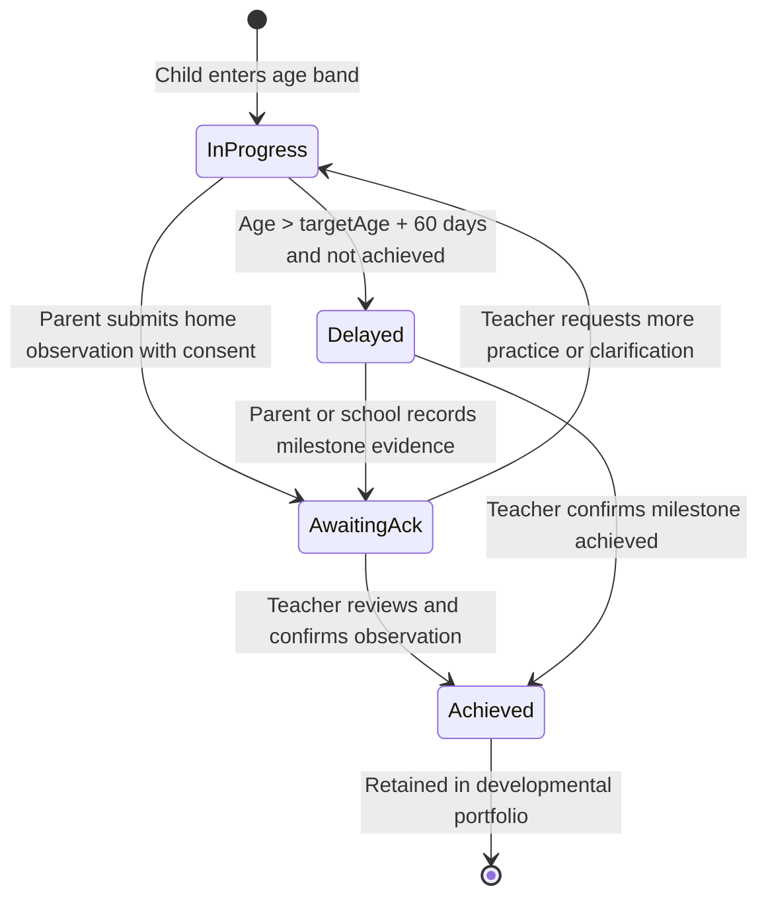

# Data Model: Child Development Milestones - Kindergarten

> Feature ID: `027-child-development-milestones-kindergarten`
> Regulatory Basis: Thông tư 51/2020/TT-BGDĐT, Thông tư 23/2010/TT-BGDĐT, Nghị định 13/2023/NĐ-CP

## Entities

| Entity | Fields | Owner | Notes |
| --- | --- | --- | --- |
| `ChildProfile` | `id`, `name`, `dob`, `classGrade`, `gender`, `avatarUrl`, `isPreschool` | `sophia-product-manager` | Distinguishes preschool (3-72 months) from high school (> 72 months). |
| `StatutoryDomain` | `key`, `nameVi`, `nameEn`, `icon`, `colorHex`, `circularReference` | `david-systems-architect` | Fixed enum of 5 statutory domains (Thể chất, Nhận thức, Ngôn ngữ, Tình cảm - Xã hội, Thẩm mỹ). |
| `MilestoneItem` | `id`, `domainKey`, `title`, `description`, `targetAgeMonths`, `standardCode`, `recommendations` | `david-systems-architect` | Standardized curriculum items mapped to age brackets. |
| `StudentMilestoneStatus` | `studentId`, `milestoneId`, `status`, `achievedDate`, `verifiedByTeacher`, `evidenceUrls` | `david-systems-architect` | Tracks completion per student: `achieved`, `awaiting_ack`, `in_progress`, `delayed`. |
| `HomeObservationEvidence` | `submissionId`, `studentId`, `milestoneId`, `parentNote`, `mediaUrls`, `consentConfirmed`, `createdAt` | `ada-qa-agent` | Stores parental observation with mandatory Decree 13/2023 consent record. |
| `PeriodicEvaluationReport` | `reportId`, `studentId`, `semester`, `teacherName`, `domainComments`, `viewedAt`, `parentFeedback` | `david-systems-architect` | Official semi-annual report card for kindergarten growth. |

## State Transitions

## Validation Rules

1. **Age Validation**: If `child.ageInMonths > 72`, the child development module is disabled, and the UI redirects to the secondary academic transcript screen.
2. **Date Validation**: For any home observation submission, `achievedDate` cannot be in the future (`achievedDate <= currentDate`).
3. **Decree 13/2023 Consent Gate**: `consentConfirmed` MUST evaluate to `true` before any submission containing images or videos is accepted by the client or persisted.
4. **Media Constraints**: Maximum 3 images (JPEG/PNG, <= 5MB each) or 1 video clip (MP4, <= 30 seconds, <= 25MB) per milestone submission.
5. **Non-ranking Display Invariant**: The aggregate radar chart must calculate percentages per domain independently; no composite ranking, percentiles, or competitive comparisons between children are permitted.
