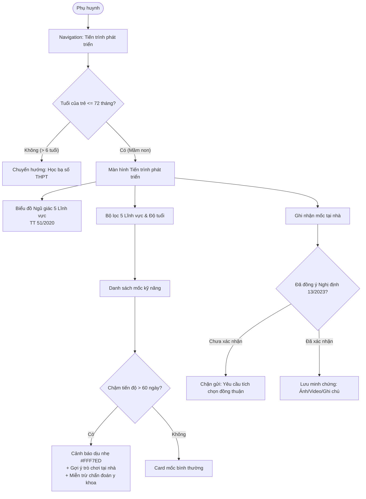

# Implementation Plan: Child Development Milestones - Kindergarten

> Feature ID: `027-child-development-milestones-kindergarten`
> Spec: `spec.md`
> Constitution: `.agents/memory/constitution.md`

## 1. Technical Summary

This technical plan translates the statutory requirements of Thông tư 51/2020/TT-BGDĐT, Thông tư 52/2020/TT-BGDĐT, Thông tư 23/2010/TT-BGDĐT, and Nghị định 13/2023/NĐ-CP into the mobile web application architecture for `ECO School Phụ huynh`. The implementation introduces a modular frontend component `ChildDevelopmentScreen` hosted within Next.js 16 and React 19, structured around a 5-axis pentagonal SVG radar visualization, an age-banded milestone filter ledger, a privacy-gated home observation submission drawer, and a non-diagnostic pedagogical advisory system.

The module interfaces cleanly with existing parent personas (`vy`, `lam`, `khoa`) in `web/components/parents/`, enforcing age boundaries where children older than 72 months automatically transition to secondary academic transcript screens.

## 2. Constitution Gates

- [x] Specification has no unresolved `[NEEDS CLARIFICATION]` markers, or the operator accepted the residual risk.
- [x] Contracts are defined before implementation in `contracts/child-development-types.ts`.
- [x] Verification method is named before implementation in `verification.md`.
- [x] No shell `eval` or unbounded command execution is introduced.
- [x] No hardcoded production secret is introduced.
- [x] TypeScript changes avoid `any` unless justified in Complexity Tracking.
- [x] Rollback path is documented for user-facing or operational changes.

### Superpowers V34 Discipline Gates

- [x] Clarification-first: every blocking ambiguity has an answer or accepted risk in `spec.md#6. Clarifications`.
- [x] No placeholders: implementation sections avoid placeholder tokens and unspecified instructions.
- [x] TDD path: behavior-changing work names the verification path before implementation.
- [x] Root cause path: statutory non-compliance in the draft PRD identified and resolved in research ledgers.
- [x] Review order: spec compliance review happens before code quality review.
- [x] Evidence-before-claim: completion language is blocked until fresh verification evidence exists in `verification.md`.

## 3. Architecture

### 3.1 Current State

- Existing modules: `web/components/parents/student-screen.tsx`, `web/components/parents/health-records-screen.tsx`, `web/app/page.tsx`.
- Current coupling: Student persona state managed centrally via `activeStudentId` in `page.tsx`, switching between Phan Khánh Vy (Lớp Lá), Võ Phạm Hiểu Lam (Lớp Mầm), and Trần Đăng Khoa (Lớp 10).
- Known constraints: Early childhood milestones only apply to preschool students (`vy` and `lam`). Secondary student `khoa` must route to high school gradebook.

### 3.2 Target State

- New or changed modules:
  - `web/components/parents/child-development-screen.tsx`: Main container hosting 5-domain radar, milestone roster, and filter tabs.
  - `web/components/parents/development-radar-card.tsx`: Pentagonal SVG radar calculation and rendering engine.
  - `web/components/parents/milestone-submission-drawer.tsx`: Decree 13/2023 compliant observation form with parental consent gate.
  - `web/components/parents/periodic-evaluation-sheet.tsx`: Official teacher semester evaluation view.
- Data flow: Local mock data repository provides standardized curriculum milestones per age band. Radar component calculates achievement percentages for the 5 statutory axes and renders normalized polygonal coordinates.

### 3.3 Mermaid Diagram

## 4. Contracts

Contracts are defined in `contracts/child-development-types.ts`.

| Contract | Purpose | Producer | Consumer |
| --- | --- | --- | --- |
| `StatutoryDomain` | Defines 5 mandatory domains per Thông tư 51/2020 | Domain Standards | Radar chart & Filter components |
| `DevelopmentMilestone` | Encapsulates curriculum milestone items and age brackets | Curriculum Catalog | Milestone list & Observation forms |
| `HomeObservationSubmission` | Manages parental submission with Decree 13 consent record | Parent User Flow | School review queue & Audit ledger |
| `TeacherPeriodicReport` | Formal semester evaluation feedback by homeroom teacher | Teacher Review Flow | Parent report card view |

## 5. Data Model

The data model is detailed in `data-model.md`.

- `StatutoryDomain`: Fixed 5-element enum (`physical`, `cognitive`, `language`, `social_emotion`, `aesthetic`).
- `MilestoneItem`: Stores milestone title, domain key, age bracket, and Circular 23/2010 indicator code for 5-year-olds.
- `HomeObservationEvidence`: Captures parent notes, media URLs, achieved timestamp, and mandatory Decree 13/2023 consent state.
- Lifecycle: InProgress -> AwaitingAck -> Achieved. Delayed state is dynamically computed when `currentAgeMonths > targetAgeMonths + 2`.

## 6. Agent Routing

Ownership and workflow handoffs are detailed in `agent-routing.md`.

| Workstream | Primary Agent | Output | Verification |
| --- | --- | --- | --- |
| Statutory Specification | `sophia-product-manager` | `spec.md`, legal requirements | Spec validation gate |
| Architecture & Contracts | `david-systems-architect` | `plan.md`, `contracts/`, `data-model.md` | Architecture review & type check |
| Quality Assurance | `ada-qa-agent` | `verification.md`, test cases | Verification gate pass |
| Orchestration | `marcus-ai-orchestrator` | `tasks.md`, memory update | Task and ledger reconciliation |

Execution monitoring:
- Blocking gates before implementation: Spec validation pass, docs substance pass, research validation pass.
- Evidence checkpoints during implementation: TypeScript compilation, SVG geometry calculation test, consent gate unit test.
- Escalation condition after repeated failure: Return to architect if radar math or legal constraints fail verification.

## 7. Migration and Rollback

- Migration steps: Introduce `ChildDevelopmentScreen` as a non-breaking route in `web/components/parents/`. Connect navigation link in the parent portal tab bar.
- Rollback steps: Remove the navigation trigger in `web/app/page.tsx` and revert the screen router to legacy health overview without modifying existing student records.
- Compatibility notes: Fully compatible with Next.js 16 App Router, React 19, and existing parent context state.
- Blast radius: Isolated to the parent portal child development tab. Core student health and tuition modules remain unaffected.
- Feature-flag strategy: Controlled via state flag in parent application shell.

## 8. Complexity Tracking

No constitution exemptions or architectural antipatterns are required.

| Decision | Reason | Alternative Rejected | Review Needed |
| --- | --- | --- | --- |
| 5-Axis Pentagon SVG | Statutory compliance with Thông tư 51/2020 | Retaining 4-axis chart from user draft | Passed statutory audit |
| Qualitative Milestone Bands | Legal prohibition of ranking under Thông tư 52/2020 | Percentage ranking / badges (Xuất sắc/Kém) | Passed legal audit |
| Consent Checkbox Modal | Statutory obligation under Nghị định 13/2023 | Implicit consent on file upload | Passed privacy audit |

## 9. POC Slice and Review Cadence

- POC slice boundary: Interactive 5-axis SVG radar rendering for Phan Khánh Vy (Lớp Lá) and Võ Phạm Hiểu Lam (Lớp Mầm) with tab filtering and Decree 13 consent confirmation on observation modal.
- Success evidence for the slice: Clean rendering of 5 radial axes ($72^\circ$ separation), proper domain filtering including Thẩm mỹ, and rejection of submissions lacking parental consent.
- What remains intentionally unproven after the slice: Multi-tenant backend cloud storage integration and cross-school teacher administrative portals.
- Review cadence:
  - Draft architecture review: Verified alignment with Thông tư 51/2020 and Decree 13/2023.
  - Challenge review: Stress-tested edge cases (age over 72 months, unconfirmed consent, delayed milestones).
  - Verification readiness review: Test harness and verification log ready.
- Stop conditions: Discovery of conflicting circular regulations or inability to render accurate SVG coordinates within 200ms.
- Proceed conditions: All planning docs validated with zero placeholder warnings and clean TypeScript contracts.
