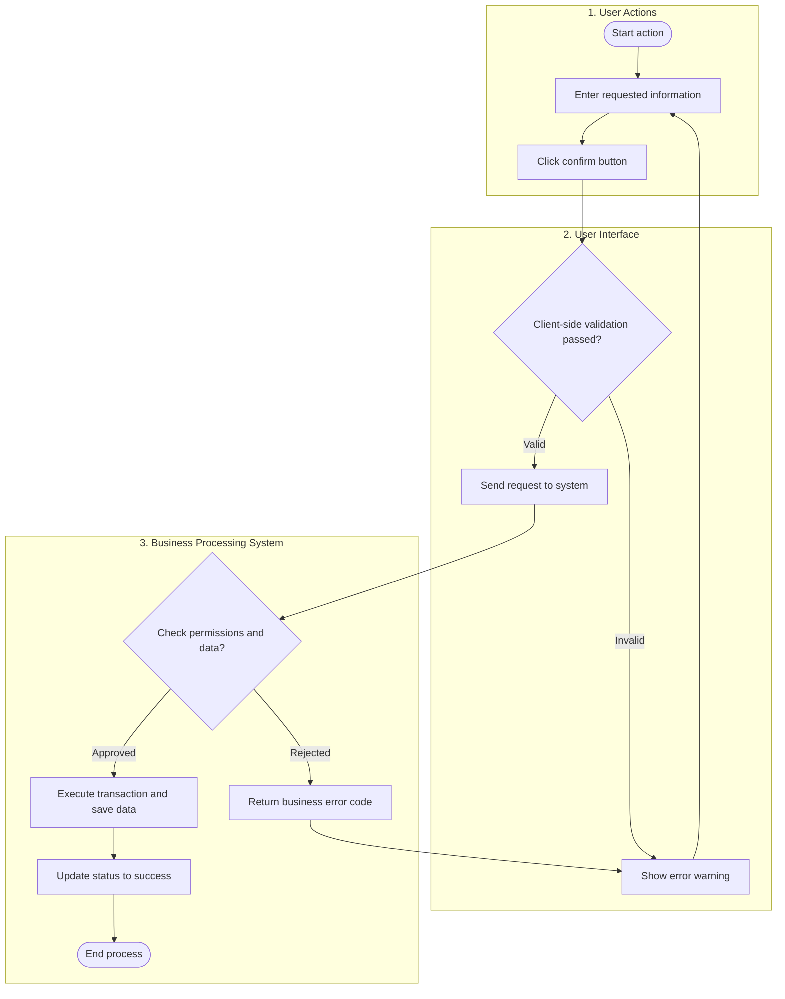
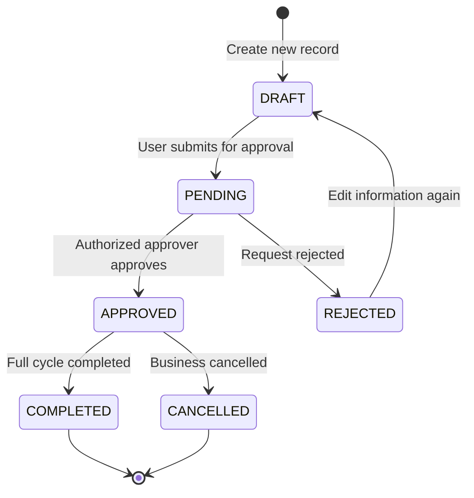
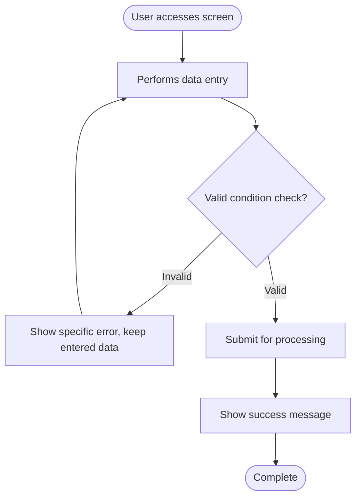

# BUSINESS ANALYSIS SPECIFICATION (BA SPECIFICATION)
## [MODULE/EPIC CODE]: [MODULE NAME]

> **Document Code:** `BA-DOC-[MODULE_CODE]`
> **Version:** `2.0 - Production Specification (Consolidated Single Document)`
> **Screen Code / Wireframe:** `[SCREEN_CODE]` (`[ROUTE_PATH]`)
> **Format Standard:** `ba-document Universal Skill V2.0`
> **Language Standard:** Expressed entirely in professional **English**, retaining international BA/ITC technical terms (`User Story`, `Acceptance Criteria`, `MUST`, `Swim Lane`, `State Diagram`, `Flowchart`, `RBAC`...).
> **Scope Boundary Principle:** Specified down to **Acceptance Criteria (AC)** level and business flow — does not go deep into source code or detailed technical implementation.

---

## TABLE OF CONTENTS
1. [SYSTEM OVERVIEW & ACTOR MATRIX](#1-system-overview--actor-matrix)
2. [MASTER PROCESS FLOWS](#2-master-process-flows)
3. [USER STORIES, ACCEPTANCE CRITERIA & DETAILED FLOW DIAGRAMS](#3-user-stories-acceptance-criteria--detailed-flow-diagrams)
4. [DATA DICTIONARY & GOLDEN BUSINESS RULES](#4-data-dictionary--golden-business-rules)

---

## 1. SYSTEM OVERVIEW & ACTOR MATRIX

### 1.1 Context & Business Objectives
[Describe the real-world operating context and the reason this module exists.]

This module addresses [3 to 5] core operational problems:
1. **[Problem Name 1]**: [Description of the real-world problem and how it's solved].
2. **[Problem Name 2]**: [Description of the real-world problem and how it's solved].
3. **[Problem Name 3]**: [Description of the real-world problem and how it's solved].
4. **[Problem Name 4]**: [Description of the real-world problem and how it's solved].
5. **[Problem Name 5]**: [Description of the real-world problem and how it's solved].

### 1.2 Actor Matrix

| No. | Actor | System Role | Responsibilities / Key Behavior in This Module |
| :---: | :--- | :--- | :--- |
| **1** | **[User actor 1]** | `[role_code_1]` | [Responsibilities, permissions, entry screens] |
| **2** | **[User actor 2]** | `[role_code_2]` | [Responsibilities, permissions, entry screens] |
| **3** | **[User actor 3]** | `[role_code_3]` | [Responsibilities, permissions, entry screens] |
| **4** | **Automated System (System Engine)** | `system` | [Automated calculations, permission checks, background notifications] |

### 1.3 Interface Layout Architecture or Operating Modes

```
┌────────────────────────────────────────────────────────────────────────────────────────┐
│                                  HEADER / NAVIGATION BAR                                 │
├──────────────────────────────┬─────────────────────────────────────────────────────────┤
│           LEFT PANEL          │                      RIGHT PANEL                        │
│    [Filters / List]           │              [Detail / Main action area]                │
│                                │                                                         │
│                                │                                                         │
└──────────────────────────────┴─────────────────────────────────────────────────────────┘
```

---

## 2. MASTER PROCESS FLOWS

### 2.1 Swim Lane: Multi-Actor Business Process



### 2.2 Business State Lifecycle Diagram



#### State Transition Table
| # | State | Meaning | Trigger Event | Next State |
| :-: | :--- | :--- | :--- | :--- |
| **1** | `DRAFT` | Draft record, being composed | User clicks create new | `PENDING` |
| **2** | `PENDING` | Awaiting review/approval | User clicks submit for approval | `APPROVED` or `REJECTED` |
| **3** | `APPROVED` | Validly approved | Authorized approver clicks Approve | `COMPLETED` or `CANCELLED` |
| **4** | `REJECTED` | Approval rejected | Approver rejects with a reason | `DRAFT` |
| **5** | `COMPLETED` | Business process fully completed | Final step processed | End (`[*]`) |
| **6** | `CANCELLED` | Cancelled | User or admin cancels | End (`[*]`) |

---

## 3. USER STORIES, ACCEPTANCE CRITERIA & DETAILED FLOW DIAGRAMS

### US-[MODULE]-001: [Feature Name 1]

**US ID:** `US-[MODULE]-001`
**Summary:** [Brief description of the feature's purpose, 1-2 sentences]
**User Story:**
> As a **[Specific actor/role]**,
> I want **[the action or capability]**,
> So that **[the business value or benefit]**.

#### Acceptance Criteria Summary
| ID | Feature | Acceptance Criteria |
| :---: | :--- | :--- |
| **1.1** | [Criterion name 1] | The system MUST [specific, testable requirement] |
| **1.2** | [Criterion name 2] | The system MUST [specific, testable requirement] |
| **1.3** | [Criterion name 3] | The system MUST [specific, testable requirement] |
| **1.4** | [Criterion name 4] | The system MUST [specific, testable requirement] |

#### Detailed Business Flow Diagram (Mermaid Flowchart)


#### Detailed Acceptance Criteria Specification (Standard 6-Step Framework)
1. **Display Requirements:**
   - Display location: [Describe location].
   - Default state: [Describe initial state].
   - UI components: [Buttons, input fields, tables, icons].
2. **Validation Rules:**
   - Required-field constraints: [List of fields that cannot be empty].
   - Data format: [Email, phone number, date format constraints...].
   - Logic constraints: [Min/max thresholds, numeric or logical conditions...].
3. **Processing Logic:**
   - Step 1: [System receives and validates input].
   - Step 2: [System computes or transforms data].
   - Step 3: [System updates the database and changes state].
4. **Exception & Error Handling:**
   - When [error case 1]: Show message `[Message content]`.
   - When [error case 2]: Show message `[Message content]`.
5. **Performance & Response Times:**
   - Immediate UI response time: $< 500\text{ms}$.
   - Transaction execution time: $< 2\text{s}$.
6. **Security & Permissions:**
   - Permissions (RBAC): Only `[role_list]` roles are allowed to perform this action.
   - Prevention mechanism: Double-click prevention lock.

---

<!-- [Note: Repeat the structure above for subsequent User Stories: US-[MODULE]-002, US-[MODULE]-003...] -->

---

## 4. DATA DICTIONARY & GOLDEN BUSINESS RULES

### 4.1 Entity Data Dictionary

#### Table / Entity: `[entity_name]`
| Field Name | Data Type | Key | Required | Business Description & Constraints |
| :--- | :--- | :---: | :---: | :--- |
| `id` | `UUID` / `String` | PK | ✅ | Globally unique identifier |
| `code` | `VARCHAR(50)` | UK | ✅ | Unique business identifier code |
| `status` | `VARCHAR(32)` | - | ✅ | Status: `DRAFT`, `PENDING`, `APPROVED`... |
| `created_at` | `TIMESTAMP` | - | ✅ | Record creation timestamp |

---

### 4.2 Golden Business Rules (15–20 Rules)

- **`BR-[MODULE]-001` ([Rule Name 1])**: [Description of the invariant rule protecting business integrity].
- **`BR-[MODULE]-002` ([Rule Name 2])**: [Description of the invariant rule protecting business integrity].
- **`BR-[MODULE]-003` ([Rule Name 3])**: [Description of the invariant rule protecting business integrity].
- **`BR-[MODULE]-004` ([Rule Name 4])**: [Description of the invariant rule protecting business integrity].
- **`BR-[MODULE]-005` ([Rule Name 5])**: [Description of the invariant rule protecting business integrity].
- **`BR-[MODULE]-006` ([Rule Name 6])**: [Description of the invariant rule protecting business integrity].
- **`BR-[MODULE]-007` ([Rule Name 7])**: [Description of the invariant rule protecting business integrity].
- **`BR-[MODULE]-008` ([Rule Name 8])**: [Description of the invariant rule protecting business integrity].
- **`BR-[MODULE]-009` ([Rule Name 9])**: [Description of the invariant rule protecting business integrity].
- **`BR-[MODULE]-010` ([Rule Name 10])**: [Description of the invariant rule protecting business integrity].
- **`BR-[MODULE]-011` ([Rule Name 11])**: [Description of the invariant rule protecting business integrity].
- **`BR-[MODULE]-012` ([Rule Name 12])**: [Description of the invariant rule protecting business integrity].
- **`BR-[MODULE]-013` ([Rule Name 13])**: [Description of the invariant rule protecting business integrity].
- **`BR-[MODULE]-014` ([Rule Name 14])**: [Description of the invariant rule protecting business integrity].
- **`BR-[MODULE]-015` ([Rule Name 15])**: [Description of the invariant rule protecting business integrity].
