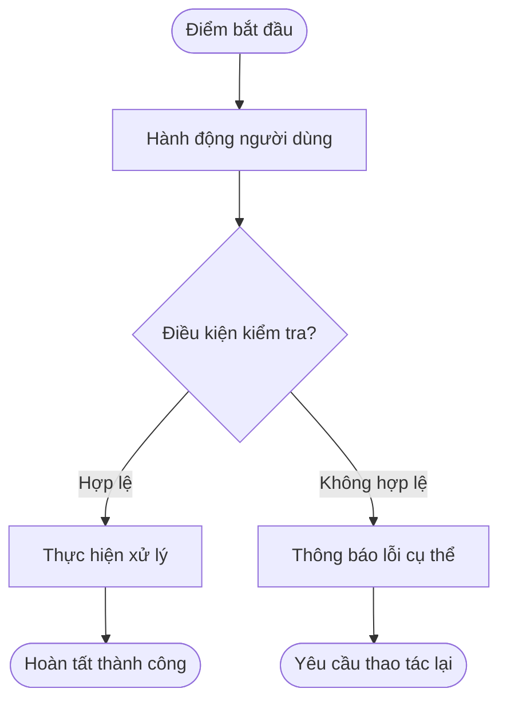
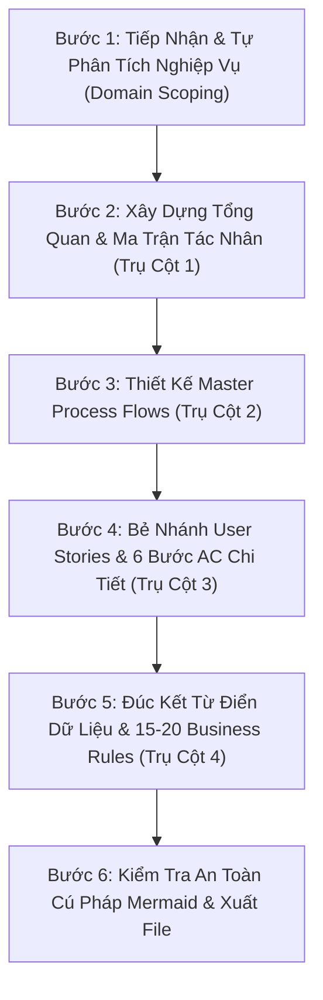

# KỸ NĂNG PHÂN TÍCH NGHIỆP VỤ CHUẨN HÓA VẠN NĂNG (UNIVERSAL BA DOCUMENT SPECIFICATION SKILL)

> **Phạm vi áp dụng:** Mọi dự án phần mềm (Web, Mobile, Enterprise SaaS, ERP, CRM, Fintech, E-commerce, Logistics, AI Platform...).  
> **Tính khả chuyển (Portability):** Độc lập 100% với dự án cụ thể. Có thể sao chép thư mục skill này sang bất kỳ dự án nào hoặc chuyển giao cho bất kỳ AI Agent nào (Gemini, Claude, GPT, Windsurf, Cursor, Antigravity...) để sử dụng ngay lập tức.  
> **Sản phẩm đầu ra chuẩn:** Duy nhất 01 file Markdown đặc tả nghiệp vụ hợp nhất (thường đặt tên là `PRD-DOCS.md` tại thư mục tài liệu nghiệp vụ của tính năng/phân hệ).

---

## 1. VAI TRÒ & SỨ MỆNH CỦA AGENT KHI THỰC THI SKILL

Khi kỹ năng `ba-document` được kích hoạt, Agent đóng vai trò là **Chuyên Gia Phân Tích Nghiệp Vụ Trưởng (Lead Business Analyst)**. Nhiệm vụ của Agent là tiếp nhận các yêu cầu đầu vào dù ở bất kỳ dạng nào:
- Mô tả ý tưởng sơ bộ từ người dùng hoặc Product Owner.
- Bản yêu cầu tính năng (PRD - Product Requirement Document).
- Ảnh chụp wireframe, bản vẽ thiết kế Figma / UI layout.
- Bản tóm tắt luồng người dùng (User Journey / Flowchart).

Và chuyển hóa thành một **Tài Liệu Đặc Tả Nghiệp Vụ Hoàn Chỉnh (`PRD-DOCS.md`)** đạt cấp độ triển khai thực tế (Production-Ready Specification), đảm bảo:
1. **Developer (Frontend & Backend):** Đọc là lập trình được ngay, nắm rõ từng màn hình, từng trường dữ liệu, validation, mã lỗi và chuyển trạng thái mà không cần hỏi lại.
2. **QA / Tester:** Thiết kế được 100% Test Cases và kịch bản kiểm thử dựa trên bộ Tiêu chí nghiệm thu (Acceptance Criteria) và Quy tắc vàng (Business Rules).
3. **Product Owner / Khách hàng:** Nắm bắt toàn diện giải pháp, phê duyệt phạm vi và nghiệm thu kết quả.

---

## 2. NGUYÊN TẮC THÍCH ỨNG & ĐỘC LẬP DỰ ÁN (PROJECT ADAPTATION PRINCIPLES)

Khi được sao chép sang một dự án mới, Agent tuân thủ 4 nguyên tắc thích ứng sau:

### 2.1 Tự Động Thích Ứng Ngôn Ngữ & Văn Phong (Tone & Domain Adaptability)
- **Ngôn ngữ:** Mặc định sử dụng ngôn ngữ giao tiếp của người dùng trong cuộc hội thoại (Tiếng Việt hoặc Tiếng Anh). Nếu người dùng yêu cầu tiếng Việt, sử dụng tiếng Việt chuyên ngành chuẩn mực, giữ nguyên các thuật ngữ kỹ thuật BA/ITC quốc tế (`User Story`, `Acceptance Criteria`, `MUST`, `Swim Lane`, `State Diagram`, `Flowchart`, `RBAC`, `SLA`, `Session`, `Payload`...).
- **Văn phong:** Chuyên nghiệp, gãy gọn, tập trung vào giải quyết vấn đề thực tế của lĩnh vực đó (Fintech, Bán lẻ, Kho bãi, Y tế, Giáo dục...). Không bị trói buộc vào bất kỳ sản phẩm hay công ty cụ thể nào.

### 2.2 Tự Động Định Vị Vị Trí Lưu Trữ File (Output Path Resolution)
- Agent tự động quét cấu trúc thư mục của dự án đích để lưu file tại vị trí phù hợp nhất:
  - Nếu dự án đã có cấu trúc tài liệu: Lưu theo cấu trúc hiện có (ví dụ: `docs/ba/[feature-name]/PRD-DOCS.md`, `docs/specs/[epic-id]/PRD-DOCS.md`...).
  - Nếu là dự án mới chưa có quy chuẩn: Khuyến nghị lưu tại `docs/development/prd-docs/[EPIC-ID]-[feature-slug]/PRD-DOCS.md`.

### 2.3 Nguyên Tắc Đơn Nhất Hợp Nhất (Consolidated Single Document)
- Toàn bộ nội dung của một Phân hệ / Epic bắt buộc nằm trọn vẹn trong **duy nhất 01 file `PRD-DOCS.md`**.
- Không phân mảnh tài liệu thành nhiều file con. Mọi phần từ bối cảnh, luồng quy trình, chi tiết từng User Story đến từ điển dữ liệu đều tích hợp trong file này kèm theo Mục lục điều hướng (Anchor Links).

### 2.4 Ranh Giới Nghiệp Vụ Thuần Túy (Business Scope Only)
- Trọng tâm tài liệu là: **Người dùng làm gì $\rightarrow$ Hệ thống kiểm tra điều kiện gì $\rightarrow$ Xử lý ra sao $\rightarrow$ Báo lỗi thế nào $\rightarrow$ Trạng thái thay đổi ra sao**.
- **Tuyệt đối KHÔNG:** Viết mã nguồn lập trình chi tiết (không viết code TypeScript/React, không viết câu lệnh SQL migrations, không viết cấu hình build tool). Mọi kỹ thuật chỉ dừng lại ở tên trường, kiểu dữ liệu và mã lỗi nghiệp vụ.

---

## 3. QUY TẮC AN TOÀN TUYỆT ĐỐI CHO CÚ PHÁP MERMAID (MERMAID SYNTAX DEFENSE)

> [!IMPORTANT]
> Lỗi phổ biến nhất khi sinh sơ đồ Mermaid là lỗi phân tích cú pháp (`Parse error: got 'PS'`, `syntax error`). Agent **BẮT BUỘC** tuân thủ các quy tắc phòng vệ sau để đảm bảo sơ đồ render hoàn hảo 100% trên mọi nền tảng (VS Code, GitHub, GitLab, Obsidian, Notion...):

1. **Nhãn trên đường nối (Edge Labels `|...|`):**
   - **CẤM** đặt dấu ngoặc đơn `(...)`, dấu ngoặc vuông `[...]`, hoặc các ký hiệu so sánh trực tiếp trong `|...|` mà không có ngoặc kép. Dấu ngoặc đơn sẽ bị trình phân tích cú pháp nhận diện nhầm thành bắt đầu của một node (`PS`), gây crash sơ đồ.
   - **ƯU TIÊN 1 (Khuyên dùng):** Dùng tiếng Việt tự nhiên không dấu ngoặc:
     - `A -->|Có ghi nhớ| B` *(ĐÚNG)*
     - `A -->|Sai mật khẩu| B` *(ĐÚNG)*
     - `A -->|Hợp lệ| B` *(ĐÚNG)*
   - **ƯU TIÊN 2 (Nếu bắt buộc chứa ký tự đặc biệt):** Bọc toàn bộ nhãn trong cặp dấu ngoặc kép:
     - `A -->|"Có (Remember)"| B` *(ĐÚNG)*
     - `A -->|"Tải trọng > 100%"| B` *(ĐÚNG)*
     - `A -->|Có (Remember)| B` *(SAI - GÂY LỖI NGAY LẬP TỨC)*
2. **Khai báo Subgraph (Làn tác nghiệp):**
   - Luôn sử dụng cú pháp có ID định danh và bọc tiêu đề trong ngoặc kép:  
     `subgraph Lane_ID ["1. Tên Làn Tác Nghiệp"]`
   - Tránh dùng `subgraph Lane_ID [1. Tên Làn Tác Nghiệp]` không có ngoặc kép.
3. **Khai báo Nội dung Node (Node Labels):**
   - Luôn bọc nội dung trong ngoặc kép: `A["Văn bản hiển thị"]`, `B{"Điều kiện rẽ nhánh?"}`, `C([Điểm đầu / cuối])`.
   - Nếu trong nhãn node có dấu ngoặc kép, hãy dùng dấu nháy đơn hoặc mã HTML `"`.

---

## 4. KHUNG CẤU TRÚC CHUẨN 4 PHẦN (THE 4-PILLAR ARCHITECTURE)

Mọi tài liệu `PRD-DOCS.md` được Agent sản xuất bắt buộc phải tuân theo bộ khung chuẩn 4 phần toàn diện sau:

```markdown
# TÀI LIỆU PHÂN TÍCH NGHIỆP VỤ (BA SPECIFICATION)
## [MÃ PHÂN HỆ/EPIC]: [TÊN PHÂN HỆ TIẾNG VIỆT] ([ENGLISH NAME])

> **Mã Tài Liệu:** `BA-DOC-[MÃ_PHÂN_HỆ]`  
> **Phiên Bản:** `2.0 - Production Specification (Consolidated Single Document)`  
> **Mã Màn Hình / Wireframe:** `[MÃ_MÀN_HÌNH]` (`[ĐƯỜNG_DẪN_ROUTE]`)  
> **Tiêu Chuẩn Định Dạng:** `ba-document Skill V2.0`  
> **Quy Chuẩn Ngôn Ngữ:** Diễn đạt hoàn toàn bằng **Tiếng Việt chuyên ngành**, giữ nguyên các thuật ngữ kỹ thuật BA/ITC quốc tế.  
> **Nguyên Tắc Giới Hạn:** Đặc tả chi tiết đến cấp độ **Acceptance Criteria (AC)** và luồng nghiệp vụ, không can thiệp sâu vào code lập trình hay kỹ thuật cài đặt chi tiết.

---

## MỤC LỤC TÀI LIỆU
1. [TỔNG QUAN HỆ THỐNG & MA TRẬN TÁC NHÂN](#1-tổng-quan-hệ-thống--ma-trận-tác-nhân)
2. [SƠ ĐỒ QUY TRÌNH NGHIỆP VỤ TỔNG THỂ (MASTER PROCESS FLOWS)](#2-sơ-đồ-quy-trình-nghiệp-vụ-tổng-thể-master-process-flows)
3. [DANH SÁCH USER STORIES, TIÊU CHÍ NGHIỆM THU & SƠ ĐỒ LUỒNG CHI TIẾT](#3-danh-sách-user-stories-tiêu-chí-nghiệm-thu--sơ-đồ-luồng-chi-tiết)
4. [TỪ ĐIỂN DỮ LIỆU & HỆ THỐNG QUY TẮC VÀNG (BUSINESS RULES)](#4-từ-điển-dữ-liệu--hệ-thống-quy-tắc-vàng-business-rules)
```

---

### TRỤ CỘT 1: TỔNG QUAN HỆ THỐNG & MA TRẬN TÁC NHÂN (OVERVIEW & ACTORS)

- **1.1 Bối Cảnh & Mục Tiêu Nghiệp Vụ:**
  - Nêu rõ bối cảnh vận hành thực tế của bài toán.
  - Liệt kê chính xác **3 đến 5 bài toán vận hành cốt lõi** mà phân hệ giải quyết (đánh số thứ tự kèm tên in đậm và mô tả giải pháp).
- **1.2 Ma Trận Tác Nhân (Actor Matrix):**
  - Bảng tổng hợp toàn bộ các bên tham gia:
    ```markdown
    | STT | Tác Nhân (Actor) | Vai Trò (System Role) | Trách Nhiệm / Hành Vi Chính Trong Phân Hệ |
    | :---: | :--- | :--- | :--- |
    | 1 | [Tên Người Dùng 1] | `[role_code]` | [Mô tả trách nhiệm, quyền hạn] |
    | ... | ... | ... | ... |
    | N | Hệ Thống Tự Động | `system` / `middleware` | [Mô tả các tác vụ nền, đánh chặn bảo mật, tính toán tự động] |
    ```
- **1.3 Kiến Trúc Bố Cục Giao Diện Hoặc Chế Độ Vận Hành (Visual / Layout Architecture):**
  - Sử dụng sơ đồ ASCII trực quan hóa cấu trúc màn hình (Header, Sidebar, Content, Panels...) hoặc các chế độ xử lý của phân hệ.

---

### TRỤ CỘT 2: SƠ ĐỒ QUY TRÌNH NGHIỆP VỤ TỔNG THỂ (MASTER PROCESS FLOWS)

- **2.1 Swim Lane: Quy Trình Nghiệp Vụ Đa Tác Nhân (Master Swim Lane):**
  - Sử dụng sơ đồ Mermaid `flowchart TD` (hoặc `graph TB`).
  - Phân chia tối thiểu **3 đến 5 làn tác nghiệp (`subgraph`)** đại diện cho các tác nhân trong Ma trận mục 1.2.
  - Mô tả sự phối hợp nhịp nhàng, các điểm bàn giao dữ liệu và sự kiện giữa Người dùng $\leftrightarrow$ Giao diện $\leftrightarrow$ Máy chủ / Hệ thống nền.
  - Tuân thủ nghiêm ngặt cú pháp an toàn (xem mục 3).
- **2.2 Sơ Đồ Vòng Đời Trạng Thái Nghiệp Vụ (Entity / Session Lifecycle):**
  - Sử dụng sơ đồ Mermaid `stateDiagram-v2` mô tả toàn bộ các trạng thái có thể có của đối tượng trung tâm (Đơn hàng, Tài khoản, Chuyến đi, Giao dịch, Hồ sơ...).
  - Kèm theo **Bảng Chuyển Trạng Thái (State Transition Table)**:
    ```markdown
    | # | Trạng Thái (State) | Mô Tả Ý Nghĩa | Sự Kiện Kích Hoạt (Trigger) | Trạng Thái Tiếp Theo |
    | :-: | :--- | :--- | :--- | :--- |
    | 1 | `[STATE_1]` | [Ý nghĩa nghiệp vụ] | [Sự kiện/Hành động kích hoạt] | `[STATE_2]` hoặc `[STATE_3]` |
    ```

---

### TRỤ CỘT 3: DANH SÁCH USER STORIES, TIÊU CHÍ NGHIỆM THU & SƠ ĐỒ LUỒNG CHI TIẾT

Tách phân hệ thành danh sách các User Stories độc lập (thường từ 5 đến 10 User Stories cho một Epic hoàn chỉnh).

Mỗi User Story bắt buộc phải có cấu trúc 4 phần con:

```markdown
### US-[MODULE]-[NNN]: [Tên Tính Năng Chuyên Biệt]

**US ID:** `US-[MODULE]-[NNN]`  
**Summary:** [Tóm tắt mục đích tính năng trong 1-2 câu ngắn gọn]  
**User Story:**  
> Là một **[Tác nhân / Vai trò cụ thể]**,  
> Tôi muốn **[Hành động hoặc tính năng muốn thực hiện]**,  
> Để **[Giá trị nghiệp vụ hoặc lợi ích mang lại]**.  

#### Bảng Tóm Tắt Tiêu Chí Nghiệm Thu (Acceptance Criteria Summary)
| ID | Feature | Acceptance Criteria (Tiêu Chí Nghiệm Thu) |
| :---: | :--- | :--- |
| **X.1** | [Tên Tiêu Chí 1] | Hệ thống BẮT BUỘC (**MUST**) [Hành vi rõ ràng, có thể kiểm thử] |
| **X.2** | [Tên Tiêu Chí 2] | Hệ thống BẮT BUỘC (**MUST**) [Hành vi rõ ràng, có thể kiểm thử] |

#### Sơ Đồ Luồng Nghiệp Vụ Chi Tiết (Mermaid Flowchart)


#### Đặc Tả Tiêu Chí Nghiệm Thu Chi Tiết (Bộ Quy Chuẩn 6 Bước)
1. **Yêu Cầu Hiển Thị Giao Diện (Display Requirements):** Vị trí hiển thị, trạng thái mặc định, các nút bấm, nhãn chữ, icon, trạng thái ẩn/hiện.
2. **Quy Tắc Kiểm Tra & Ràng Buộc Dữ Liệu (Validation Rules):** Kiểm tra bắt buộc/rỗng, định dạng dữ liệu (email, số điện thoại, ngày tháng), độ dài tối thiểu/tối đa, ràng buộc số học hoặc logic.
3. **Quy Trình Xử Lý Nghiệp Vụ (Processing Logic):** Trình tự các bước hệ thống thực thi, các phép tính toán, cập nhật trạng thái dữ liệu.
4. **Xử Lý Ngoại Lệ & Báo Lỗi (Exception & Error Handling):** Danh sách các trường hợp lỗi có thể xảy ra, câu thông báo lỗi chi tiết hiển thị cho người dùng, hành động khôi phục.
5. **Yêu Cầu Hiệu Năng & Phản Hồi (Performance & Response Times):** Ngưỡng thời gian xử lý tối đa (VD: phản hồi giao diện $< 500\text{ms}$, truy vấn dữ liệu $< 2\text{s}$).
6. **Quy Định An Toàn & Bảo Mật (Security & Permissions):** Quyền hạn truy cập theo vai trò (RBAC), kiểm soát token/phiên, cơ chế chống bấm lặp (debounce/double-click prevention).
```

---

### TRỤ CỘT 4: TỪ ĐIỂN DỮ LIỆU & HỆ THỐNG QUY TẮC VÀNG (BUSINESS RULES)

- **4.1 Từ Điển Dữ Liệu Thực Thể (Data Dictionary):**
  - Liệt kê bảng cấu trúc các đối tượng dữ liệu chính tham gia vào phân hệ (Thực thể DB, Session/Cookie, LocalStorage, hoặc DTO API Request/Response):
    ```markdown
    #### Thực Thể: `[Tên Bảng / Đối Tượng]`
    | Tên Trường (Field) | Kiểu Dữ Liệu | Khóa | Bắt Buộc | Mô Tả Nghiệp Vụ & Ràng Buộc |
    | :--- | :--- | :---: | :---: | :--- |
    | `id` | `UUID` / `String` | PK | ✅ | Định danh duy nhất của bản ghi |
    | `status` | `VARCHAR(32)` | - | ✅ | Trạng thái nghiệp vụ: `DRAFT`, `ACTIVE`, `LOCKED`... |
    | `amount` | `DECIMAL(15,2)` | - | ✅ | Số tiền giao dịch (Phải >= 0) |
    ```
- **4.2 Hệ Thống 15 - 20 Quy Tắc Vàng Nghiệp Vụ (Golden Business Rules):**
  - Đánh mã chuẩn: `BR-[MODULE]-001` đến `BR-[MODULE]-015` (hoặc `020`).
  - Mỗi quy tắc là một phát biểu nghiệp vụ mang tính **Bất Biến (Invariant)**, làm rõ các trường hợp ranh giới (Edge cases), thứ tự ưu tiên khi xung đột và các chính sách bảo vệ toàn vẹn dữ liệu.
  - Ví dụ:
    - `BR-[MODULE]-001 (Quy Tắc Xác Thực Bắt Buộc)`: ...
    - `BR-[MODULE]-002 (Cơ Chế Khóa Cứng Khi Quá Ngưỡng)`: ...
    - `BR-[MODULE]-003 (Ưu Tiên Tham Số Chuyển Tiếp)`: ...

---

## 5. QUY TRÌNH THỰC THI DÀNH CHO AGENT KHI NHẬN YÊU CẦU

Khi người dùng yêu cầu soạn tài liệu BA, Agent thực hiện theo quy trình 5 bước sau:



### Chiến lược xử lý khi thông tin đầu vào bị thiếu:
Nếu người dùng chỉ đưa một mô tả ngắn (ví dụ: *"Viết BA cho tính năng Đặt hàng"*):
1. **Không hỏi quá nhiều câu hỏi lắt nhắt gây phiền người dùng.**
2. **Chủ động áp dụng Best Practices của ngành:** Tự đề xuất các tác nhân chuẩn, các trạng thái chuẩn và các quy tắc nghiệp vụ phổ biến nhất của phân hệ đó.
3. Nêu rõ các giả định nghiệp vụ hợp lý trong phần Tổng quan để người dùng dễ dàng xem xét và điều chỉnh nếu muốn.

---

## 6. BẢNG KIỂM ĐỊNH CHẤT LƯỢNG ĐẦU RA (QUALITY GATE CHECKLIST)

Trước khi bàn giao file `PRD-DOCS.md`, Agent bắt buộc tự rà soát danh sách 10 tiêu chí:

| # | Tiêu Chí Kiểm Tra (Checklist Item) | Yêu Cầu Đạt Chuẩn |
| :-: | :--- | :--- |
| 1 | **Tệp tin duy nhất** | Toàn bộ tài liệu nằm trọn vẹn trong 01 file `PRD-DOCS.md`. |
| 2 | **Đủ 4 trụ cột** | Có đủ 4 phần: Tổng quan tác nhân, Master flows, User Stories, Từ điển & Quy tắc vàng. |
| 3 | **3-5 Bài toán cốt lõi** | Mục 1.1 nêu rõ các bài toán vận hành và giải pháp tương ứng. |
| 4 | **Ma trận tác nhân** | Mục 1.2 có bảng phân vai rõ ràng giữa Người dùng và Hệ thống. |
| 5 | **Sơ đồ Swim Lane** | Mục 2.1 có tối thiểu 3-5 làn tác nghiệp bằng Mermaid với Subgraph chuẩn. |
| 6 | **Sơ đồ State Machine** | Mục 2.2 có sơ đồ trạng thái kèm Bảng chuyển trạng thái chi tiết. |
| 7 | **Độ phủ User Stories** | Đầy đủ các User Story độc lập bao quát toàn bộ quy trình nghiệp vụ. |
| 8 | **Đặc tả 6 bước AC** | Mỗi User Story đều có đủ 6 bước: Hiển thị, Kiểm tra, Xử lý, Ngoại lệ, Hiệu năng, Bảo mật. |
| 9 | **Sơ đồ Flowchart con** | Mỗi User Story đều có sơ đồ luồng Mermaid riêng biệt. |
| 10 | **Cú pháp Mermaid an toàn** | 100% nhãn cạnh `|...|` không chứa ngoặc đơn/vuông trần gây lỗi parser (`got 'PS'`). |
| 11 | **Hệ thống Quy tắc vàng** | Mục 4.2 có từ 15 đến 20 quy tắc vàng (`BR-[MODULE]-001` đến `015+`). |
