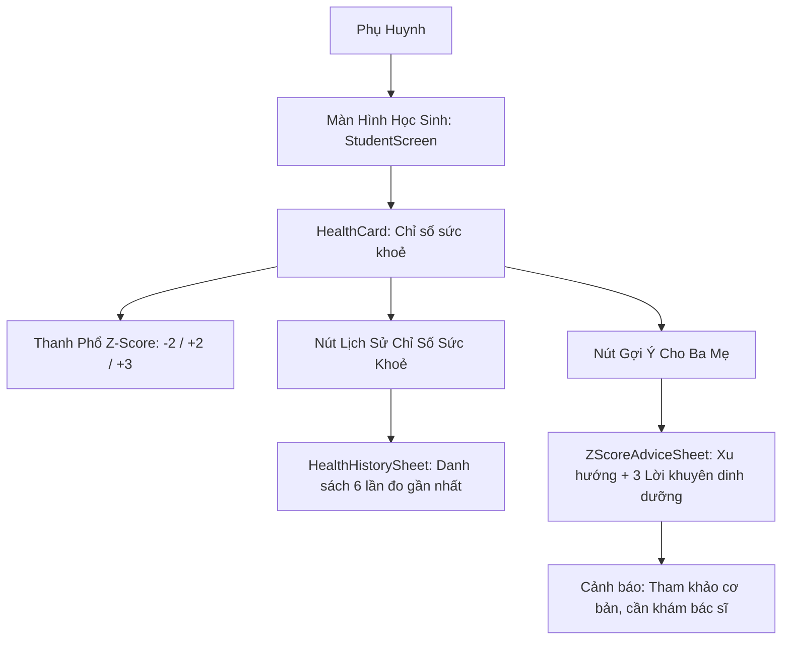

# Epic: Student Health Tracking & BMI/Z-Score Card

## Jira Story

- Story: As a parent, I want to monitor my child's physical height, weight, BMI, and WHO BMI-for-age Z-score directly on their dedicated student screen, view historical checkup logs, and access tailored parental advice sheets so that I can make informed decisions about their nutrition and physical activity.
- Jira issue type: Epic
- Acceptance owner: `sophia-product-manager`
- Product hypothesis: Presenting WHO-aligned Z-scores with color-coded classification and actionable, non-diagnostic lifestyle pointers will empower parents to track physical growth objectively without alarming them with overly clinical terminology.
- Research evidence: Ministry of Health Decision No. 3777/QĐ-BYT (16/12/2024), legacy mockups `Hoc sinh homescreen_Phan Khanh Vy.PNG` and `Hoc sinh homescreen_Tran Dang Khoa.PNG`.

## Priority

- Priority: P0 (Blocker)
- Severity if missed: Critical — Parents rely on the physical growth section to evaluate student health updates provided by school medical checkups.
- Rationale: First core feature ported and enriched on the Học sinh screen in Next.js.
- Target release: Phase 1 MVP

## Outcome

This epic delivers the student physical health monitoring subsystem in `web/components/parents/student-screen.tsx`. It provides parents with immediate visibility into their child's physical metrics (height in cm, weight in kg, derived BMI index), an official WHO BMI-for-age Z-score spectrum gauge with piecewise-linear marker positioning, a 6-month historical log sheet, and a dedicated "Gợi ý cho ba mẹ" advice sheet.

The architectural decision to lead with Z-scores rather than raw adult BMI bands ensures clinical validity across children aged 2 through 18, because raw BMI cutoffs do not account for natural childhood growth spurts. By comparing the two most recent checkups, the system computes coarse developmental trends (increasing, decreasing, or stable) to deliver reassuring, non-prescriptive advice.

## PM Notes

- PM-visible status: Fully implemented and verified in Next.js with clean compilation.
- Demo narrative: Parent opens the app, taps Phan Khánh Vy (Z-score 0.4, Normal), inspects the green band, taps "Gợi ý cho ba mẹ", and reads the stable trajectory with balanced nutrition advice. The parent then taps "Đổi", selects Trần Đăng Khoa (Z-score 2.3, Overweight), and observes the orange badge, increased trend line (+0.2), and physical activity suggestions.
- Acceptance impact: Unlocks physical development tracking across all three mock student personas.
- Scope change since planning: Replaced raw adult BMI gauge with official MOH Decision 3777/QĐ-BYT Z-score classification, combined metrics into single history view, and introduced the "Gợi ý cho ba mẹ" sheet.
- Risk or open decision: The advice provided is deliberately non-diagnostic to prevent medical liability; a clear disclaimer instructs parents to consult certified pediatricians for individualized care.

## Relationship Map

| Relation | Target | Label | Rationale |
| --- | --- | --- | --- |
| Enables | `F-001-001-student-health-card` | `ENABLES` | This epic establishes the physical health tracking boundary for child monitoring. |
| Uses | `M-001-001-student-health-card` | `USES` | Consumes health card rendering components and Z-score calculation utilities. |
| Implements | `docs/prd.md` | `IMPLEMENTS` | Realizes Section 2.1 of the Product Requirements Document. |
| Relates to | `P-001-001-student-detail-screen` | `RELATES_TO` | Renders embedded within the student cockpit detail view. |

## Issues

| Issue ID | Source | Priority | Status | Owner | Evidence | Resolution |
| --- | --- | --- | --- | --- | --- | --- |
| `ISSUE-HEALTH-001` | Code review | P1 | Closed | `benny-frontend-engineer` | `student-screen.tsx` line 151 | Handled single-record edge cases where delta trend computation lacks prior checkup |
| `ISSUE-HEALTH-002` | Design review | P2 | Closed | `benny-frontend-engineer` | `globals.css` line 1159 | Extracted bottom sheet into `OverlayPortal` to prevent background scroll interference |

## Acceptance Criteria

- [x] Criterion 1: HealthCard renders current height (cm), weight (kg), derived BMI, Z-score numeric value, and Asian WHO classification badge.
- [x] Criterion 2: Gauge marker position is piecewise-linearly interpolated across standard cutoffs (-4, -2, 2, 3, 4) to ensure accurate visual alignment.
- [x] Criterion 3: Tapping `"💡 Gợi ý cho ba mẹ ›"` opens `ZScoreAdviceSheet` displaying trend comparison against previous checkup if available.
- [x] Criterion 4: Advice sheet presents 3 tailored dietary and activity bullet points matching the child's band (`under`, `normal`, `over`, `obese`).
- [x] Criterion 5: Tapping `"Lịch sử chỉ số sức khoẻ"` opens sheet listing up to the 6 most recent checkup records in chronological order.

## Mermaid Diagram

## Evidence

- Tests: TypeScript compilation `npx tsc --noEmit` verified with zero errors; Next.js production build verified successful.
- Build/lint: Clean Next.js 16 webpack bundle compilation without runtime warnings.
- Review notes: Verified across test personas `vy` (normal), `khoa` (overweight), and `lam` (underweight) with expected advice variations.

## Work Log

- Date: 2026-10-05
  - Action: Ported Z-score health gauge, combined history metrics, and implemented "Gợi ý cho ba mẹ" advice sheet.
  - Agent/skill: `sophia-product-manager`
  - Evidence: Commit `9dfd9ed` and local server response `200 OK` on `http://localhost:3100`.
  - Docs updated before code: Reconciled `docs/prd.md`, `docs/tasks.md`, and `docs/development/index.md`.

## Change Log

- Date: 2026-10-05
  - Code change: Implemented `ZScoreAdviceSheet` and `.zscore-advice-row` in `web/components/parents/student-screen.tsx` and `web/app/globals.css`.
  - Documentation update: Formally documented Epic E-001 with Jira Story, Acceptance Criteria, and quality evidence.
  - Evidence: Verified clean build and verified state across test students.
