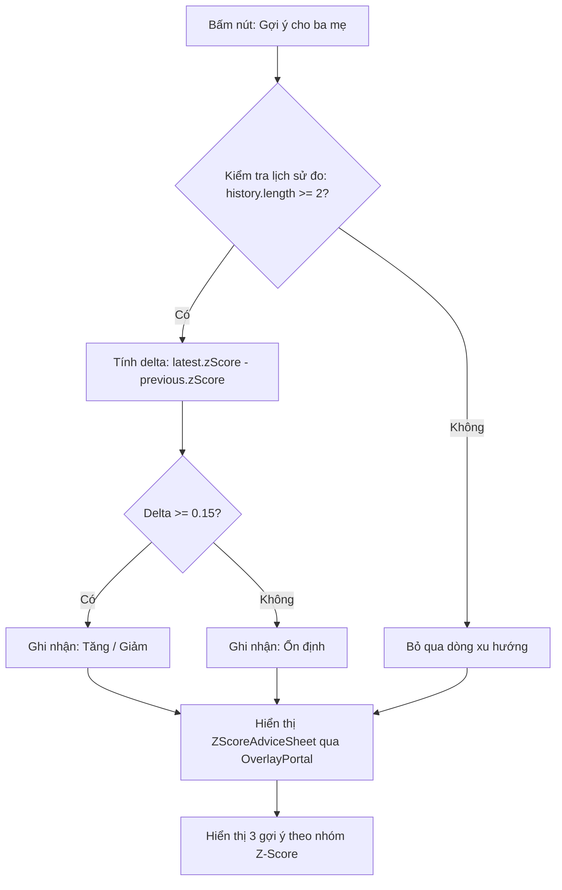

# Feature: Student Health Card & Advice Sheet

## Jira Story

- Story: As a parent, I want to inspect my child's physical growth card on the student detail screen, view their height, weight, BMI, and WHO BMI-for-age Z-score with colored status badges, and open a parent advice sheet to review dietary and activity recommendations.
- Jira issue type: Feature
- Acceptance owner: `sophia-product-manager`
- Business value: Delivers actionable physical health tracking, strengthening parent engagement and school health transparency.

## Priority

- Priority: P0 (Blocker)
- Severity if missed: Critical — Health evaluation card is a prominent component of the student cockpit screen.
- Rationale: First feature ported to Next.js and enriched with the "Gợi ý cho ba mẹ" sheet.
- Target release: Phase 1 MVP

## Acceptance criteria

- [x] AC-1: The HealthCard displays height (cm), weight (kg), derived BMI index ($weight / (height/100)^2$), and numeric Z-score value with informational info button.
- [x] AC-2: The 4-tier Z-score track renders colored segments: Thiếu cân (blue, Z below -2), Bình thường (green, -2 to +2), Thừa cân (orange, +2 to +3), and Béo phì (crimson, Z above +3).
- [x] AC-3: Marker indicator on the track is calculated via piecewise-linear interpolation between boundary ticks (-4, -2, 2, 3, 4).
- [x] AC-4: Tapping the advice button `"💡 Gợi ý cho ba mẹ ›"` opens `ZScoreAdviceSheet` displaying trend delta against previous checkup if at least two checkups exist.
- [x] AC-5: The advice sheet displays 3 bulleted pointers corresponding to the active Z-score classification band.
- [x] AC-6: The bottom sheet includes a medical consultation disclaimer and closes cleanly on backdrop scrim click or close button tap.

## Edge cases

- Edge case 1: Single checkup in history (`history.length < 2`). Handled safely: trend line returns `null` and omits delta comparison text without crashing.
- Edge case 2: Extreme Z-score values beyond $\pm 4$. Handled: marker position is clamped to 0% and 100% respectively.
- Edge case 3: Rapid student switching via "Đổi". Handled: component re-renders with fresh height, weight, and history arrays without residual sheet state.

## User Value

This feature provides immense reassurance and utility to parents by translating complex raw anthropometric measurements into clear, digestible developmental benchmarks. Instead of deciphering whether a specific BMI number is suitable for a 4-year-old versus a 16-year-old, parents are presented with standard deviation percentiles endorsed by the Ministry of Health.

The addition of the "Gợi ý cho ba mẹ" bottom sheet provides positive reinforcement for normal development and actionable lifestyle adjustments for underweight or overweight trends, because guidance is phrased around positive habits (balanced protein, varied diet, outdoor playtime) rather than restrictive medical regimens.

## PM Notes

- PM-visible status: Production-ready in `web/components/parents/student-screen.tsx`.
- Demo narrative: Showcase Lý Tường Lam (`lam`, underweight, blue badge, stable trend) versus Trần Đăng Khoa (`khoa`, overweight, orange badge, increasing trend line).
- Acceptance impact: Fully closes the student physical health tracking epic.

## Requirements Trace

- Traces to: `docs/prd.md` Section 2.1 (Student Health & BMI Tracking).
- Traces to spec: `.agents/specs/026-child-bmi-tracking-and-hoc-sinh-screen/spec.md`.

## Relationship Map

| Relation | Target | Label | Rationale |
| --- | --- | --- | --- |
| Implements | `E-001-student-health-tracking` | `IMPLEMENTS` | Fulfills the parent physical health tracking epic outcome. |
| Uses | `M-001-001-student-health-card` | `USES` | Consumes health calculations and styling rules. |
| Enables | `P-001-001-student-detail-screen` | `ENABLES` | Embeds directly within the student detail page. |

## Code Scope

- Component file: `web/components/parents/student-screen.tsx` (implements `HealthCard`, `ZScoreAdviceSheet`, `HealthHistorySheet`, `zScorePercent`, `zScoreBand`, `zScoreTrendLine`).
- Style sheet: `web/app/globals.css` (defines `.zscore-advice-row`, `.zscore-advice-list`, `.zscore-advice-note`, `.health-frame`, `.bmi-track`, `.bmi-marker`).
- Data contract: `web/lib/mock-data.ts` (exports `HealthRecord`, `Student`, and `MOCK_STUDENTS`).

## Mermaid Diagram

## Verification

- Command: `cd web && npx tsc --noEmit`
- Result: 0 errors, type safety verified across all student types.
- Command: `cd web && pnpm build`
- Result: Static generation successful.
- Manual test: Verified rendering on `http://localhost:3100` across `vy`, `khoa`, and `lam`.

## Work Log

- Date: 2026-10-05
  - Action: Built `ZScoreAdviceSheet` component, trend comparison helper, and CSS styles.
  - Agent/skill: `benny-frontend-engineer`
  - Evidence: Commit `9dfd9ed` in `main`.
  - Docs updated before code: Reconciled `docs/prd.md` and feature specifications.

## Change Log

- Date: 2026-10-05
  - Code change: Implemented health card advice trigger button and modal drawer in `student-screen.tsx`.
  - Documentation update: Authored feature specification note with Jira Story and Acceptance criteria.
  - Evidence: Verified clean compilation and zero build errors.
