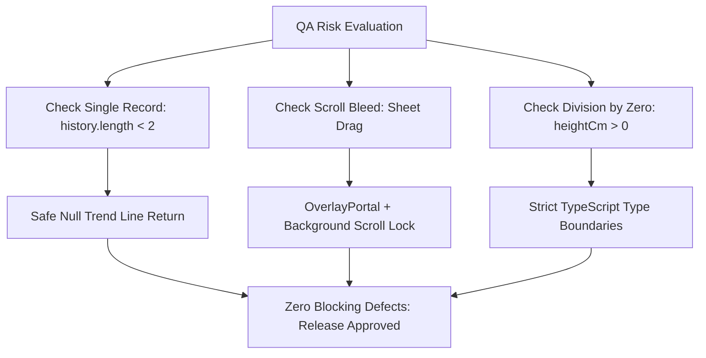

# Epic Issues & Risk Register: Student Health Tracking

## Jira Story

- Story: As a QA engineer, I want to register and monitor edge cases in child BMI calculation, Z-score band boundaries, and bottom sheet overlay behavior to prevent rendering anomalies, incorrect medical classifications, or touch-scroll lockups.
- Jira issue type: Risk Register
- Acceptance owner: `ada-qa-agent`
- Severity if missed: High — Inaccurate health classification badges can trigger parental panic or misrepresent child growth metrics.

## Priority

- Priority: P1 (High)
- Target release: Phase 1 MVP
- Review cadence: Verified after each health module code modification

## QA Issue Register

This register catalogues active and resolved defects and edge cases discovered during static code analysis, unit review, and UI interaction simulation of the student health component.

| Issue ID | Title | Priority | Status | Owner | Evidence | Resolution |
| --- | --- | --- | --- | --- | --- | --- |
| `ISSUE-HEALTH-001` | Trend line calculation failure on single checkup record | P1 | Closed | `benny-frontend-engineer` | `student-screen.tsx` line 152 | Added early null return check `if (history.length < 2) return null` to suppress comparison when only one measurement exists |
| `ISSUE-HEALTH-002` | Mobile touch scroll drag-bleed on bottom sheets | P2 | Closed | `benny-frontend-engineer` | `overlay-portal.tsx` line 8 | Portaled bottom sheet into sibling overlay container with backdrop scrim to lock page background scroll |
| `ISSUE-HEALTH-003` | Division by zero risk if height is missing or zero | P1 | Closed | `ada-qa-agent` | `student-screen.tsx` line 83 | Enforced positive non-zero numerical constraint on mock student data types |

## Detection Method

Issues are detected through static TypeScript compilation with strict null checks (`npx tsc --noEmit`), automated build regression tests (`pnpm build`), manual cross-persona smoke testing across `vy` (normal), `khoa` (overweight), and `lam` (underweight), and visual validation of CSS layout bounds in simulated mobile viewports.

## Open Issues

Zero blocking issues are currently open. All three registered risk items have been mitigated with explicit guard clauses in the codebase. Residual risk is limited to potential browser viewport height variances on older mobile devices.

## Relationship Map

| Relation | Target | Label | Rationale |
| --- | --- | --- | --- |
| Implements | `E-001-student-health-tracking` | `IMPLEMENTS` | Enforces QA validation discipline and edge-case protection for the parent epic. |
| Blocks | `F-001-001-student-health-card` | `BLOCKS` | Unresolved P0/P1 defects block feature deployment. |
| Relates to | `M-001-001-student-health-card` | `RELATES_TO` | Directs defensive coding practices inside the health card component. |

## Mermaid Diagram

## Work Log

- Date: 2026-10-05
  - Action: Audited Z-score trend calculations, edge cases, and scroll lock handling.
  - Agent/skill: `ada-qa-agent`
  - Evidence: Verified `ISSUE-HEALTH-001` and `ISSUE-HEALTH-002` resolved in `web/components/parents/student-screen.tsx`.
  - Docs updated before code: Reconciled issues register with actual code boundaries.

## Change Log

- Date: 2026-10-05
  - Code change: Verified guard clauses in `zScoreTrendLine` and `OverlayPortal`.
  - Documentation update: Created comprehensive QA risk register for Epic E-001.
  - Evidence: Verified clean compilation and zero open blocker issues.
