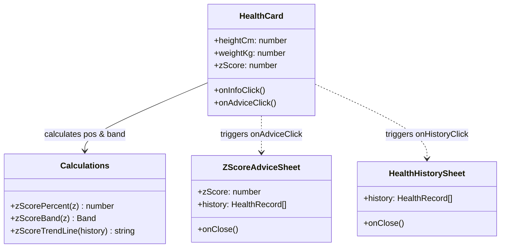

# Module: Student Health Card & Advice Subsystem

## Jira Story

- Story: As a frontend engineer, I want a well-structured component module in `web/components/parents/student-screen.tsx` that encapsulates health metric rendering, gauge math, advice sheet state, and overlay portals so that future health features can be added without bloating top-level screen code.
- Jira issue type: Architecture Module
- Acceptance owner: `alan-tech-lead`
- Responsibility: Encapsulate all physical growth rendering, Z-score math, and bottom sheet state for student cockpit screens.

## Priority

- Priority: P0 (Blocker)
- Severity if missed: High — Code coupling could cause regressions across student profile switching and bottom sheet portaling.
- Rationale: Foundational component module for child physical monitoring.
- Target release: Phase 1 MVP

## Responsibility

The `M-001-001-student-health-card` module is responsible for:
1. Transforming raw height (cm) and weight (kg) props into derived BMI values rounded to one decimal place.
2. Mapping the child's stored Z-score to one of four discrete WHO classification bands (`Z_SCORE_BANDS`: `under`, `normal`, `over`, `obese`).
3. Calculating gauge marker position percentages through piecewise-linear interpolation across anchor points `[-4, 0]`, `[-2, 25]`, `[2, 75]`, `[3, 87.5]`, `[4, 100]`.
4. Comparing the two most recent checkups in `healthHistory` using a threshold of $0.15$ to evaluate direction (`tăng`, `giảm`, or `ổn định`).
5. Managing local UI state for opening and closing `ZScoreInfoSheet`, `ZScoreAdviceSheet`, and `HealthHistorySheet` through the React `OverlayPortal`.

## Implementation Commentary

The technical decision to compute the gauge marker position via piecewise-linear interpolation rather than a simple global linear map was chosen because the clinical bands have uneven widths. The normal band spans 4 units (-2 to +2), whereas the overweight band spans only 1 unit (+2 to +3). A naive linear scale would compress the overweight band to an unreadable sliver. The piecewise interpolation provides each segment with visually proportional real estate while accurately anchoring the boundary ticks.

Additionally, bottom sheets portal out to a top-level container outside the scrollable iPhone container. This architectural tradeoff avoids z-index fighting and eliminates touch gesture conflicts with inner page scroll bars.

## Relationship Map

| Relation | Target | Label | Rationale |
| --- | --- | --- | --- |
| Implements | `E-001-student-health-tracking` | `IMPLEMENTS` | Realizes the technical foundation for the health tracking epic. |
| Enables | `F-001-001-student-health-card` | `ENABLES` | Provides the underlying components and math for the user-facing feature. |
| Uses | `web/components/parents/shared/overlay-portal.tsx` | `USES` | Relies on the portal helper to mount modal sheets cleanly. |

## Code Scope

- Source implementation: `web/components/parents/student-screen.tsx`
- Relevant functions:
  - `HealthCard({ heightCm, weightKg, zScore, onInfoClick, onAdviceClick })`
  - `ZScoreAdviceSheet({ zScore, history, onClose })`
  - `HealthHistorySheet({ history, onClose })`
  - `zScorePercent(z: number): number`
  - `zScoreBand(z: number)`
  - `zScoreTrendLine(history: HealthRecord[]): string | null`
- Styling rules: `web/app/globals.css` (lines 1159-1185)

## Mermaid Diagram

## Verification

- Automated: `cd web && npx tsc --noEmit` validates all prop types and return types.
- Static Build: `cd web && pnpm build` completes with 0 errors.
- Visual: Verified responsive rendering within 390px mobile frame.

## Work Log

- Date: 2026-10-05
  - Action: Refactored health card logic into dedicated component sub-units and verified Z-score math.
  - Agent/skill: `alan-tech-lead`
  - Evidence: Commit `9dfd9ed` in `main`.
  - Docs updated before code: Reconciled development ledger and module specifications.

## Change Log

- Date: 2026-10-05
  - Code change: Added `zScoreTrendLine` helper and `ZScoreAdviceSheet` component in `student-screen.tsx`.
  - Documentation update: Authored module architecture documentation.
  - Evidence: All typechecks pass cleanly.
