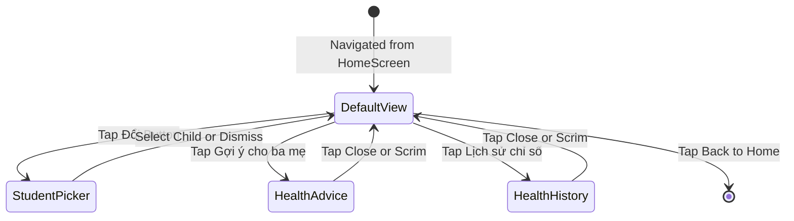

# Page: Student Detail Screen (Học Sinh)

## Jira Story

- Story: As a parent, I want to navigate to the student detail screen upon clicking a child card from the dashboard, inspect their credentials, view their card points, track their physical health metrics, and review recent activities so that I have a complete snapshot of my child's school profile.
- Jira issue type: Page Surface
- Acceptance owner: `sophia-product-manager`
- PM/User value: Serves as the central command center for all student-specific operations.

## Priority

- Priority: P0 (Blocker)
- Severity if missed: Critical — Primary landing surface for student operations.
- Rationale: Core navigational hub connecting the home dashboard with health, fee, and activity features.
- Target release: Phase 1 MVP

## Route / Surface

- Component: `StudentScreen` in `web/components/parents/student-screen.tsx`
- Parent container: `web/app/page.tsx`
- Routing mechanism: State-based screen switch `screen === 'student'` with active prop `selectedStudentId`.
- Layout structure:
  - Sticky Top Bar: back button (`onBack`), title `"Học sinh"`, settings gear icon.
  - Student Header: Avatar, student name, student ID, class, school, and `"👥 Đổi"` button.
  - Balance Card: Card balance display (`Số dư thẻ`) with top-up quick shortcut.
  - 8-Icon Shortcut Grid: 4x2 grid of school features.
  - Health Card: Height, weight, BMI, Z-score gauge, and `"💡 Gợi ý cho ba mẹ"` button.
  - Recent Activities: Itemized chronological log feed.
  - Fixed Bottom CTA: `"Nạp điểm vào thẻ"` button (disabled for schools without top-up support).

## PM Notes

- PM-visible status: Active and rendered at `http://localhost:3100`.
- Demo narrative: From home dashboard, tap any student card to enter this page. Test switching students using the `"Đổi"` button to observe instant re-rendering of all physical metrics and card balances.
- Acceptance impact: Unlocks full student detail visibility.
- Tradeoff and rationale: Maintained in-memory state switching rather than browser URL segments to prevent flash of unstyled content during mobile simulator transitions.

## Relationship Map

| Relation | Target | Label | Rationale |
| --- | --- | --- | --- |
| Implements | `E-001-student-health-tracking` | `IMPLEMENTS` | Hosts the student health card and advice modal surface. |
| Uses | `M-001-001-student-health-card` | `USES` | Embeds the health card component inside the page body. |
| Enables | `F-001-001-student-health-card` | `ENABLES` | Provides the user surface where parents interact with health advice. |

## States

1. **Default State**: Displays student header, card balance, feature shortcuts, and health metrics for the active child.
2. **Student Switching State (`showPicker: true`)**: Opens `StudentPickerSheet` over the page with backdrop scrim.
3. **Health History State (`showHealthHistory: true`)**: Opens `HealthHistorySheet` with 6-month checkup table.
4. **Z-Score Info State (`showZScoreInfo: true`)**: Opens `ZScoreInfoSheet` explaining MOH Decision 3777 standard.
5. **Z-Score Advice State (`showZScoreAdvice: true`)**: Opens `ZScoreAdviceSheet` with personalized trend and lifestyle advice.

## Mermaid Diagram

## Verification

- Automated: `npx tsc --noEmit` validates `StudentScreen` props and screen enum union.
- Static Build: `pnpm build` generates static HTML prerender for `/`.
- Runtime: Dev server verified serving `200 OK` on `http://localhost:3100`.

## Work Log

- Date: 2026-10-05
  - Action: Verified student detail page layout, top bar actions, and bottom sheet state integration.
  - Agent/skill: `benny-frontend-engineer`
  - Evidence: Verified active dev server rendering.
  - Docs updated before code: Reconciled page states and navigation flow.

## Change Log

- Date: 2026-10-05
  - Code change: Bound `onAdviceClick` to `showZScoreAdvice` state in `StudentScreen`.
  - Documentation update: Authored page specification note with state machine diagram.
  - Evidence: Verified clean state transitions.
