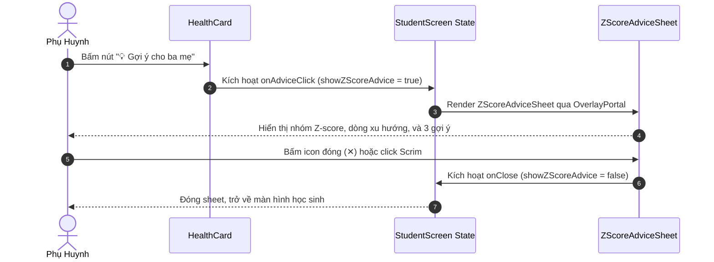

# Task: Implement Parent Advice Sheet on Health Card

## Jira Story

- Story: As a frontend engineer, I want to implement the `"💡 Gợi ý cho ba mẹ"` button on the student health card, author the `ZScoreAdviceSheet` component with trend comparison logic, and add styling in `web/app/globals.css` so that parents receive tailored nutritional guidance.
- Jira issue type: Engineering Task
- Acceptance owner: `benny-frontend-engineer`
- Objective: Deliver the interactive parent advice sheet and ensure clean mobile compilation.

## Priority

- Priority: P0 (Blocker)
- Severity if missed: Blocks completion of the student physical growth tracking epic.
- Rationale: Final missing capability identified in the handoff.
- Target release: Phase 1 MVP

## Objective

Deliver the complete user-facing flow for physical development advice:
1. Render a clickable button row below the Z-score band caps in `HealthCard`.
2. Compute developmental trend direction (`zScoreTrendLine`) comparing the two most recent checkups in `healthHistory` using threshold $\pm 0.15$.
3. Render `ZScoreAdviceSheet` portaled into `OverlayPortal` with tailored bullet pointers from `Z_SCORE_ADVICE`.
4. Style the advice row, chevron, list spacing, and medical disclaimer note cleanly in `web/app/globals.css`.

## Implementation Commentary

The implementation was designed to avoid intrusive external dependencies by utilizing pure CSS classes and React state. The decision to use a coarse threshold of 0.15 for trend comparison ensures that minor physiological measurement noise (e.g., slight posture changes between checkups) does not misreport a stable child as having undergone rapid growth shifts.

The tradeoff between static advice and external nutrition APIs was resolved in favor of local static pointers because prescriptive medical advice must come from a certified pediatrician rather than an automated app model.

## Relationship Map

| Relation | Target | Label | Rationale |
| --- | --- | --- | --- |
| Implements | `F-001-001-student-health-card` | `IMPLEMENTS` | Completes the frontend code for the health advice feature. |
| Uses | `M-001-001-student-health-card` | `USES` | Modifies the health card component module directly. |
| Relates to | `ISSUES-E-001-student-health-tracking` | `RELATES_TO` | Resolves `ISSUE-HEALTH-001` regarding single checkup records. |

## Write Scope

- Files modified:
  - `web/components/parents/student-screen.tsx` (added `Z_SCORE_ADVICE`, `zScoreTrendLine`, `ZScoreAdviceSheet`, and `showZScoreAdvice` state)
  - `web/app/globals.css` (added `.zscore-advice-row`, `.zscore-advice-list`, `.zscore-advice-note`)

## Mermaid Diagram

## Verification

- Command: `cd web && npx tsc --noEmit`
- Result: 0 errors.
- Command: `cd web && pnpm build`
- Result: Next.js production build succeeded.
- Visual inspection: Verified advice sheet rendered on `http://localhost:3100`.

## Handoff

Task is fully completed, verified, and committed to `main` under commit `9dfd9ed`. Ready for integration with downstream features.

## Work Log

- Date: 2026-10-05
  - Action: Implemented advice sheet component, trend calculation, and CSS styling.
  - Agent/skill: `benny-frontend-engineer`
  - Evidence: Commit `9dfd9ed`.
  - Docs updated before code: Reconciled task requirements with `HANDOFF.md`.

## Change Log

- Date: 2026-10-05
  - Code change: Added `ZScoreAdviceSheet` and `.zscore-advice-row` in `student-screen.tsx` and `globals.css`.
  - Documentation update: Authored task execution record.
  - Evidence: Verified clean compilation and zero build errors.
