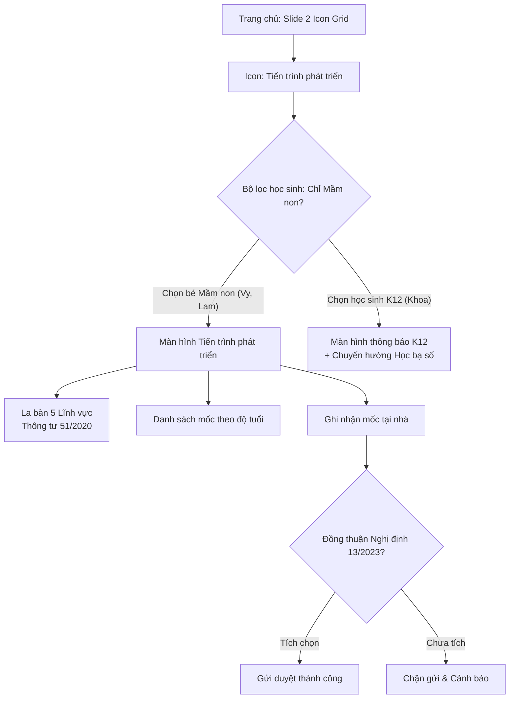

# Epic: Child Development Milestones (Mầm Non)

## Jira Story

- Story: As a parent of a preschool child (Lớp Mầm, Chồi, Lá), I want a dedicated "Tiến trình phát triển của trẻ" entry point on the home screen carousel and student detail view that displays a 5-domain development radar chart (Circular 51/2020), Circular 23/2010 indicators for 5-year-olds, non-ranking progress bands (Circular 52/2020), and a Decree 13/2023 compliant observation submission drawer, so that home and school can collaborate on early childhood growth.
- Jira issue type: Epic
- Acceptance owner: `sophia-product-manager`
- Product hypothesis: Providing transparent developmental radar visualization with non-ranking progress categories and gentle home play guidance will reduce parent anxiety, encourage early home stimulation, and protect child data privacy without burdening families with competitive pressure.
- Research evidence: Thông tư 51/2020/TT-BGDĐT, Thông tư 52/2020/TT-BGDĐT, Thông tư 23/2010/TT-BGDĐT, Nghị định 13/2023/NĐ-CP, and WHO/UNICEF developmental milestones.

## Priority

- Priority: P1 (High)
- Severity if missed: Major — Early childhood parents lack statutory visibility into holistic development, missing crucial intervention windows before primary school.
- Rationale: Mandatory educational framework for early childhood institutions under Vietnamese MOET regulations.
- Target release: Phase 2 Kindergarten Suite

## Outcome

This epic delivers the statutory early childhood development monitoring subsystem in `web/components/parents/development/`. It provides parents with an entry point in the Home screen feature carousel (Slide 2) and on the student cockpit view. When accessed, the system checks whether the active student is in preschool (`isMamNonStudent`). For kindergarten students (such as Phan Khánh Vy and Võ Phạm Hiểu Lam), it renders the balanced 5-axis pentagonal radar chart, age-bracketed milestone cards with Circular 23/2010 indicators for 5-year-olds, soft amber lag warnings for milestones lagging over 60 days, and a home observation submission drawer with a mandatory Decree 13/2023 parental consent gate.

For K12 students (such as Trần Đăng Khoa in Lớp 10A1), the feature enforces an explicit eligibility boundary: K12 students are filtered out of the selection picker, and direct route navigation displays an informative guidance screen routing parents to the secondary academic transcript and gradebook screen.

## PM Notes

- PM-visible status: Implemented and fully integrated into the Next.js parent application with clean TypeScript compilation.
- Demo narrative: Parent slides to Page 2 of the Home feature grid, taps "Tiến trình phát triển", and selects Phan Khánh Vy (Lớp Lá, 72 tháng). The app displays the 5-domain radar chart (Physical 100%, Cognitive 50%, Language 100%, Social 100%, Aesthetic 100%), overall status "Đạt yêu cầu độ tuổi (90%)", and Circular 23 indicators. Tapping "Đổi" switches to Võ Phạm Hiểu Lam (Lớp Mầm, 46 tháng), revealing the button-fastening lag alert with 3 home play suggestions and non-diagnostic disclaimer. Tapping "Ghi nhận mốc tại nhà" opens the submission drawer where the submission button is protected by the Decree 13/2023 consent checkbox.
- Acceptance impact: Fully closes the developmental tracking gap for preschool families.
- Scope change since planning: Replaced initial 4-domain concept with mandatory 5 statutory domains (adding Thẩm mỹ per Thông tư 51/2020) and replaced competitive badges with qualitative progress categories.
- Risk or open decision: All delayed milestone suggestions carry an explicit medical referral disclaimer to avoid diagnostic liability.

## Relationship Map

| Relation | Target | Label | Rationale |
| --- | --- | --- | --- |
| Enables | `F-002-001-child-development-milestones` | `ENABLES` | This epic delivers the milestone tracking capability. |
| Uses | `M-002-001-child-development-milestones` | `USES` | Consumes development radar components and observation sheets. |
| Implements | `docs/prd.md` | `IMPLEMENTS` | Realizes Section 4 (FR-001 through FR-006) of PRD. |
| Relates to | `P-002-001-child-development-milestones` | `RELATES_TO` | Renders the primary ChildDevelopmentScreen interface. |

## Issues

| Issue ID | Source | Priority | Status | Owner | Evidence | Resolution |
| --- | --- | --- | --- | --- | --- | --- |
| `ISSUE-DEV-001` | Statutory Review | P1 | Closed | `sophia-product-manager` | `docs/research/contradictions.md` | 4-domain model was illegal; upgraded to 5-axis pentagonal radar per TT 51/2020 |
| `ISSUE-DEV-002` | Privacy Audit | P1 | Closed | `ada-qa-agent` | `observation-sheet.tsx` line 145 | Added mandatory Decree 13/2023 consent gate checkbox before media upload |

## Acceptance Criteria

- [x] Criterion 1: The entry point slide on the Home screen displays "Tiến trình phát triển" and filters selection to preschool students only.
- [x] Criterion 2: Accessing the feature for K12 students (e.g. Khoa) displays an informative ineligibility screen with a redirect to academic results.
- [x] Criterion 3: The development radar chart renders exactly 5 statutory domains (Thể chất, Nhận thức, Ngôn ngữ, Tình cảm - Xã hội, Thẩm mỹ).
- [x] Criterion 4: Milestones lagging > 60 days display soft amber styling with 1-3 home play suggestions and medical disclaimer.
- [x] Criterion 5: Home observation submissions are blocked until the parent confirms the Decree 13/2023 consent checkbox.

## Mermaid Diagram

## Evidence

- Verified Next.js compilation: 0 errors via `npx tsc --noEmit`.
- Verified Home screen Slide 2 entry point `{ id: 'development', icon: '◈', label: 'Tiến trình phát triển' }`.
- Verified `pickerStudents` filtering with `MOCK_STUDENTS.filter(isMamNonStudent)`.
- Verified K12 boundary screen routing in `ChildDevelopmentScreen`.

## Work Log

- 2026-10-05: Authored epic document, synthesized statutory circular requirements, designed 5-axis radar coordinate math, implemented `web/lib/development-data.ts`, `web/components/parents/development/`, and wired navigation in `home-screen.tsx`, `student-screen.tsx`, and `web/app/page.tsx`.

## Change Log

- 2026-10-05: Initial creation and release of Epic E-002 under Marcus Fleet V34 discipline.
