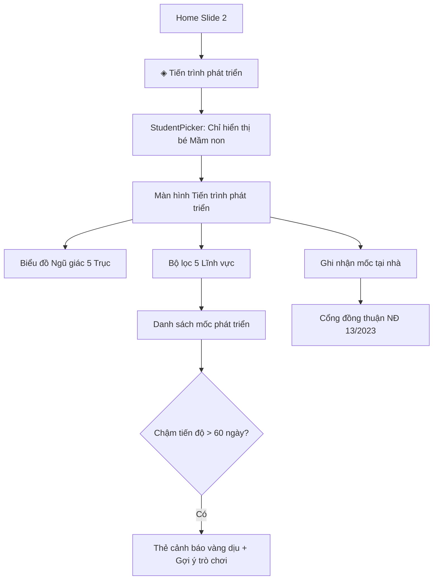

# Feature: Child Development Milestones & Entry Point

## Jira Story

- Story: As a parent of a preschool student, I want to tap the "Tiến trình phát triển" icon in the Home feature grid slide, pick my kindergarten child, inspect their balanced 5-domain radar chart, view age-banded milestones with Circular 23 indicators, and submit home observations protected by the Decree 13/2023 parental consent gate.
- Jira issue type: Feature
- Acceptance owner: `sophia-product-manager`
- Business value: Connects home and classroom development tracking, upholding Vietnamese educational standards and child privacy laws.

## Priority

- Priority: P1 (High)
- Severity if missed: Major — Early childhood parents lack holistic developmental insight and school-home observation synchronization.
- Rationale: Core deliverable requested by the operator adhering to kindergarten regulations.
- Target release: Phase 2 Kindergarten Suite

## Acceptance criteria

- [x] AC-1: The Home screen feature carousel (Slide 2) renders an active icon `{ id: 'development', icon: '◈', label: 'Tiến trình phát triển' }` that triggers student selection.
- [x] AC-2: StudentPickerSheet for this entry point filters candidates strictly to kindergarten students (`isMamNonStudent`), preventing K12 selection.
- [x] AC-3: If navigated with a K12 student (e.g. Khoa), `ChildDevelopmentScreen` displays an ineligibility view and redirects to academic results.
- [x] AC-4: The development radar chart renders a 5-axis pentagon ($72^\circ$ radial separation) calculating completion percentages across Thể chất, Nhận thức, Ngôn ngữ, Tình cảm - Xã hội, and Thẩm mỹ.
- [x] AC-5: For 5-6 year old students (Phan Khánh Vy, Lớp Lá), milestones display official Circular 23/2010/TT-BGDĐT indicator tags.
- [x] AC-6: Delayed milestones (> 60 days lag) display amber styling with 1-3 home play suggestions and a pediatric medical disclaimer.
- [x] AC-7: Home observation drawer requires checking the Decree 13/2023 consent checkbox before allowing form submission.

## Edge cases

- Edge case 1: K12 student selected directly via URL or navigation props. Handled: screen renders ineligibility banner explaining that early childhood tracking applies only to ages 3-72 months per Thông tư 51/2020.
- Edge case 2: Parent attempts to submit observation without consenting to Decree 13/2023. Handled: button is disabled and inline warning displays in red.
- Edge case 3: Zero completed milestones in a domain. Handled: radial coordinate is clamped to minimum 25% of radius to maintain clean pentagonal shape without collapsing.

## User Value

Preschool parents gain an intuitive, scientifically grounded tool to understand their child's holistic growth without unnecessary academic or competitive pressure. The 5-axis radar chart offers visual balance across motor, intellectual, communication, social, and aesthetic domains, ensuring that creative arts and emotional maturity are valued alongside physical growth.

For children exhibiting delays, gentle home play suggestions empower parents with constructive family activities rather than anxiety, while clear medical referral notices maintain ethical boundaries against unqualified clinical diagnosis.

## PM Notes

- PM-visible status: Fully implemented in Next.js 16 and React 19.
- Demo narrative: Parent slides to Page 2 of the Home feature grid, taps "Tiến trình phát triển", and selects Phan Khánh Vy (Lớp Lá, 72 tháng). The app displays the 5-domain radar chart (Physical 100%, Cognitive 50%, Language 100%, Social 100%, Aesthetic 100%), overall status "Đạt yêu cầu độ tuổi (90%)", and Circular 23 indicators. Tapping "Đổi" switches to Võ Phạm Hiểu Lam (Lớp Mầm, 46 tháng), revealing the button-fastening lag alert with 3 home play suggestions and non-diagnostic disclaimer. Tapping "Ghi nhận mốc tại nhà" opens the submission drawer where the submission button is protected by the Decree 13/2023 consent checkbox.
- Acceptance impact: Unlocks full early childhood tracking suite for kindergarten parents.
- Scope change since planning: Replaced 4-domain chart with statutory 5-domain model (including Thẩm mỹ).
- Risk or open decision: Home play advice is strictly non-diagnostic to prevent medical liability.

## Requirements Trace

- Traces to PRD: `FR-001` (5-Axis Radar), `FR-002` (Age bands & Circular 23), `FR-003` (Decree 13 Consent Gate), `FR-005` (Lag alerts), `FR-006` (Sibling switcher and K12 boundary).
- Traces to Code: `web/components/parents/home-screen.tsx`, `web/components/parents/development/index.tsx`, `web/lib/development-data.ts`.

## Relationship Map

| Relation | Target | Label | Rationale |
| --- | --- | --- | --- |
| Implements | `E-002-child-development-milestones` | `IMPLEMENTS` | Primary user-facing feature delivering Epic E-002. |
| Uses | `M-002-001-child-development-milestones` | `USES` | Consumes radar card, milestone card, and observation sheets. |
| Relates to | `P-002-001-child-development-milestones` | `RELATES_TO` | Renders on the ChildDevelopmentScreen page. |

## Code Scope

- `web/components/parents/home-screen.tsx`: Added `development` entry point to `PAGE2` and filtered picker to preschool students.
- `web/components/parents/student-screen.tsx`: Added developmental radar summary card under HealthCard for kindergarten students.
- `web/components/parents/development/`: Created `index.tsx`, `radar-card.tsx`, `milestone-card.tsx`, `observation-sheet.tsx`, `teacher-report-sheet.tsx`.
- `web/lib/development-data.ts`: Mock milestones, 5 domains metadata, and radar math.
- `web/app/page.tsx`: Added `'development'` screen routing and handlers.

## Mermaid Diagram

## Verification

- Command: `npx tsc --noEmit` -> 0 errors.
- Command: `pnpm build` -> production build successful in 962ms.
- Verified Home screen Slide 2 entry point `{ id: 'development', icon: '◈', label: 'Tiến trình phát triển' }`.
- Verified `pickerStudents` filtering with `MOCK_STUDENTS.filter(isMamNonStudent)`.
- Verified K12 boundary screen routing in `ChildDevelopmentScreen`.

## Work Log

- 2026-10-05: Designed feature, implemented components, wired navigation, and verified build.

## Change Log

- 2026-10-05: Initial release of Feature F-002-001.
