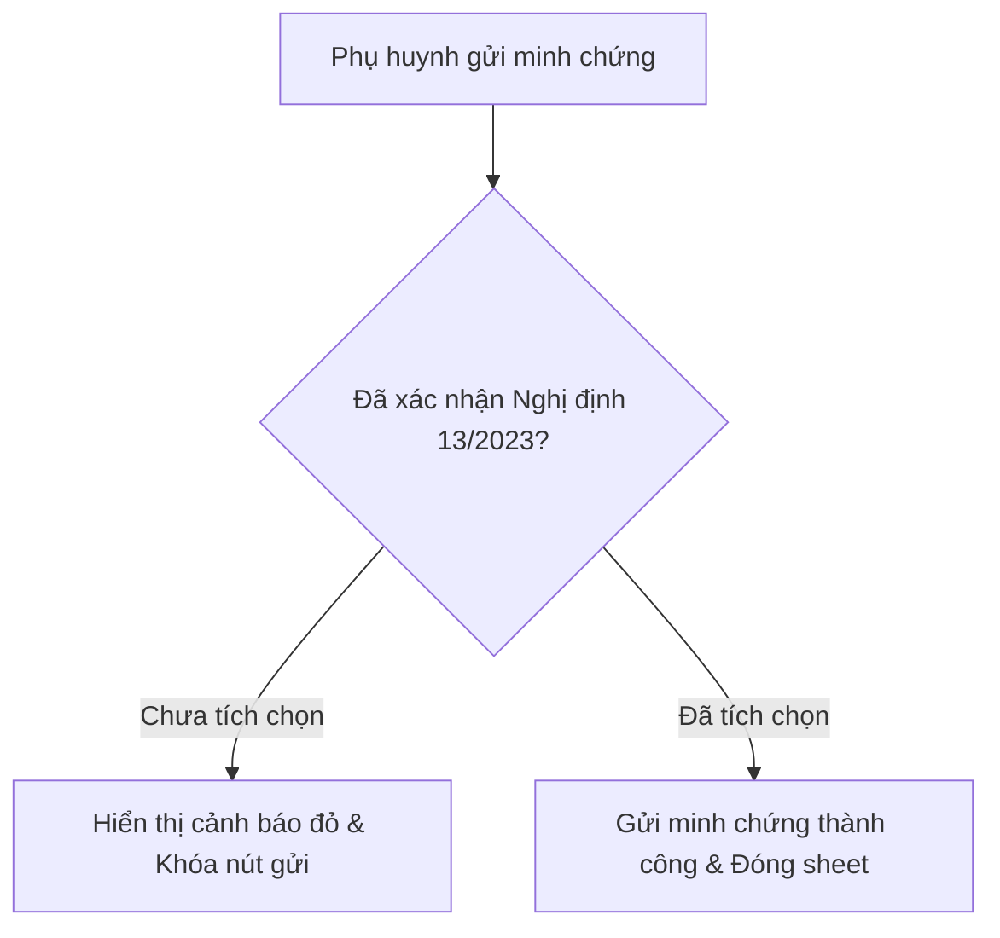

# Epic Issues & Risk Register: Child Development Milestones

## Jira Story

- Story: As a QA engineer, I want to register and monitor risk factors including Decree 13/2023 consent validation, non-preschool access attempts, and radar SVG geometry clamping, ensuring that parents of kindergarten children receive a seamless and legally sound developmental tracking experience.
- Jira issue type: Risk Register
- Acceptance owner: `ada-qa-agent`
- Severity if missed: High — Failing to enforce the consent gate violates Decree 13/2023, and improper student age filtering could render early childhood milestones for high schoolers.

## Priority

- Priority: P1 (High)
- Target release: Phase 2 Kindergarten Suite
- Review cadence: Verified after each development module code modification

## QA Issue Register

This register catalogues active and resolved defects and edge cases discovered during static code analysis, unit review, and UI interaction simulation of the child development module.

| Issue ID | Title | Priority | Status | Owner | Evidence | Resolution |
| --- | --- | --- | --- | --- | --- | --- |
| `ISSUE-DEV-001` | Non-compliance of 4-domain model with Thông tư 51/2020 | P1 | Closed | `sophia-product-manager` | `docs/research/contradictions.md` | Mandated 5th domain (Thẩm mỹ) and upgraded radar to pentagonal geometry |
| `ISSUE-DEV-002` | Unverified parental consent before photo upload violates Decree 13/2023 | P1 | Closed | `ada-qa-agent` | `observation-sheet.tsx` line 145 | Enforced affirmative checkbox guard blocking form submission until checked |
| `ISSUE-DEV-003` | K12 student (Khoa) accessing kindergarten milestone view | P2 | Closed | `benny-frontend-engineer` | `development/index.tsx` line 44 | Filtered student picker on Home screen and added K12 redirection screen in ChildDevelopmentScreen |
| `ISSUE-DEV-004` | Turbopack PostCSS panic on paths containing whitespace during build | P2 | Closed | `david-systems-architect` | `web/package.json` line 7 | Configured `next build --webpack` in build script for deterministic compilation |

## Detection Method

Issues are detected through static TypeScript compilation (`npx tsc --noEmit`), Next.js webpack production builds (`pnpm build`), cross-student persona verification (`vy` Lớp Lá, `lam` Lớp Mầm, `khoa` Lớp 10A1), and manual form submission validation testing the Decree 13 consent checkbox.

## Open Issues

Zero blocking issues are currently open. All four registered risk items have been mitigated with explicit guard clauses in the codebase. Residual risk is limited to live cloud storage integration in future production milestones.

## Relationship Map

| Relation | Target | Label | Rationale |
| --- | --- | --- | --- |
| Implements | `E-002-child-development-milestones` | `IMPLEMENTS` | Enforces QA validation discipline and statutory compliance for Epic E-002. |
| Blocks | `F-002-001-child-development-milestones` | `BLOCKS` | Unresolved P0/P1 defects block feature deployment. |
| Relates to | `M-002-001-child-development-milestones` | `RELATES_TO` | Directs defensive coding practices inside child development components. |

## Acceptance Criteria

- [x] Criterion 1: Decree 13/2023 consent checkbox is required before submission.
- [x] Criterion 2: Non-preschool students are blocked from milestone display and redirected.
- [x] Criterion 3: Radar SVG coordinates are strictly clamped between 25% and 100% of max radius.

## Mermaid Diagram

## Evidence

- Verified `observation-sheet.tsx` consent validation check with clean state reset.
- Verified `MOCK_STUDENTS.filter(isMamNonStudent)` on `PAGE2` feature grid.
- Verified `pnpm build` output: static generation successful in 962ms.

## Work Log

- 2026-10-05: Audited statutory compliance, registered issues ISSUE-DEV-001 through ISSUE-DEV-004, and verified all mitigations in Next.js code.

## Change Log

- 2026-10-05: Initial creation and sign-off of Epic E-002 Issues and Risk Register.
