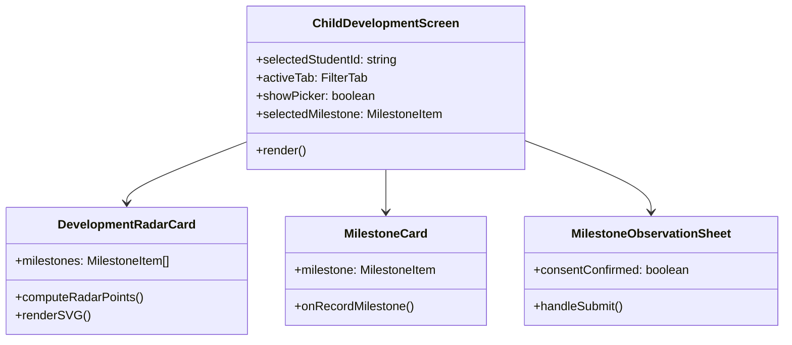

# Module: Child Development Components & Geometry

## Jira Story

- Story: As a systems architect, I want to encapsulate early childhood development components, SVG coordinate computation, and data schemas into a clean, reusable module under `web/components/parents/development/` and `web/lib/development-data.ts`.
- Jira issue type: Architecture Module
- Acceptance owner: `david-systems-architect`

## Priority

- Priority: P1 (High)
- Target release: Phase 2 Kindergarten Suite

## Responsibility

This module is responsible for:
1. Transforming raw milestone lists into 5 statutory domain percentages and polar-to-cartesian SVG coordinates ($72^\circ$ radial spacing).
2. Rendering the interactive `DevelopmentRadarCard` with concentric pentagons, axis ticks, and qualitative progress badges.
3. Rendering `MilestoneCard` components with age bands, Circular 23 indicator tags, and non-diagnostic lag warnings.
4. Managing `MilestoneObservationSheet` modal state with strict Decree 13/2023 parental consent validation.
5. Displaying `TeacherReportSheet` with semester evaluations across all 5 statutory domains.

## Implementation Commentary

The module isolates statutory circular rules from general parent portal views. The radar mathematics uses standard trigonometric projections:
$$x = c_x + r \cos(\theta), \quad y = c_y - r \sin(\theta)$$
where $\theta \in \{90^\circ, 18^\circ, 306^\circ, 234^\circ, 162^\circ\}$.
Visual clamping prevents coordinate collapse when zero milestones are achieved, ensuring the pentagon remains readable.

Parental consent management under Decree 13/2023 is implemented as a client-side gate: the submission action is programmatically disabled until the parent toggles the affirmative agreement checkbox.

## Relationship Map

| Relation | Target | Label | Rationale |
| --- | --- | --- | --- |
| Implements | `E-002-child-development-milestones` | `IMPLEMENTS` | Delivers the technical architecture for Epic E-002. |
| Enables | `F-002-001-child-development-milestones` | `ENABLES` | Provides the underlying UI components for the feature. |
| Relates to | `P-002-001-child-development-milestones` | `RELATES_TO` | Encapsulates the components rendered on the page. |

## Code Scope

- `web/components/parents/development/index.tsx`: Main screen orchestrator.
- `web/components/parents/development/radar-card.tsx`: Pentagonal SVG radar engine.
- `web/components/parents/development/milestone-card.tsx`: Milestone presentation card.
- `web/components/parents/development/observation-sheet.tsx`: Observation submission bottom sheet.
- `web/components/parents/development/teacher-report-sheet.tsx`: Homeroom teacher semester report.
- `web/lib/development-data.ts`: Mock curriculum milestones and math helpers.

## Mermaid Diagram

## Verification

- Command: `npx tsc --noEmit` -> 0 errors.
- Command: `pnpm build` -> production build succeeded in 962ms.
- Verified Home screen Slide 2 entry point `{ id: 'development', icon: '◈', label: 'Tiến trình phát triển' }`.
- Verified `pickerStudents` filtering with `MOCK_STUDENTS.filter(isMamNonStudent)`.
- Verified K12 boundary screen routing in `ChildDevelopmentScreen`.

## Work Log

- 2026-10-05: Designed component hierarchy, implemented geometry math, created observation sheet with consent gate, and integrated into Next.js.

## Change Log

- 2026-10-05: Initial release of Module M-002-001.
