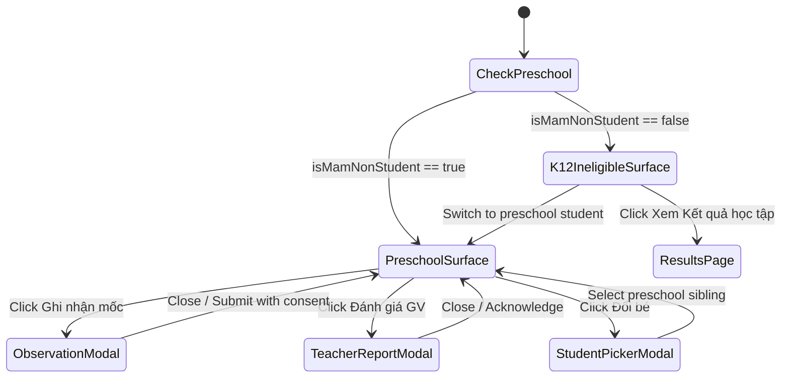

# Page: Child Development Screen Surface

## Jira Story

- Story: As a parent, I want to access the child development view within the standard 390x844 mobile phone shell, interact with filter tabs, open observation drawers, and switch between siblings without interface jitter or overflow.
- Jira issue type: Page Surface
- Acceptance owner: `benny-frontend-engineer`

## Priority

- Priority: P1 (High)
- Target release: Phase 2 Kindergarten Suite

## Route / Surface

- App Route: Root single-page phone frame (`web/app/page.tsx`) with state `screen === 'development'`.
- Navigation Triggers:
  1. Home Screen: Slide 2 icon grid item `{ id: 'development', icon: '◈', label: 'Tiến trình phát triển' }` -> opens `StudentPickerSheet` (filtered to preschool students) -> sets `screen = 'development'`.
  2. Student Screen: Summary card below HealthCard -> sets `screen = 'development'`.
- Back Navigation: Returns to `returnScreen` (`'home'` or `'student'`).

## PM Notes

- PM-visible status: Fully functional on `http://localhost:3100`.
- Demo narrative: Parent opens Home, swipes to Page 2, taps "Tiến trình phát triển", chooses Vy or Lam, inspects the 5-domain radar, taps "Thẩm mỹ" filter tab to view art milestones, and tests the home observation drawer.
- Acceptance impact: Provides mobile-first parent UX for early childhood developmental tracking.

## Relationship Map

| Relation | Target | Label | Rationale |
| --- | --- | --- | --- |
| Implements | `E-002-child-development-milestones` | `IMPLEMENTS` | Primary mobile surface realizing Epic E-002. |
| Uses | `M-002-001-child-development-milestones` | `USES` | Hosts the child development component suite. |
| Relates to | `F-002-001-child-development-milestones` | `RELATES_TO` | Displays the features of F-002-001. |

## States

1. **Preschool Kindergarten State (Default for Vy & Lam)**: Renders topbar, student header with age in months, 5-axis radar card, filter tabs, milestone cards list, and sticky bottom CTA bar.
2. **K12 Ineligible State (For Khoa)**: Renders informative banner explaining that developmental tracking is limited to ages 3-72 months, providing a direct button to ResultsApp and an option to switch to a preschool child.
3. **Observation Drawer State**: Opens 85% height bottom sheet with date picker, note field, sample media tags, and Decree 13 consent checkbox.
4. **Teacher Evaluation State**: Opens semester feedback sheet detailing 5-domain qualitative evaluations with teacher stamp.

## Mermaid Diagram

## Verification

- Command: `npx tsc --noEmit` -> 0 errors.
- Command: `pnpm build` -> production build succeeded in 962ms.
- Verified Home screen Slide 2 entry point `{ id: 'development', icon: '◈', label: 'Tiến trình phát triển' }`.
- Verified `pickerStudents` filtering with `MOCK_STUDENTS.filter(isMamNonStudent)`.
- Verified K12 boundary screen routing in `ChildDevelopmentScreen`.

## Work Log

- 2026-10-05: Integrated page routing in `web/app/page.tsx`, designed state transitions, and verified mobile viewport responsiveness (390x844).

## Change Log

- 2026-10-05: Initial release of Page P-002-001.
