# Task: Implement Development Entry Point and Kindergarten Screen

## Jira Story

- Story: As a frontend engineer, I want to add `{ id: 'development', icon: '◈', label: 'Tiến trình phát triển' }` to Slide 2 of the Home feature grid, filter the student picker to kindergarten students only, wire routing in `web/app/page.tsx`, and construct `ChildDevelopmentScreen` with 5 statutory domains and Decree 13/2023 consent validation.
- Jira issue type: Implementation Task
- Acceptance owner: `benny-frontend-engineer`

## Priority

- Priority: P1 (High)
- Target release: Phase 2 Kindergarten Suite

## Objective

Deliver the complete, working user flow requested by the operator:
1. Entry point in the feature carousel slide (`PAGE2` in `home-screen.tsx`).
2. Student picker filtering: only kindergarten students (`isMamNonStudent`) are selectable.
3. K12 boundary enforcement: if K12 student is reached, display ineligibility notice with redirect to academic report card.
4. 5-Axis SVG radar calculation and rendering according to Thông tư 51/2020.
5. Observation submission drawer with mandatory Decree 13/2023 consent checkbox.

## Implementation Commentary

Implemented across 5 files:
- `web/lib/development-data.ts`: Standardized curriculum milestones for Vy (Lớp Lá) and Lam (Lớp Mầm), polar coordinate math for the 5 vertices, and status derivation.
- `web/components/parents/development/`: Created `radar-card.tsx`, `milestone-card.tsx`, `observation-sheet.tsx`, `teacher-report-sheet.tsx`, and `index.tsx`.
- `web/components/parents/home-screen.tsx`: Added `development` entry point in `PAGE2` and filtered `pickerStudents` via `isMamNonStudent`.
- `web/components/parents/student-screen.tsx`: Added summary card under `HealthCard` leading to development view.
- `web/app/page.tsx`: Added `'development'` to `Screen` union and rendered `ChildDevelopmentScreen`.
- `web/package.json`: Configured `next build --webpack` to avoid Turbopack PostCSS whitespace panics.

## Relationship Map

| Relation | Target | Label | Rationale |
| --- | --- | --- | --- |
| Implements | `F-002-001-child-development-milestones` | `IMPLEMENTS` | Directly implements the feature scope. |
| Uses | `M-002-001-child-development-milestones` | `USES` | Uses the modular components created. |
| Relates to | `P-002-001-child-development-milestones` | `RELATES_TO` | Renders the page surface. |

## Write Scope

- `web/components/parents/home-screen.tsx`
- `web/components/parents/student-screen.tsx`
- `web/components/parents/development/*`
- `web/lib/development-data.ts`
- `web/app/page.tsx`
- `web/package.json`

## Mermaid Diagram

```mermaid
flowchart LR
    TaskStart[Bắt đầu Task] --> AddEntry[Thêm icon vào Home Slide 2]
    AddEntry --> FilterPicker[Lọc chỉ nhận bé Mầm non]
    FilterPicker --> CreateScreen[Tạo ChildDevelopmentScreen]
    CreateScreen --> AddRadar[Vẽ Radar SVG Ngũ giác 5 trục]
    AddRadar --> AddConsent[Thêm Cổng đồng thuận NĐ 13]
    AddConsent --> BuildVerify[Kiểm tra npx tsc & pnpm build]
    BuildVerify --> TaskDone[Hoàn thành Task]
```

## Verification

- Command: `npx tsc --noEmit` -> 0 errors.
- Command: `pnpm build` -> production build succeeded in 962ms.
- Verified Home screen Slide 2 entry point `{ id: 'development', icon: '◈', label: 'Tiến trình phát triển' }`.
- Verified `pickerStudents` filtering with `MOCK_STUDENTS.filter(isMamNonStudent)`.
- Verified K12 boundary screen routing in `ChildDevelopmentScreen`.

## Handoff

- Producing skill: `benny-frontend-engineer`
- Reviewing skill: `ada-qa-agent`
- Verification evidence: Next.js build passes cleanly; local dev server active on port 3100.

## Work Log

- 2026-10-05: Implemented entry point in `home-screen.tsx`, authored `development-data.ts` and `development/` components, wired screen in `page.tsx`, and verified webpack production build.

## Change Log

- 2026-10-05: Task T-002-001-001 completed and verified.
