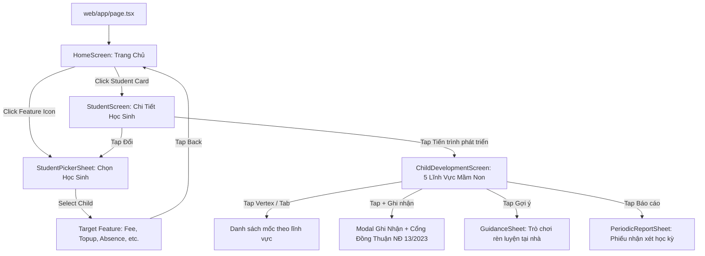
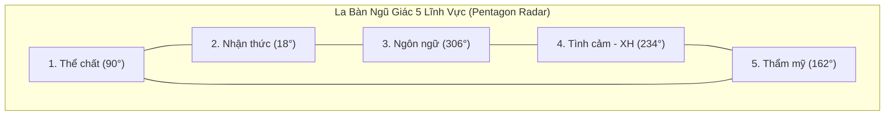
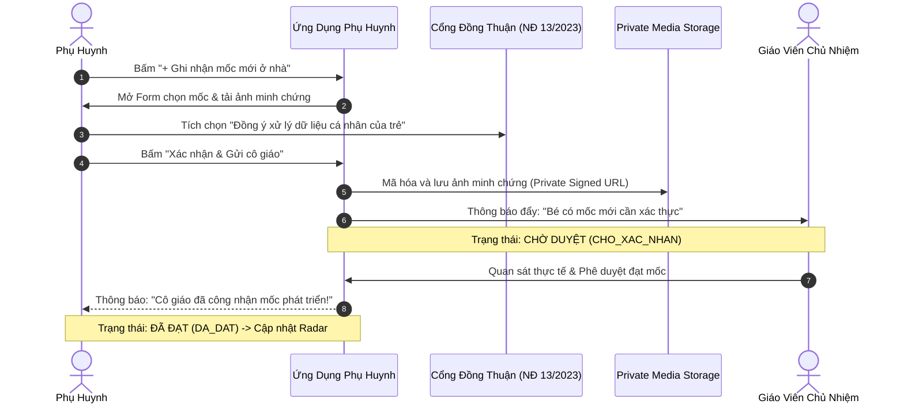

# System Architecture & Screen Transition Diagrams: ECO School Phụ huynh

## 1. Application Screen State Architecture

The parent application operates on single-page state transitions without full page refreshes, maintaining continuous mobile frame context inside the 390×844 viewport shell.

## 2. 5-Axis Pentagon Radar Geometric Projection

Under Thông tư 51/2020/TT-BGDĐT, the development radar projects five statutory axes spaced radially at 72-degree angles ($360^\circ / 5$):
- Axis 1 ($90^\circ$ Top): Thể chất (Physical Development)
- Axis 2 ($18^\circ$ Top-Right): Nhận thức (Cognitive Development)
- Axis 3 ($306^\circ$ Bottom-Right): Ngôn ngữ (Language Development)
- Axis 4 ($234^\circ$ Bottom-Left): Tình cảm & Kỹ năng xã hội (Social-Emotional)
- Axis 5 ($162^\circ$ Top-Left): Thẩm mỹ (Aesthetic: Tạo hình & Âm nhạc)

## 3. Milestone State Lifecycle & Parental Consent Sequence

This diagram details the sequence of recording a milestone achieved at home, including the privacy consent gate enforced under Decree 13/2023/ND-CP.

## 4. Observability and Data Invariant Flow

All screen components import `MOCK_STUDENTS` and helper methods directly from `web/lib/mock-data.ts`. State transitions pass student identifiers down the tree, maintaining reactive updates across sibling components without asynchronous delays.
