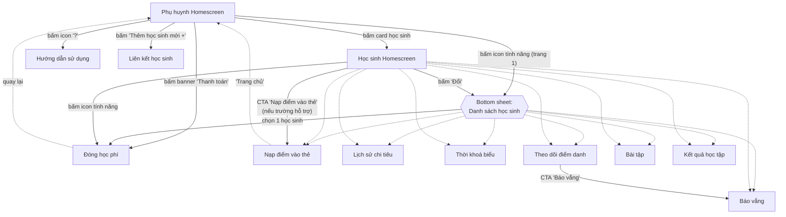
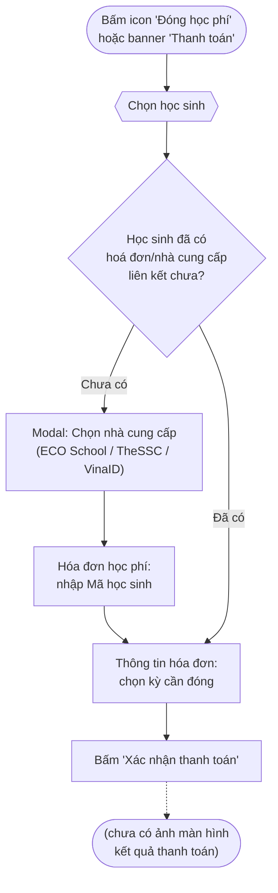
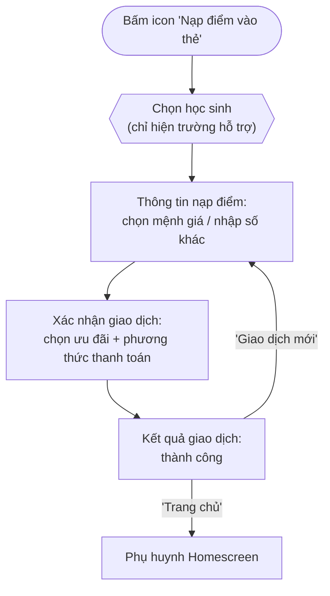
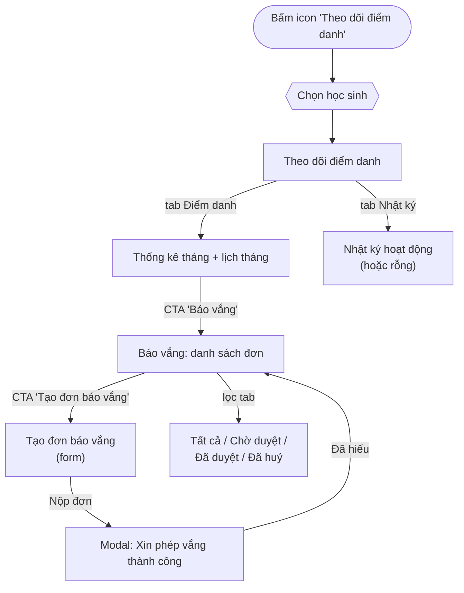
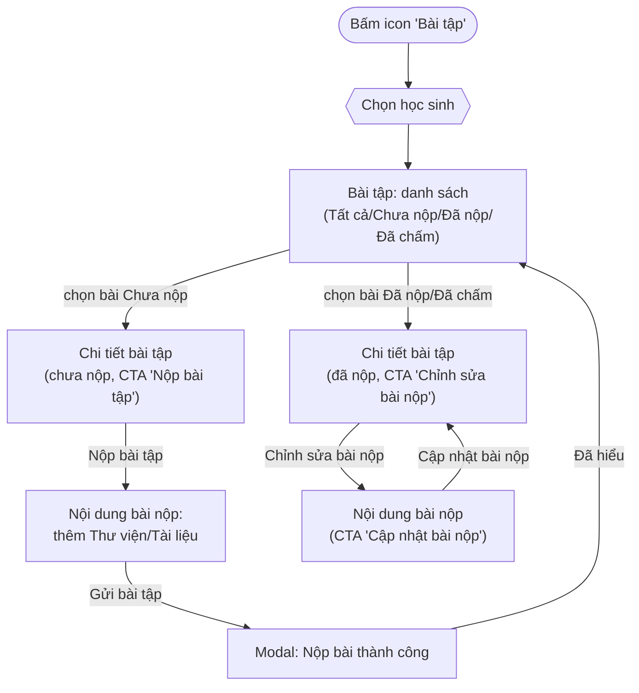
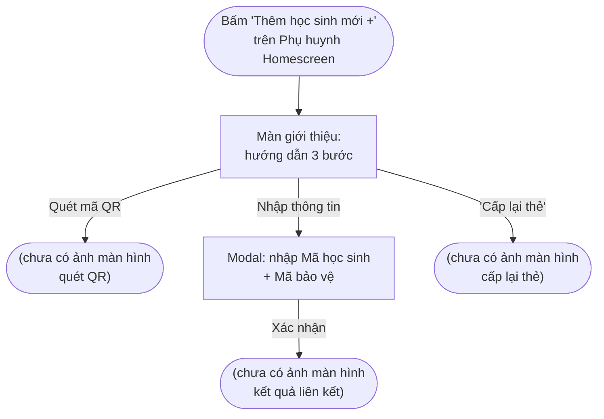
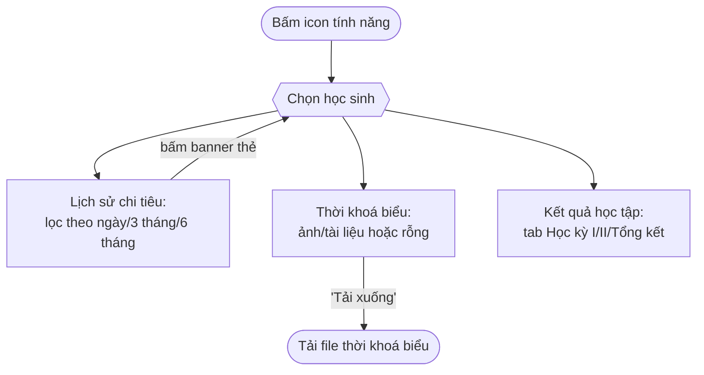
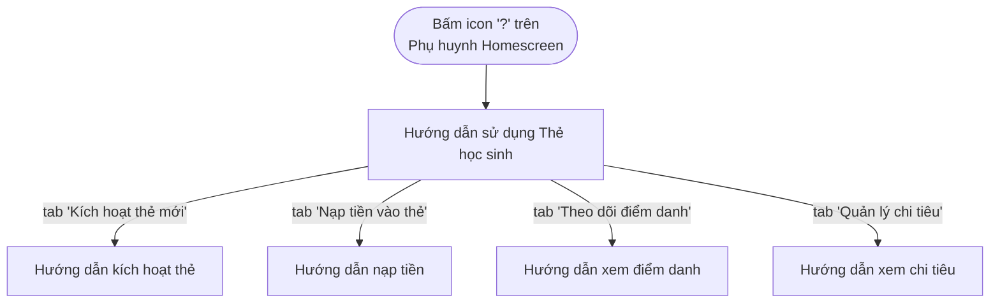

# Flows — EDU Parent (Phụ huynh) App
*Sơ đồ điều hướng dựng lại từ ảnh chụp màn hình thật trong `./reference`.*

## 1. Sơ đồ tổng quan (Home → các Tab tính năng)

> Ghi chú: các mũi tên chấm (`-.->`) từ Picker/StudentHome tới từng tính năng đều dùng chung cơ chế "vào màn danh sách/chi tiết của tính năng với ngữ cảnh học sinh đã chọn". Icon trang 2 của Home (Học bạ số, Thực đơn, Hoạt động, Hóa đơn, Dặn thuốc, Bảng tin, Nhật ký chăm sóc) không có màn hình trong bộ ảnh tham chiếu nên không được vẽ chi tiết ở đây.

---

## 2. Luồng Đóng học phí

---

## 3. Luồng Nạp điểm vào thẻ

---

## 4. Luồng Theo dõi điểm danh → Báo vắng

---

## 5. Luồng Bài tập

---

## 6. Luồng Liên kết học sinh

---

## 7. Luồng Lịch sử chi tiêu / Thời khoá biểu / Kết quả học tập (dạng xem, không phân nhánh)

---

## 8. Luồng Hướng dẫn sử dụng

